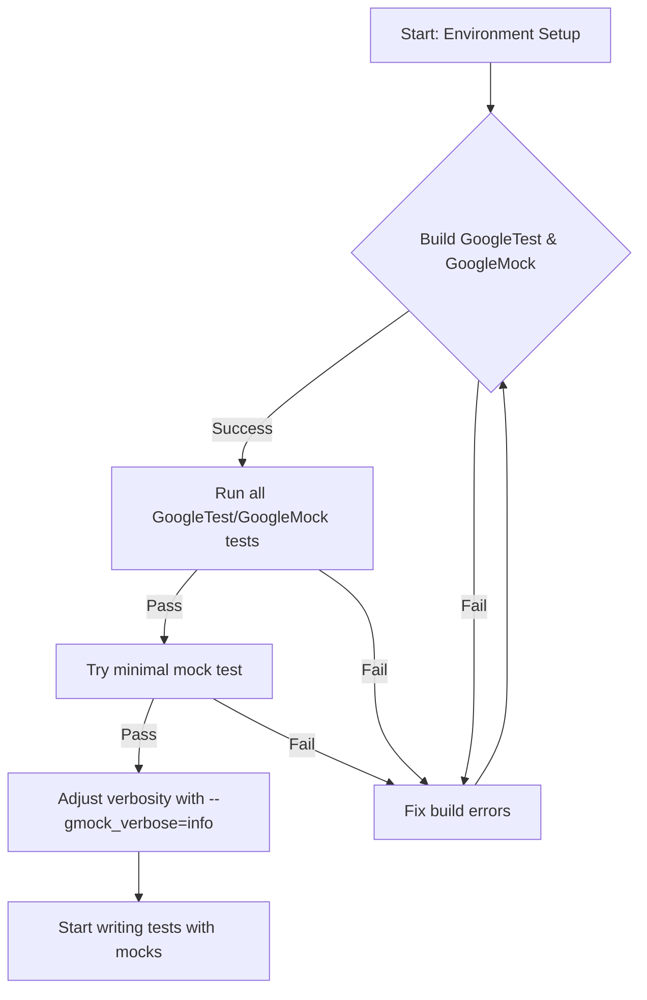

# Quick Validation & Next Steps

Fast checks to confirm a healthy GoogleTest installation. Learn simple commands and diagnostics to ensure your testing environment is ready for development, and get links to essential resources for learning advanced usage.

---

## 1. Validate Your Installation

After installing GoogleTest and GoogleMock, it is critical to confirm that your testing environment is correctly set up and ready for your development workflow. This quick validation prevents wasted debug time and ensures seamless test execution.

### Step 1: Build and Run the Provided Tests

GoogleMock ships with an extensive suite of tests. A successful run of these tests verifies that GoogleTest and GoogleMock are integrated properly in your build environment.

```bash
# From your googletest root directory
mkdir build && cd build
cmake ..
make
ctest
```

- `ctest` will run all GoogleTest and GoogleMock test binaries.
- Confirm that all tests pass with no errors or failures.

### Step 2: Run a Minimal GoogleMock Test

Create a simple test source file to ensure the basic mocking functionality compiles and runs correctly.

```cpp
#include <gmock/gmock.h>
#include <gtest/gtest.h>

using ::testing::NiceMock;
using ::testing::Return;

class MockFoo {
 public:
  MOCK_METHOD(int, GetValue, ());
};

TEST(QuickCheck, BasicMock) {
  NiceMock<MockFoo> mock;
  ON_CALL(mock, GetValue()).WillByDefault(Return(5));
  EXPECT_EQ(mock.GetValue(), 5);
}
```

Compile and run this test. Expect a simple successful test run.

<Tip>
If this fails, check your include paths and link settings to ensure `libgmock` and `libgtest` are correctly linked.
</Tip>

## 2. Use GoogleMock Flags to Inspect Behavior

GoogleMock supports flags to enable verbose output and catch issues early.

- **Catch Leaked Mocks:**

  Configure GoogleMock to detect mock objects that are leaked (never destroyed):

  ```cpp
  ::testing::GMOCK_FLAG_SET(catch_leaked_mocks, true);
  ```

  This is also enabled by default during test runs.

- **Verbose Mode:**

  Use the `--gmock_verbose` flag to control logging verbosity of GoogleMock.

  | Level   | Behavior                                 |
  |---------|------------------------------------------|
  | `info`  | Logs detailed mock call information and stack traces. |
  | `warning` | Logs warnings only (default).            |
  | `error` | Only logs errors, suppressing all else. |

  Run your tests with:
  ```
  ./your_test_binary --gmock_verbose=info
  ```

  This output shows the matching mechanism of expectations and helps debug failures.

## 3. Basic Checks for Your First Operation

To perform a quick sanity check on your mocks after setup, you can use simple expectations and mock calls as shown in the minimal test above.

Here is an actionable checklist:

- **Create** a mock object.
- **Set** an `ON_CALL` to specify default behavior.
- **Set** an `EXPECT_CALL` with simple matchers.
- **Call** the mock method and verify returned values.

Example:

```cpp
using ::testing::Return;
using ::testing::NiceMock;

class MockBar {
 public:
  MOCK_METHOD(bool, IsReady, (), ());
};

TEST(QuickStart, CheckBehavior) {
  NiceMock<MockBar> mock;
  ON_CALL(mock, IsReady()).WillByDefault(Return(true));
  EXPECT_CALL(mock, IsReady())
      .Times(1);

  EXPECT_TRUE(mock.IsReady());
}
```

This simple test confirms that the mocking system can expect, intercept, and respond to calls.

## 4. Understanding Uninteresting Calls and Strictness

GoogleMock classifies mock calls as _expected_, _unexpected_, or _uninteresting_:

- **Expected calls** match set expectations and produce success.
- **Unexpected calls** violate expectations and cause test failures.
- **Uninteresting calls** are calls without explicit expectations.

GoogleMock provides wrappers to control how uninteresting calls are handled:

| Wrapper      | Behavior on _Uninteresting Calls_ |
| ------------ | ---------------------------------- |
| `NiceMock<T>`| Suppresses uninteresting call warnings (quiet mode).
| `NaggyMock<T>` | (Default) Produces warnings on uninteresting calls.
| `StrictMock<T>` | Treats uninteresting calls as errors (fail tests).

Choose the appropriate wrapper based on your testing needs.

<Tip>
Starting with `NiceMock<T>` fosters maintainable and resilient tests by avoiding noise from uninteresting calls.
</Tip>

## 5. Helpful Resources & Next Steps

Now that you have verified your installation and run your first simple tests, further improve your knowledge and testing capabilities using these core resources:

- [Getting Started with Mocks](https://google.github.io/googletest/guides/getting-started-workflows/mocking-basics.html): Learn to define mocks, set expectations, and verify behavior.
- [gMock Cheat Sheet](https://google.github.io/googletest/gmock_cheat_sheet.html): A concise reference for mock macros, matchers, and actions.
- [Mocking Reference](https://google.github.io/googletest/reference/mocking.html): Detailed documentation about mocking features and clauses.
- [gMock Cookbook](https://google.github.io/googletest/gmock_cook_book.html): Recipes and best practices for advanced mocking.

For troubleshooting installation issues, refer to the [Troubleshooting Common Setup Issues](https://google.github.io/googletest/getting-started/first-run-validation/troubleshooting-common-issues) guide.

## 6. Summary Diagram of Validation Workflow



---

## Troubleshooting Tips

- If tests fail during build:
  - Confirm compiler version and platform compatibility.
  - Verify inclusion of appropriate headers (`<gmock/gmock.h>`, `<gtest/gtest.h>`).
  - Ensure linking against `gmock` and `gtest` libraries.

- If tests fail to run:
  - Check runtime library versions.
  - Consult verbose output with `--gmock_verbose=info` to locate failure causes.

- If unexpected/uninteresting call warnings/errors occur:
  - Verify expectations are correctly defined before test execution.
  - Use appropriate mock wrappers (`NiceMock` or `StrictMock`) as per test intent.

## Additional Practical Tips

- Set expectations **before** exercising your mocks; unordered, late expectations cause undefined behavior.
- Use `RetiresOnSaturation()` to make expectations non-sticky when needed.
- Remember that `EXPECT_CALL` statements later in the code take precedence over earlier ones.

---

For detailed, progressive mastery, start from the [Quickstart: Setting Up GoogleTest & GoogleMock](https://google.github.io/googletest/guides/getting-started-workflows/quickstart-setup.html) guide, proceed to writing your first test, and then explore mocking basics and best practices.

---

_Source code and further implementation details can be found on the official [googletest GitHub repository](https://github.com/google/googletest)._