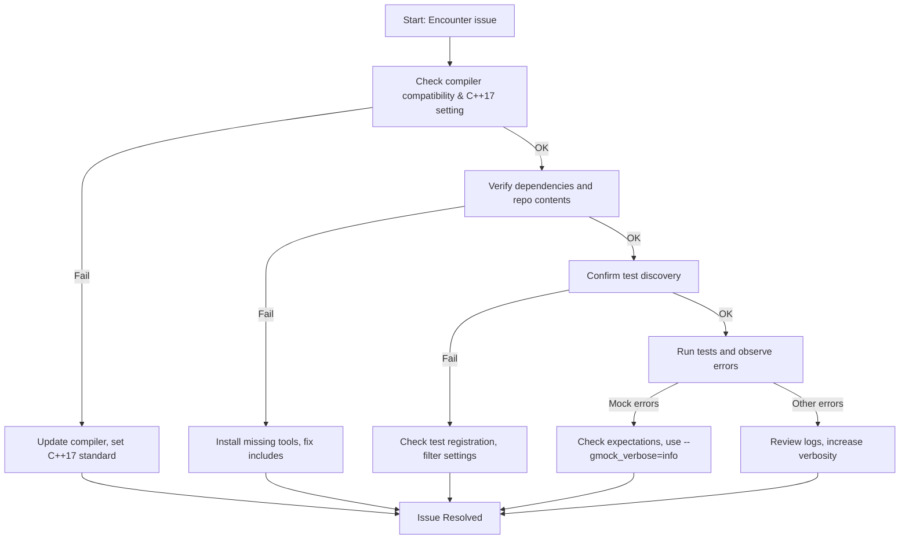

# Troubleshooting & Common Setup Issues

This page provides practical guidance for resolving common problems you might encounter during the installation, configuration, and initial use of GoogleTest and GoogleMock. If you run into compiler errors, missing dependencies, or test discovery failures, this guide will help you diagnose and fix these issues efficiently.

---

## 1. Compiler Errors During Build

Compiler errors can arise from incompatible compilers, missing language standards, or incorrect project setup.

### 1.1 Check Compiler Compatibility

GoogleTest requires a C++17-compliant compiler. Make sure your compiler version supports C++17 features.

- **Verify Compiler Version:** For example, run `g++ --version` or `clang++ --version`.
- **Supported Compilers:** GCC 7+, Clang 5+, MSVC 2017 Update 15.7 or later.

### 1.2 Confirm Build System Configuration

- Ensure your build tool (CMake, Bazel, etc.) is set to use C++17.
- For CMake, add this line:

  ```cmake
  set(CMAKE_CXX_STANDARD 17)
  set(CMAKE_CXX_STANDARD_REQUIRED ON)
  ```

- Ensure that both GoogleTest and GoogleMock are properly included and linked.

### 1.3 Resolve Macro Expansion Conflicts

If you include system headers that define common macros (e.g., on Windows), macro redefinitions may cause breaking errors.

- Use the workaround of undefining conflicting macros before including GoogleMock headers:

  ```cpp
  #ifdef Method
  #undef Method
  #endif
  #include <gmock/gmock.h>
  ```

- Refer to [gmock-spec-builders_test.cc](https://github.com/google/googletest/blob/main/googlemock/test/gmock-spec-builders_test.cc) for examples addressing this issue.

## 2. Missing Dependencies or Files

### 2.1 Ensure Dependencies Are Installed

- Verify you have installed CMake or Bazel as your build system.
- Install necessary build tools (make, ninja, Visual Studio build tools, etc.).
- Confirm your platform's threading libraries and exception support are enabled.

### 2.2 Repository Contents

Make sure you have cloned the complete GoogleTest repository, including the `googletest` and `googlemock` directories.

- The `gmock` subdirectory contains GoogleMock sources.
- The `googletest` subdirectory contains GoogleTest sources.

### 2.3 Include Paths and Linking

- Add both GoogleMock and GoogleTest include paths in your project.
- Link against the compiled GoogleTest/GoogleMock libraries.

## 3. Test Discovery Failures

If your tests are not discovered or executed:

### 3.1 Confirm Tests Are Linked

- Ensure your test binaries link with GoogleTest and GoogleMock libraries.
- Verify the source files defining tests are included and compiled.

### 3.2 Naming and Registration

- Make sure tests use the appropriate `TEST()`, `TEST_F()`, or `TEST_P()` macros.
- Confirm `testing::InitGoogleMock(&argc, argv);` or `testing::InitGoogleTest(&argc, argv);` is called in `main()` before `RUN_ALL_TESTS()`.

### 3.3 Use Test Listing Options

Run your test executable with:

```bash
./your_test_binary --gtest_list_tests
```

This command lists all discovered test cases. If no tests show up, verify your test code setup.

### 3.4 Filtering

Be sure no restrictive filters (e.g., `--gtest_filter`) or environment variables are blocking test execution.

## 4. Common Runtime Issues

### 4.1 Unexpected Mock Function Calls

- Usually caused when calls do not match any `EXPECT_CALL` or when `EXPECT_CALL` expectations are saturated.
- Run tests with `--gmock_verbose=info` to see trace of mock calls and better understand mismatches.
- Consider adding "catch-all" expectations with `EXPECT_CALL(mock, Method(_)).Times(AnyNumber())` to suppress unwanted warnings.
- Use `NiceMock<T>` to suppress uninteresting call warnings where appropriate.

### 4.2 Uninteresting Call Warnings

These warnings indicate mock methods were called without expectations:

```none
GMOCK WARNING:
Uninteresting mock function call - returning default value.
    Function call: MethodName(...)
```

- To suppress, add `EXPECT_CALL` with `Times(AnyNumber())` or switch to `NiceMock<T>`.
- Avoid ignoring genuine bugs by suppressing these warnings blindly.

### 4.3 Leaked Mock Objects

When mocks are allocated on the heap and not deleted, GoogleMock reports leaks:

```
ERROR: this mock object should be deleted but never is. Its address is @0x#.
```

- Fix this by ensuring your code deletes mock objects properly.
- Alternatively, explicitly mark mocks as okay to leak with:

  ```cpp
  Mock::AllowLeak(mock_object);
  ```

## 5. Debugging Setup Issues

### 5.1 Increase Verbosity

Run tests with increased verbosity:

```bash
./your_test_binary --gmock_verbose=info
```

This shows detailed mock call and expectation matching trace.

### 5.2 Check Stack Trace Depth

If stack traces are too verbose or unhelpful, set:

```bash
./your_test_binary --gtest_stack_trace_depth=0
```

Adjust as needed.

### 5.3 Use Scoped Trace for Complex Failures

In test code, use `SCOPED_TRACE()` to add context to failures when tests call helper functions.

## 6. Useful Links and Commands

- [GoogleTest FAQ - Troubleshooting](https://github.com/google/googletest/blob/main/docs/gmock_faq.md)
- [gMock Cookbook - Common Patterns](https://github.com/google/googletest/blob/main/docs/gmock_cook_book.md)
- Run tests listing:
  ```bash
  ./your_test_binary --gtest_list_tests
  ```
- Run tests with verbosity:
  ```bash
  ./your_test_binary --gmock_verbose=info
  ```

---

## Support and Community

If problems persist, please:

- Check detailed logs and error output.
- Consult the GoogleTest and GoogleMock issue trackers on GitHub.
- Join community forums or mailing lists related to GoogleTest for peer support.

---

## Summary

This page equips you with step-by-step fixes for compile-time and runtime issues, helps ensure your tests are properly discovered and run, and guides on diagnosing mock-related warnings and errors. Combined with verbosity flags and inspection tools, you can resolve setup issues rapidly and maintain robust, reliable test suites.

---

## Troubleshooting Flowchart


