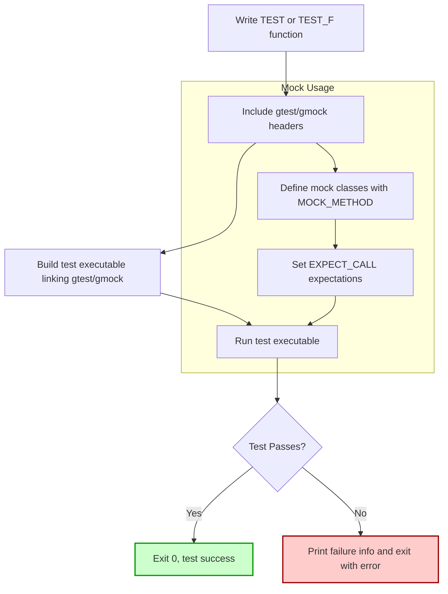

# Writing and Running Your First Test

Welcome to GoogleTest! This guide walks you through creating, building, and running a minimal test case using GoogleTest and GoogleMock, enabling confident first-time usage and understanding of the core test workflow.

---

## 1. Overview of a Minimal Test Workflow

A GoogleTest unit test verifies that your code behaves as expected. A typical workflow involves:

- **Defining a test case**: Write a test function that exercises a unit of your code.
- **Setting expectations/assertions**: Use GoogleTest/GoogleMock macros to specify expected outcomes.
- **Building the test executable**: Integrate GoogleTest and your code.
- **Running the tests**: Execute tests and interpret results.

This page covers all the essential steps for first-time test creation, running, and validation.

---

## 2. Creating a Simple Test

### Step 2.1: Include GoogleTest Headers

Include the necessary headers for testing and mocking.

```cpp
#include <gtest/gtest.h>   // GoogleTest framework
#include <gmock/gmock.h>   // GoogleMock framework (optional)
```

### Step 2.2: Define a Test Suite and Test Case

Use the `TEST` macro to create a test suite and an individual test case.

```cpp
TEST(SampleTestSuite, SimpleTestCase) {
  int value = 5;
  EXPECT_EQ(value, 5) << "Value should be 5";
}
```

- `SampleTestSuite`: Logical grouping of tests.
- `SimpleTestCase`: Name of this particular test.
- `EXPECT_EQ`: A GoogleTest assertion to check equality.
- The `<<` operator allows appending a custom failure message.

### Step 2.3 (Optional): Using GoogleMock

If you want to use mocks for your test, define mock classes using `MOCK_METHOD` macros and set expectations. For example:

```cpp
class MockFoo {
 public:
  MOCK_METHOD(void, DoSomething, (int x), ());
};

TEST(MockTestSuite, MockMethodCalled) {
  MockFoo mock;
  EXPECT_CALL(mock, DoSomething(5));
  mock.DoSomething(5);  // This satisfies the expectation.
}
```

---

## 3. Building Your Test

### Step 3.1: Link with GoogleTest and GoogleMock Libraries

Ensure your build configuration links against `gtest`, `gmock`, and their pthread dependencies on Linux or the respective libraries on other platforms.

Example g++ command:

```bash
g++ -std=c++17 -pthread sample_test.cc -lgtest -lgtest_main -lgmock -o sample_test
```

If using CMake or Bazel, include `googletest` and `googlemock` targets as dependencies.

### Step 3.2: Compile and Link

Run the build command. Fix any compilation errors (often due to missing includes or linkage).

---

## 4. Running Your Tests

### Step 4.1: Execute the Test Binary

```bash
./sample_test
```

### Step 4.2: Interpreting Output

GoogleTest prints the progress and results of all test cases:

```text
[==========] Running 1 test from 1 test suite.
[----------] Global test environment set-up.
[----------] 1 test from SampleTestSuite
[ RUN      ] SampleTestSuite.SimpleTestCase
[       OK ] SampleTestSuite.SimpleTestCase (0 ms)
[----------] 1 test from SampleTestSuite (0 ms total)

[----------] Global test environment tear-down
[==========] 1 test from 1 test suite ran. (0 ms total)
[  PASSED  ] 1 test.
```

- `PASSED`: Your test succeeded.
- Failure output includes file, line, and failure message for diagnostics.

### Step 4.3: Failures and Debugging

If a test fails, GoogleTest outputs detailed info regarding the failure location and reason. Use this to quickly identify and fix issues.

---

## 5. Understanding the Sample main() Function

GoogleTest provides a default `main()` function via the `gtest_main` library. If you want to define your own to customize initialization, use the following pattern:

```cpp
#include <gtest/gtest.h>
int main(int argc, char** argv) {
  testing::InitGoogleTest(&argc, argv);
  return RUN_ALL_TESTS();
}
```

- `InitGoogleTest` parses command line flags.
- `RUN_ALL_TESTS` runs all registered tests and returns 0 if all pass.

---

## 6. Tips and Best Practices

- Write meaningful test case and test suite names.
- Use assertions (`EXPECT_*` or `ASSERT_*`) to verify behavior.
- Set `EXPECT_CALL`s on mock objects _before_ exercising tested code.
- Don't ignore the return value of `RUN_ALL_TESTS()` in your `main()`.
- Use `TEST_F` and fixtures when you share common test data or setup.
- Use `NiceMock` or `StrictMock` to tune how mocks treat uninteresting calls.

---

## 7. Troubleshooting Common Issues

| Issue                        | Cause & Resolution                                          |
|------------------------------|------------------------------------------------------------|
| Tests do not run or no tests found | Missing `testing::InitGoogleTest(&argc, argv)` call; ensure test registration. |
| Linker errors on `main` function | Link with `gtest_main` or provide your own `main()` function. |
| Uninteresting mock call warnings | Use `NiceMock<T>` or explicitly set `EXPECT_CALL(...).Times(AnyNumber())`. |
| Test executable crashes or hangs | Check your test logic and mocks; enable debugging and logging. |

For complex failures, run with `--gmock_verbose=info` to get detailed mock call traces.

---

## 8. Next Steps

- Explore writing parameterized tests for broader coverage.
- Learn advanced mock features from the [gMock Cookbook](https://google.github.io/googletest/gmock_cook_book.html).
- Consult the [GoogleTest Primer](https://google.github.io/googletest/primer.html) for test writing fundamentals.
- Integrate your tests into your CI/CD pipeline.

---

## 9. References

- [GoogleTest Primer](https://google.github.io/googletest/primer.html)
- [gMock for Dummies](https://google.github.io/googletest/gmock_for_dummies.html)
- [gMock Cheat Sheet](https://google.github.io/googletest/gmock_cheat_sheet.html)
- [Writing and Running Tests Guide](https://google.github.io/googletest/guides/getting-started.html)
- [API Reference: Mock Methods](https://google.github.io/googletest/reference/mocking.md#MOCK_METHOD)

---

<Callout title='Quick Start Example'>
```cpp
#include <gmock/gmock.h>
#include <gtest/gtest.h>

// Sample test case
TEST(SampleTest, ValueEqualsFive) {
    int x = 5;
    EXPECT_EQ(x, 5) << "x should be equal to 5";
}

int main(int argc, char** argv) {
  testing::InitGoogleTest(&argc, argv);
  return RUN_ALL_TESTS();
}
```
</Callout>

---

## 10. Summary Diagram of the Test Workflow



This diagram illustrates the logical flow for writing and running your first GoogleTest-based test.

---