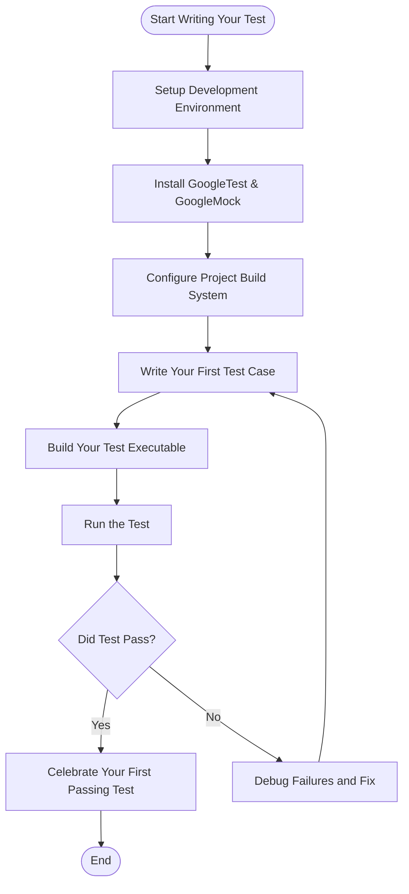

# Writing Your First Test

Experience firsthand how to author and run your initial test case using GoogleTest. This page guides you step-by-step through installing the necessary tools, writing a simple assertion, and understanding the basic mechanics that underpin your tests.

---

## 1. Prerequisites & System Requirements

Before diving into writing your first test, ensure your development environment meets these foundational requirements:

- **Compiler Support:** A C++17 compliant compiler (e.g., GCC 7+, MSVC 2017+, Clang 5+).
- **Build Tools:** CMake (version 3.14 or higher recommended) or Bazel for building your tests.
- **Basic Tooling:** Access to a terminal or command prompt, text editor, and C++ development environment.
- **GoogleTest/GMock Packages:** The latest release of GoogleTest, which includes gMock.

<Check>
Ensure that your platform and compiler support is compatible. Refer to the [Supported Platforms and Requirements](/overview/feature-overview/supported-platforms) page for detailed compatibility matrices.
</Check>


## 2. Installation Instructions

GoogleTest and GoogleMock are distributed together and can be installed via multiple methods:

### 2.1 Using CMake

1. Clone the repository:

```bash
git clone https://github.com/google/googletest.git
cd googletest
```

2. Create a build directory and generate your build system:

```bash
mkdir build
cd build
cmake ..
cmake --build .
```

3. Optionally, install GoogleTest on your system:

```bash
cmake --install .
```

### 2.2 Using Bazel

If your project is Bazel-based, add GoogleTest and GoogleMock as dependencies according to Bazel’s standard configuration. See Bazel integration guides.

### 2.3 Manual Build

You can compile the sources manually and link against them. This is less recommended but viable for small projects.

### Verification

Run the provided tests to confirm installation:

```bash
./build/gtest/gtest
./build/gmock/gtest/gmock_main
```

All tests should pass without errors.

<Warning>
If you encounter build errors, verify your compiler version and dependencies. Consult the [Installation Methods](/getting-started/setup-prerequisites-installation/installation-methods) guide for platform-specific instructions and troubleshooting.
</Warning>


## 3. Configuration & Setup

### 3.1 Integrate GoogleTest with Your Project

In your `CMakeLists.txt`, add:

```cmake
# Add GoogleTest as subdirectory or find_package
add_subdirectory(path/to/googletest)

# Link with gtest and gmock
add_executable(your_test_executable your_test_file.cc)
target_link_libraries(your_test_executable gtest_main gmock_main)
```

### 3.2 Initialize GoogleTest in Your Test Sources

In the source file containing your tests, include the necessary headers and initialize GoogleTest:

```cpp
#include <gtest/gtest.h>

int main(int argc, char **argv) {
  ::testing::InitGoogleTest(&argc, argv);
  return RUN_ALL_TESTS();
}
```

You don't need a separate main if you link with `gtest_main` or `gmock_main`.


## 4. First Operation Walkthrough: Write and Run Your First Test

Follow this practical example to write a basic test:

### Step 1: Create a Test Case

Your test file (e.g. `sample_test.cc`) should look like this:

```cpp
#include <gtest/gtest.h>

// Test case named ExampleTest
TEST(ExampleTest, BasicAssertions) {
  // Expect equality.
  EXPECT_EQ(7 * 6, 42);
}
```

### Step 2: Build Your Test

Compile with your build system. For example, with CMake you might run:

```bash
cmake --build build
```

### Step 3: Run Your Test

Execute the test binary:

```bash
./build/your_test_executable
```

Expected output:

```
[==========] Running 1 test from 1 test suite.
[----------] Global test environment set-up.
[----------] 1 test from ExampleTest
[ RUN      ] ExampleTest.BasicAssertions
[       OK ] ExampleTest.BasicAssertions (0 ms)
[----------] 1 test from ExampleTest (0 ms total)

[----------] Global test environment tear-down
[==========] 1 test from 1 test suite ran. (0 ms total)
[  PASSED  ] 1 test.
```

**Success:** Your first test ran and passed!

### Step 4: Interpret the Output

- `EXPECT_EQ` is an assertion that checks if two values are equal.
- The test framework reports each test's status in real time.
- Passing tests show `[  PASSED  ]`.
- Failures will indicate which assertion failed with detailed messages and point to the exact source file and line.

<Info>
Use meaningful test and test case names that describe the purpose of the test.
</Info>


## 5. Best Practices & Tips

- **Write Small Focused Tests:** Each test should verify one behavior or aspect.
- **Name Tests Clearly:** Reflect what you are testing.
- **Use Fixtures for Reuse:** When your tests share setup code, use test fixtures.
- **Keep Assertions Simple:** Ensure failure messages are clear and pinpoint ignorance.
- **Run Tests Frequently:** Integrate with your build to catch regressions early.


## 6. Troubleshooting Common Issues

### 6.1 Test Binary Does Not Run or Link

- Verify all GoogleTest and GoogleMock libraries are correctly linked.
- Confirm matching compiler and standard library versions.

### 6.2 No Tests Run

- Make sure you call `InitGoogleTest` and `RUN_ALL_TESTS()` in `main()`.
- Check that tests are discovered by naming conventions (`TEST` macro used, files included in build).

### 6.3 Test Fails Unexpectedly

- Read the assertion failure message carefully.
- Check argument expectations and test logic.
- Use verbose flag `--gtest_verbose` to get detailed output.

### 6.4 Debugging Test Failures

- Run with `--gtest_break_on_failure` to break in debugger immediately.
- Use your IDE's integration or add logging inside tests.


## 7. Next Steps & Further Learning

- Write more complex tests using [assertions and matchers](../api-reference/core-concepts/test-assertions-overview). 
- Learn setting up [test fixtures](../guides/core-workflows/writing-effective-tests).
- Explore using [mocks](../guides/core-workflows/using-mocks-in-tests) to test code with dependencies.
- Integrate GoogleTest into your build system, see the [Building and Integrating with CMake and Bazel](/guides/integration-scenarios/building-and-integrating-with-cmake-bazel) guide.


---

### Additional Resources

- [GoogleTest Primer](https://google.github.io/googletest/primer.html)
- [Feature Summary](../../overview/feature-overview/feature-summary.html)
- [gMock for Dummies](../../docs/gmock_for_dummies.html) (mocking introduction)
- [Mocking Reference](../../docs/reference/mocking.html)


---

### Summary Diagram: Test Flow



---

<Tip>
**Tip:** Running tests in verbose mode using `--gtest_verbose=info` can provide detailed insight into testing activities and help quickly identify mismatches or failures.
</Tip>

<Tip>
**Tip:** Utilize your IDE or build system integration for seamless test running and debugging.
</Tip>

<Tip>
**Tip:** When your test suite grows, group tests into suites and use fixtures for efficient setup and teardown.
</Tip>

<Tip>
**Tip:** Gradually explore [writing effective tests](../guides/core-workflows/writing-effective-tests) and [using mocks in tests](../guides/core-workflows/using-mocks-in-tests) for advanced capabilities.
</Tip>
