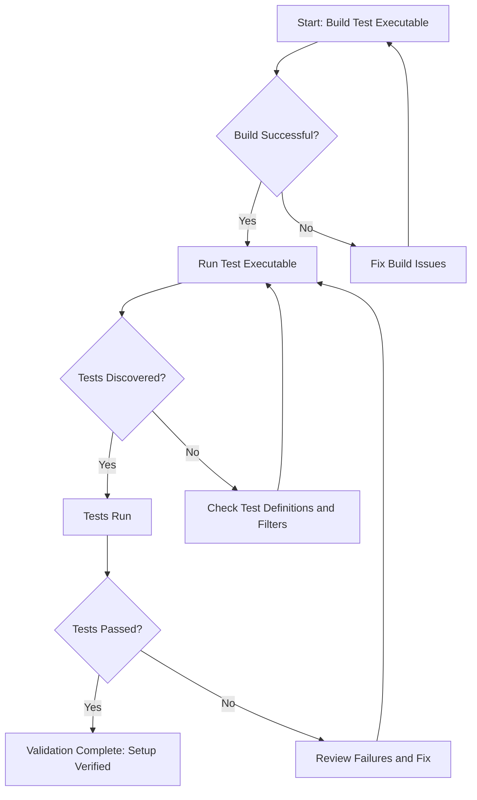

# Validating Your Setup

This guide walks you through concrete, actionable steps to verify that your GoogleTest and GoogleMock integration works correctly after installation. By confirming build success, test discovery, and sample test output, you will gain confidence to move forward and start writing your own tests.

---

## 1. Build Your Test Executable Successfully

Before running any tests, confirm that your test executable compiles and links without errors.

### Step-by-Step:

1. Navigate to the directory where your test binary is built (e.g., where `your_test_binary` resides).
2. Build your test project using your preferred build system (e.g., `make`, `cmake --build .`, or `bazel build //path/to:test`).

```bash
cmake --build .
```

3. Check for build errors. A successful build will produce the test executable (typically named with `_test` suffix).

### What to Look For:

- No compilation or link errors related to GoogleTest or GoogleMock.
- The executable file exists and has execute permissions.

### Troubleshooting Build Issues:

- If you find unresolved symbols related to GoogleTest or GoogleMock, review your build configuration to ensure headers and libraries are correctly referenced.
- Verify that your compiler supports C++17, as GoogleTest requires it.

<Note>
Always use the exact build commands specified in your setup instructions. Check for appropriate include paths and linked libraries.
</Note>

---

## 2. Run Your Test Binary and Discover Tests

GoogleTest automatically discovers all tests in your test binary. Running it will enumerate available tests and execute them.

### How to Run:

```bash
./your_test_binary
```

### What to Expect:

- Console outputs beginning with `[==========] Running X tests from Y test suites.`
- Test run progress, e.g., `[ RUN      ]  TestSuite.TestName`
- Summary at the end showing passed, failed, and skipped tests.

### Optional: List Available Tests Without Running Them

To verify test discovery alone, run:

```bash
./your_test_binary --gtest_list_tests
```

This will print all discovered test suites and their tests without executing them.

---

## 3. Verify Sample Test Execution and Output

Run the default sample tests that come with GoogleTest to verify test integration and output formatting.

### Expected Output Example:

```none
[==========] Running 4 tests from 2 test suites.
[----------] Global test environment set-up.
[----------] 3 tests from SampleTest
[ RUN      ] SampleTest.PassingTest
[       OK ] SampleTest.PassingTest
[----------] 1 test from AnotherTestSuite
[ RUN      ] AnotherTestSuite.SamplePassTest
[       OK ] AnotherTestSuite.SamplePassTest
[----------] Global test environment tear-down
[==========] 4 tests from 2 test suites ran. (X ms total)
[  PASSED  ] 4 tests.
```

### What This Confirms:

- Tests are being run, and at least some are passing.
- Console output is in the expected GoogleTest format.
- The framework successfully initializes and tears down test environments.

### What to Do if Tests Fail:

- Review failing test output to identify problems.
- Ensure your build links against the correct GoogleTest library version.
- Run with verbose output for more details:

```bash
./your_test_binary --gtest_verbose=info
```

---

## 4. Check the Return Code of the Test Program

When you run your tests, the process exit code indicates overall test success or failure.

### How to Check:

After running tests, inspect the exit code:

```bash
./your_test_binary
echo $?
```

- Exit code `0` means all tests passed.
- Non-zero means some test failed.

### Using the Exit Code in Scripts

You can use the exit code to automate CI/CD pipelines or continuous testing triggers.

---

## 5. Sample Code: Minimal Main Function to Run Tests

Your `main()` should initialize GoogleMock (which integrates GoogleTest) and run all tests, as shown below:

```cpp
#include "gmock/gmock.h"

int main(int argc, char** argv) {
  ::testing::InitGoogleMock(&argc, argv);
  return RUN_ALL_TESTS();
}
```

This ensures the framework is properly initialized and your tests execute correctly.

---

## 6. Common Pitfalls and Troubleshooting

### Test Execution Starts but No Tests Run

- Confirm that your test functions are correctly defined using `TEST()` or `TEST_F()` macros.
- Ensure that you did not prefix test or test suite names with `DISABLED_` unintentionally.
- Check the `--gtest_filter` flag if used for filtering tests.

### Unexpected Linker Errors

- Verify that your build system includes linking to GoogleTest and GoogleMock libraries.
- Check for mismatched runtime library settings (e.g., static vs dynamic CRT on Windows).

### Tests Fail Immediately on Setup or Teardown

- Inspect output for failures in `SetUpTestSuite()` or `TearDownTestSuite()` methods.
- See the example in `googletest-setuptestsuite-test_` for how these errors manifest.

<Callout title="Tip">
Use `--gtest_break_on_failure` to drop into a debugger upon test failure.
</Callout>

---

## 7. Next Steps

After confirming your setup with these steps, continue with:

- Writing your own simple tests; see the [Writing Your First Test](https://github.com/google/googletest/blob/main/docs/primer.md) guide.
- Exploring advanced features such as parameterized tests and mocking from the [Advanced GoogleTest Topics](docs/advanced.md).
- Review common troubleshooting patterns on the [Common Issues](getting-started/troubleshooting-support/common-issues.md) page.

---

## References

- [GoogleTest Primer](https://github.com/google/googletest/blob/main/docs/primer.md) - Learn how to write tests.
- [Advanced Usage Guide](docs/advanced.md) - Deep dive into GoogleTest features.
- [Mocking Reference](docs/reference/mocking.md) - Learn about mocking with GoogleMock.
- [GoogleTest FAQ](docs/faq.md) - Answers to frequent questions.

---

## Summary Diagram of Validation Flow



---