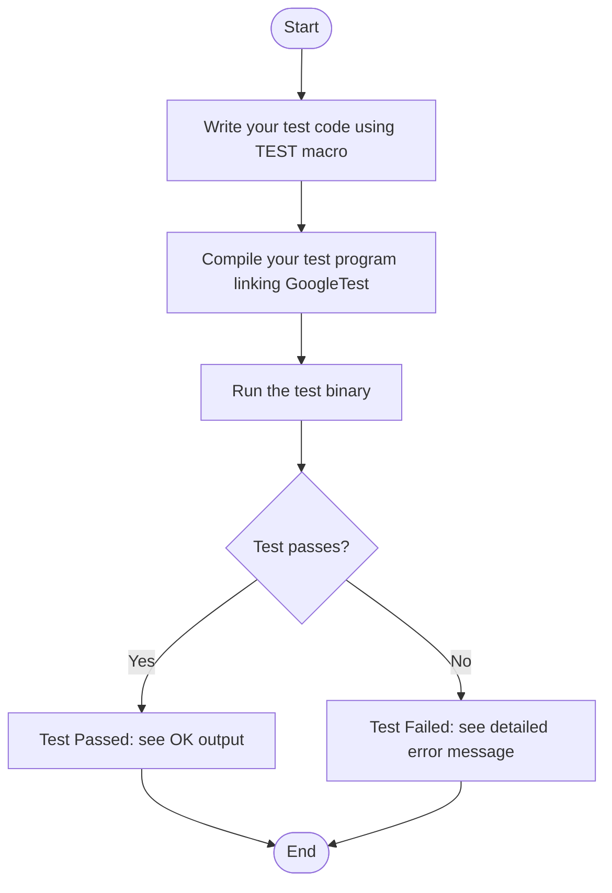

# Writing and Running Your First Test

Welcome to your first step with GoogleTest! This guide will walk you through writing a simple test case using the GoogleTest framework, compiling it with your chosen build system, and running the resulting test binary. You'll see exactly how to get visible, meaningful test results with minimal effort.

---

## 1. Prerequisites & Setup

Before jumping into writing your first test, ensure your environment is prepared:

- **Build System Ready:** GoogleTest integrates well with CMake, Bazel, or any system that can build C++.
- **GoogleTest Installed and Linked:** Follow the installation guides to have GoogleTest libraries and headers available in your project.
- **Basic C++ Knowledge:** Understanding of C++ syntax and compiling.

If you haven't installed GoogleTest yet, see the [Installation on Standard Platforms](../setup-installation/installing-standard-platforms) and [Configuration Basics](../setup-installation/configuration-basics) guides.

---

## 2. Writing Your First Test

### 2.1. Create a Test Function

GoogleTest's core is the `TEST` macro, which lets you define tests as simple C++ functions grouped in test suites. Here's the minimal example:

```cpp
#include <gtest/gtest.h>

// This test is in the "SampleTest" suite, and named "Works".
TEST(SampleTest, Works) {
  EXPECT_EQ(1, 1);  // An assertion that always succeeds
}
```

- **Test Suite Name:** `SampleTest` (grouping of related tests).
- **Test Name:** `Works` (a single test case inside the suite).

You can write any valid C++ code inside the `TEST` body and use assertions to verify behavior.

### 2.2. Assertions Overview

Use assertions like `EXPECT_EQ`, `ASSERT_TRUE`, `EXPECT_FALSE` to state expected conditions. For example:

```cpp
EXPECT_EQ(actual_value, expected_value);
ASSERT_TRUE(condition);
EXPECT_FALSE(condition);
```

`EXPECT_` assertions will report failures but continue executing the test, while `ASSERT_` assertions abort the current test function on failure.

---

## 3. Compiling Your Test

With your source file written, compile it linking against GoogleTest libraries.

### Example with g++ and pkg-config:

```shell
g++ -std=c++11 -pthread your_test.cc -o your_test \
  $(pkg-config --cflags --libs gtest_main)
```

- `-pthread` enables multithreading support, required by GoogleTest.
- `gtest_main` includes a default `main()` to run tests.

For CMake or Bazel, refer to [Test Discovery and Build Integration](../../guides/getting-started/test-discovery-setup) for examples.

### Verification

Run the compiled test:

```shell
./your_test
```

You should see output similar to:

```
[==========] Running 1 test from 1 test suite.
[----------] Global test environment set-up.
[----------] 1 test from SampleTest
[ RUN      ] SampleTest.Works
[       OK ] SampleTest.Works (0 ms)
[----------] 1 test from SampleTest (0 ms total)

[----------] Global test environment tear-down
[==========] 1 test from 1 test suite ran. (0 ms total)
[  PASSED  ] 1 test.
```

This confirms your test ran successfully.

---

## 4. Running Your First Test Step-by-Step

Follow this flow to see your test in action:

<Steps>
<Step title="Write the Test Code">
Create a new C++ file (e.g., `first_test.cc`) and add the following minimal test:

```cpp
#include <gtest/gtest.h>

TEST(FirstTestSuite, FirstTestCase) {
  EXPECT_EQ(1, 1);
}
```
</Step>
<Step title="Compile the Test">
Use a compiler command like this (adjust as needed):

```bash
g++ -std=c++11 -pthread first_test.cc -o first_test $(pkg-config --cflags --libs gtest_main)
```

Check for compilation errors and warnings.
</Step>
<Step title="Run the Test">
Execute the test binary:

```bash
./first_test
```

Validate the console output shows your test running and passing.
</Step>
</Steps>

---

## 5. Understanding the Output

When the test runs, GoogleTest reports:

- Test suite and test count.
- Which tests are running (`[ RUN      ] ...`).
- Test results (`[       OK ]`, `[  FAILED  ]`, `[  SKIPPED ]`).
- Elapsed time per test and overall.

If a test fails, GoogleTest provides detailed failure messages with file and line information.

---

## 6. Tips & Best Practices

- Use descriptive, concise test suite and test names without underscores (avoid `_`) to prevent unexpected conflicts.
- Prefer `EXPECT_` assertions where subsequent checks are meaningful.
- Use `ASSERT_` assertions when failures must abort the test early.
- Link with `gtest_main` to avoid writing your own `main()`.
- Make sure to call `testing::InitGoogleTest()` if writing a custom `main()`.

---

## 7. Troubleshooting

- If your test does not run, verify the build links against GoogleTest libraries correctly.
- If tests are not discovered, confirm your test binary is built with GoogleTest’s `TEST` or `TEST_F` macros.
- Use the flag `--gtest_list_tests` to list all tests recognized in a binary.

For detailed troubleshooting, see [Troubleshooting Common Setup Issues](../first-test-experience/troubleshooting-common-issues).

---

## 8. Next Steps

After running your first test, explore:

- Writing tests with fixtures (use `TEST_F()` for shared setup).
- Using more advanced assertions (see [Assertions Reference](../reference/assertions.md)).
- Organizing tests with parameterization and typed tests.
- Integrating with your build system for automation.

See the [GoogleTest Primer](../primer.md) for a broader conceptual introduction and [Getting Started with Mocking](../../guides/getting-started/mocking-basics) for mocking techniques.

---

Happy Testing!

---

# Visual Diagram of Your First Test Flow



---

*This document focuses exclusively on creating and running your first basic test with GoogleTest. For more detailed topics, please consult other parts of the documentation.*

---
