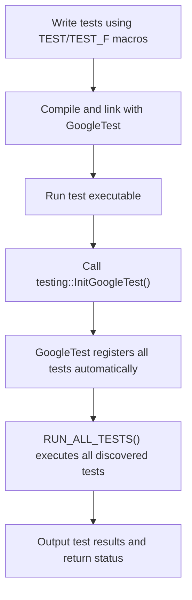

# Test Discovery and Execution

GoogleTest automates the discovery and execution of your tests so you can focus on writing effective tests rather than managing them manually. This guide explains how GoogleTest locates tests, the conventions to follow, how the test runner operates, and what your typical workflow looks like for running tests.

---

## 1. How GoogleTest Finds Your Tests Automatically

GoogleTest uses **automatic test registration** through your use of test macros. Unlike some frameworks, you do not need to manually list or register your tests anywhere.

### Naming Conventions

- Tests are defined using macros like `TEST()` or `TEST_F()`.
- Each test belongs to a **test suite** (a group of related tests) identified by a name.
- Both the test suite name and individual test names must be valid C++ identifiers without underscores.

When you write:

```cpp
TEST(FactorialTest, HandlesZeroInput) {
  EXPECT_EQ(Factorial(0), 1);
}
```

this defines a test named `HandlesZeroInput` inside the suite `FactorialTest`.

### Automatic Registration

- When compiled, GoogleTest registers this test automatically in the global registry.
- You never need to maintain or update a list of tests manually.

<Tip>
Avoid underscores in test suite and test names to ensure smooth functioning and conventions consistency.
</Tip>

---

## 2. Test Runner and Execution Workflow

GoogleTest provides a test runner executable which manages running all your registered tests.

### Running All Tests

- After compilation, your test executable automatically discovers and prepares your tests.
- The standard way to run all tests is to call:

```cpp
int main(int argc, char** argv) {
  testing::InitGoogleTest(&argc, argv);  // Initializes GoogleTest with command-line flags.
  return RUN_ALL_TESTS();                // Runs all registered tests and returns the result.
}
```

- `InitGoogleTest()` parses command line flags specific to GoogleTest and removes them from args so your code can handle others.
- `RUN_ALL_TESTS()` runs each test, reporting results and returning `0` if all pass or `1` if any fail.

### Selective Test Execution

GoogleTest allows filtering which tests to run with command-line flags:

- Use `--gtest_filter=` to specify patterns for test suites and test names.

Example:

```
./my_tests --gtest_filter=FactorialTest.*
```

runs all tests in `FactorialTest`.

### Test Result Reporting

- Results are displayed with clear PASS/FAIL markers.
- Failing tests report detailed source location and failure messages.

<Tip>
Always check the return code of `RUN_ALL_TESTS()`. It indicates overall test success and is essential for CI pipelines.
</Tip>

---

## 3. Typical Workflow: Writing, Discovering, and Running Your First Test

Follow these steps to start using GoogleTest’s automatic test discovery:

<Steps>
<Step title="Write a Test">
Create your test using the `TEST` macro, defining a test suite and test name.

```cpp
TEST(SampleTest, BasicAssertions) {
  EXPECT_EQ(1, 1);
  EXPECT_TRUE(true);
}
```
</Step>
<Step title="Build Your Test Executable">
Compile your code with GoogleTest linked. Either link with the `gtest_main` library that supplies `main()`, or define your own `main()` as shown above.
</Step>
<Step title="Run the Test Executable">
Execute your compiled binary. GoogleTest automatically discovers and runs all tests.

Example output:
```
[==========] Running 1 test from 1 test suite.
[ RUN      ] SampleTest.BasicAssertions
[       OK ] SampleTest.BasicAssertions (0 ms)
[==========] 1 test from 1 test suite ran. (0 ms total)
[  PASSED  ] 1 test.
```
</Step>
</Steps>

---

## 4. Initialization Details and Customizing Execution

### Initialization with InitGoogleTest vs InitGoogleMock

- If using **GoogleMock**, initialize with `testing::InitGoogleMock(&argc, argv);` which also initializes GoogleTest.
- For GoogleTest-only projects, use `testing::InitGoogleTest(&argc, argv);`.

### Command-line Flags

Some useful flags to control test execution:

| Flag                        | Description                                  |
|-----------------------------|----------------------------------------------|
| `--gtest_filter=<pattern>`  | Run only matching tests.                      |
| `--gtest_repeat=<count>`    | Repeat tests multiple times for stability.  |
| `--gtest_shuffle`           | Run tests in random order.                    |
| `--gtest_break_on_failure`  | Break into debugger on test failure.         |

### Custom Main

If you need to add custom setup or teardown around tests, write your own `main()` using the Init and RUN_ALL_TESTS pattern shown above.

---

## 5. Best Practices for Smooth Test Discovery and Execution

- Keep naming consistent and avoid underscores in test suite/test names.
- Use descriptive test suite names to logically group related tests.
- Prefer linking with `gtest_main` or `gmock_main` to avoid writing boilerplate `main()`.
- Always call `InitGoogleTest` or `InitGoogleMock` before `RUN_ALL_TESTS()`.
- Check the exit code of your test executable in scripts and CI to detect failures reliably.

---

## 6. Troubleshooting Common Issues With Test Discovery

<AccordionGroup title="Common Test Discovery Problems">
<Accordion title="No Tests Run or Found">
- Ensure your tests use the provided macros (`TEST`, `TEST_F`).
- Check your test executable is linked with GoogleTest libraries correctly.
- Verify you call `InitGoogleTest()` or `InitGoogleMock()` before `RUN_ALL_TESTS()`.
- Confirm test names follow valid C++ identifier rules (avoid underscores, special characters).
</Accordion>
<Accordion title="Tests Skipped Unexpectedly">
- Check if filters via `--gtest_filter` are applied.
- Validate any custom logic that might skip tests programmatically.
</Accordion>
<Accordion title="Test Flags Not Recognized">
- Confirm that `InitGoogleTest()` is called early to parse flags.
- Ensure that GoogleTest libraries linked match the versions expected.
</Accordion>
</AccordionGroup>

<Tip>
When in doubt, run your test executable with `--gtest_help` to list all recognized flags.
</Tip>

---

## 7. Additional Resources

- [GoogleTest Primer: Writing and Running Your First Test](../first-test-setup/writing-running-first-test)
- [Project Configuration for Testing](../first-test-setup/project-configuration)
- [Command-Line Flags and Options](../advanced.md#command-line-flags)
- [GoogleMock Initialization and Execution](../googlemock/README.md)

---

### Understanding GoogleTest Test Discovery Diagram




---

With this understanding of how GoogleTest automatically discovers and executes tests, you can write, organize, and run your C++ tests efficiently, maximizing your productivity and confidence in your code quality.


---

## Related Documentation

- [Project Configuration](../first-test-setup/project-configuration) — Configure your project to integrate GoogleTest
- [Writing and Running Your First Test](../first-test-setup/writing-running-first-test) — Step-by-step tutorial writing your first test
- [Quick Validation](../validation-troubleshooting/quick-validation) — Verify test framework is set up correctly
- [Troubleshooting Common Issues](../validation-troubleshooting/common-issues) — Resolve typical problems when running tests


---

## Getting Help

For further assistance:
- Check the [FAQ section](../../faq/common-issues/test-execution-failures) for test execution issues
- Visit GoogleTest's [GitHub repository](https://github.com/google/googletest)
- Use community forums or issue trackers linked from the GitHub page

---

## Summary
This documentation page equips you with the knowledge to rely on GoogleTest's robust test discovery and execution capabilities, ensuring that once you write your tests, they run automatically with minimal overhead. Mastering these mechanisms paves the way for efficient testing workflows and confident development cycles.