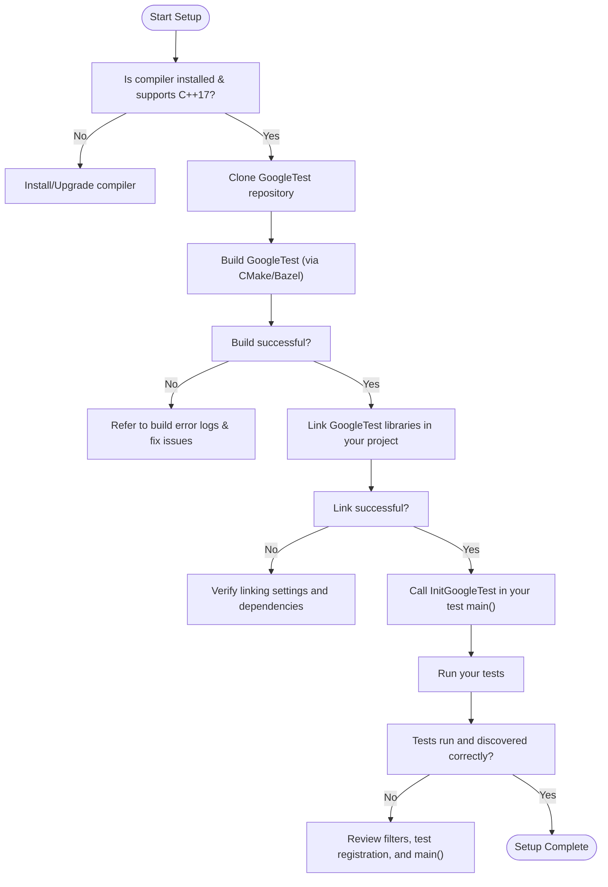

# Troubleshooting Common Issues

GoogleTest is a widely used, powerful C++ testing framework, but new users may occasionally encounter problems during setup, build, or configuration. This guide focuses specifically on common issues encountered during the installation and configuration phases. Whether your build is failing, dependencies are missing, or you're struggling with platform-specific quirks, this page will help you identify and resolve the most frequent setup and configuration errors.

---

## 1. Build Failures

### Symptoms
- Build commands fail with errors related to missing headers, libraries, or undefined symbols.
- Compilation halts with errors like "file not found", "symbol not found", or linker errors.

### Causes & Solutions
- **Missing or incompatible compiler:** GoogleTest requires a C++ compiler supporting at least the C++17 standard. Check your compiler version.

  ```bash
  # Example; check version for gcc
  gcc --version
  clang --version
  ```

- **Incorrect build system configuration:** When integrating via CMake or Bazel, ensure that GoogleTest is properly cloned and added as a dependency.

  - For CMake, verify correct inclusion of `add_subdirectory(googletest)` and linking with `gtest` or `gtest_main`.
  - For Bazel, confirm workspace and BUILD files are correctly set.

- **Incomplete source tree:** Ensure that all GoogleTest source files, including third_party directories if applicable, are present.

- **Platform-specific configuration:** On Windows, check for missing Windows SDK or Visual Studio components. On Linux, install essential packages such as build-essential.

### Troubleshooting Tips
- Enable verbose build output to trace the problem:

  ```bash
  cmake --build . -- VERBOSE=1
  ```

- Examine the first error message — often subsequent errors are cascading failures.
- Confirm environment variables (e.g., `PATH`, `INCLUDE`, `LIB`) point correctly to compilers and dependent libraries.

## 2. Missing Dependencies

### Symptoms
- Errors about missing files like `<gtest/gtest.h>` or `libgtest.a`.

### Causes & Solutions
- **GoogleTest not cloned or linked correctly:** Ensure you have cloned the GoogleTest repository and that your project references it properly.

- **Build artifacts not created:** GoogleTest requires building its own static or shared libraries before use.

- **CMake or Bazel cache issues:** Sometimes stale build caches cause the build system not to recognize new additions.

### Steps to Resolve
1. Clone GoogleTest repository properly:

   ```bash
   git clone https://github.com/google/googletest.git
   ```

2. Build GoogleTest:

   - Using CMake:
     ```bash
     cd googletest
     mkdir build && cd build
     cmake ..
     cmake --build .
     ```

3. Link your tests or projects against the built GoogleTest libraries (`libgtest.a`, `libgtest_main.a`).
4. If integrating via CMake, use `target_link_libraries(your_test gtest gtest_main)`.

5. Clean your build directories and re-run to clear stale caches.

## 3. Platform-Specific Pitfalls

### Windows
- Ensure that you are using a supported Visual Studio version with C++17 enabled.
- When building with MSVC, disable incompatible flags or resolve MSVC-specific warnings or errors.
- Check for Unicode build issues; GoogleTest supports both narrow and wide string modes.

### Linux
- Ensure required packages like `build-essential`, `cmake`, and `git` are installed.
- Watch out for differences in GCC versions and default C++ standards; explicitly set C++17 in your build files.

### macOS
- Ensure Command Line Tools for Xcode are installed.
- Watch for linker errors related to missing frameworks.

## 4. Typical Configuration Errors

### Symptoms
- Tests compile but fail to run due to configuration errors.
- Tests do not discover any test cases.
- GoogleTest output does not appear as expected.

### Causes & Solutions
- **Not calling `testing::InitGoogleTest(&argc, argv)`:** This initialization function parses command-line flags and must be called before `RUN_ALL_TESTS()`.

- **Incorrect filter flags:** The `--gtest_filter` flag can limit which tests run. If misused, you might see zero tests running.

- **Missing or incorrect test registration:** If tests are defined but never instantiated (in the case of parameterized tests), they won't run.

- **Flags that disable test output or skip tests:** Check for flags like `--gtest_brief`, `--gtest_list_tests`, or `--gtest_also_run_disabled_tests`.

### How to Verify Configuration
- Run tests with no filters to ensure tests are discovered.

  ```bash
  ./your_test_binary
  ```

- List tests without running them:

  ```bash
  ./your_test_binary --gtest_list_tests
  ```

- Use `--gtest_filter=*` to ensure all tests are run.

- Use verbose output for test runs.

## 5. Best Practices for Avoiding Setup Issues

- **Use supported build tools and compilers:** CMake 3.x or Bazel with corresponding versions.
- **Perform a clean build after any configuration change:** To prevent stale artifacts.
- **Run the example tests included with GoogleTest:** These verify your environment setup.
- **Consult `Prerequisites & System Requirements` and `Installation & Integration` guides:** For your platform-specific instructions and limitations.

## 6. Additional Resources

- See the [Installation (CMake & Bazel)](/getting-started/setup-prerequisites-installation/installation-integration) for detailed setup and integration instructions.
- Use the [Configuration & Validation](/getting-started/setup-prerequisites-installation/configuration-validation) for checking your installation correctness.
- For building and linking issues specific to your environment, consult [Build and Link Issues](/faq/troubleshooting-advanced/build-link-issues).

## 7. Troubleshooting Flowchart



---

## 8. Troubleshooting Tips

### Case: Tests Do Not Run or No Tests Found
- Verify you called `testing::InitGoogleTest(&argc, argv)` before `RUN_ALL_TESTS()`.
- Check for parameters like `--gtest_filter` restricting which tests run.
- Make sure your tests are properly marked, not disabled or skipped.
- If using parameterized tests, verify the test suite is correctly instantiated.

### Case: Build Fails with Missing Headers or Libraries
- Confirm GoogleTest is cloned and built correctly.
- Check that include directories and library paths are passed to your build system.
- Clean and rebuild after updating dependencies or configuration.

### Case: Linker Errors on Windows
- Use Visual Studio Developer Command Prompt or proper environment setup.
- Verify the runtime libraries used are consistent (static vs dynamic).

### Case: Custom Assertion Failures or Unexpected Failures
- Check your test logic carefully.
- Use GoogleTest’s rich assertion macros to get detailed failure messages.

---

By methodically following these troubleshooting steps and verifying configurations, newly onboarded users can quickly resolve common obstacles and benefit fully from GoogleTest's powerful capabilities.

---

## References

- [GoogleTest Installation (CMake & Bazel)](/getting-started/setup-prerequisites-installation/installation-integration)
- [GoogleTest Configuration & Validation](/getting-started/setup-prerequisites-installation/configuration-validation)
- [GoogleTest Build and Link Issues](/faq/troubleshooting-advanced/build-link-issues)
- [GoogleTest Primer](/docs/primer.md)

---

For personalized support, visit the [GoogleTest GitHub repository](https://github.com/google/googletest) or consult the community forums linked in the main site.

---

<Check>
Ensure you always start your main test program with `InitGoogleTest()` to initialize flags.
</Check>
<Warning>
Avoid mixing build systems or compiler versions that do not meet the C++17 requirement.
</Warning>
<Note>
Use `--gtest_list_tests` to verify test discovery without running them.
</Note>
