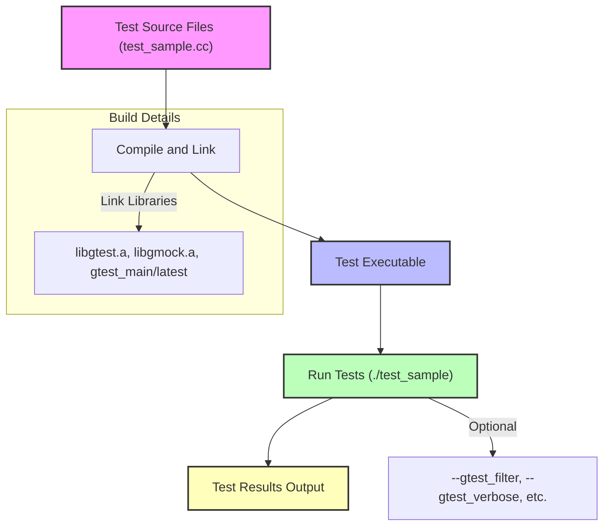

# Building & Running Tests

Welcome to this hands-on guide where you'll compile and run your first GoogleTest and GoogleMock tests. Here, we focus on practical examples that cover command-line builds and IDE workflows, helping you understand main entry points and typical build system setups.

---

## 1. Preparing Your Test Build

Before compiling, ensure your test code is properly set up with the necessary includes and linked libraries:

- Include `<gtest/gtest.h>` for GoogleTest functionality.
- Include `<gmock/gmock.h>` if you are using mocking features.
- Link against the GoogleTest and GoogleMock libraries (`gtest`, `gmock`, and optionally `gtest_main` or `gmock_main`).

Typically, your test source file will contain test cases and, optionally, a `main` function. GoogleTest provides a default `main()` in the `gtest_main` or `gmock_main` library for convenience.

### Example Test File Structure
```cpp
#include <gtest/gtest.h>
#include <gmock/gmock.h>

// Test fixture or mocks here

TEST(SampleTest, BasicAssertions) {
  EXPECT_EQ(1, 1);
}

// You may omit main() if linking with gtest_main or gmock_main
```

---

## 2. Building with Command-Line Tools

GoogleTest and GoogleMock work seamlessly with common build systems and manual compilation.

### Prerequisites
- Your environment must have a supported C++ compiler (GCC, Clang, MSVC) that supports C++11 or later.
- GoogleTest and GoogleMock source or libraries must be available.

### Step-by-Step Example Using g++
Assuming you have installed or cloned GoogleTest and GoogleMock sources:

<Steps>
<Step title="Compile GoogleTest and GoogleMock">
1. Build GoogleTest and GoogleMock static libraries (e.g., `libgtest.a`, `libgmock.a`).
2. Follow your platform or distribution instructions. For example:

```bash
cd /path/to/googletest
mkdir build && cd build
cmake ..
make
```

3. This produces the libraries you will link against.
</Step>

<Step title="Compile your test program">
Compile your test source file together with flags pointing to GoogleTest and GoogleMock include and library paths:

```bash
g++ -std=c++11 -isystem /path/to/googletest/include \
    -pthread test_sample.cc \
    /path/to/googletest/build/lib/libgtest.a \
    /path/to/googletest/build/lib/libgmock.a \
    -o test_sample
```

- Replace `/path/to/googletest` with the actual path.
- Use `-pthread` to enable threading support (required on Linux).
</Step>

<Step title="Run your tests">
Execute the test binary:

```bash
./test_sample
```

Expected output:

```
Running main() from ...
[==========] Running 1 test from 1 test suite.
[----------] Global test environment set-up.
[----------] 1 test from SampleTest
[ RUN      ] SampleTest.BasicAssertions
[       OK ] SampleTest.BasicAssertions (0 ms)
[----------] 1 test from SampleTest (0 ms total)
[----------] Global test environment tear-down
[==========] 1 test from 1 test suite ran. (0 ms total)
[  PASSED  ] 1 test.
```

</Step>
</Steps>

### Troubleshooting Tips
- **Linker errors about undefined symbols:** Confirm the correct order and paths for `libgtest.a` and `libgmock.a`. Check that you link all necessary libraries.
- **Missing pthread symbols on Linux:** Add `-pthread` flag during compile and link.
- **Test binary not running or no output:** Verify your test source has test definitions and that `main()` function is present or linked in.

---

## 3. Building with Common IDEs

Many popular IDEs (Visual Studio, CLion, Xcode) facilitate GoogleTest integration.

### Visual Studio
1. Set up a new C++ project.
2. Add GoogleTest and GoogleMock source files or link prebuilt libraries.
3. Include `gtest/include` and `gmock/include` in your project's include directories.
4. Configure your linker to include GoogleTest and GoogleMock libraries.
5. Build and run. Visual Studio Test Explorer usually detects GoogleTest tests automatically.

### CLion
1. Use CMake integration. A typical CMakeLists.txt snippet:

```cmake
find_package(GTest REQUIRED)
include_directories(${GTEST_INCLUDE_DIRS})
add_executable(test_sample test_sample.cc)
target_link_libraries(test_sample ${GTEST_LIBRARIES} ${GMOCK_LIBRARIES} pthread)
```

2. Build and run from within CLion.

### Xcode
1. Add GoogleTest as a subproject or use built static libraries.
2. Add include and library search paths.
3. Link against `libgtest.a`, `libgmock.a`.
4. Build and run test target.

<Tip>
Refer to your IDE’s documentation for specific GoogleTest templating or integration plugins that simplify test discovery and execution.
</Tip>

---

## 4. Understanding Main Entry Points

GoogleTest and GoogleMock provide default `main()` implementations in `gtest_main` and `gmock_main` libraries:

- **Use default main:** Link your tests with `gtest_main` or `gmock_main` to avoid writing `main()` yourself.
- **Custom main:** If you require special setup or integrations, provide your own `main()` that calls:

```cpp
int main(int argc, char **argv) {
  testing::InitGoogleTest(&argc, argv);
  return RUN_ALL_TESTS();
}
```

- **GoogleMock:** If you use mocking features, use `testing::InitGoogleMock(&argc, argv);` instead to initialize both frameworks.

---

## 5. Sample Build System Setup

Here is an example CMakeLists.txt snippet for GoogleTest and GoogleMock:

```cmake
cmake_minimum_required(VERSION 3.10)
project(MyTests)

find_package(GTest REQUIRED)

include_directories(${GTEST_INCLUDE_DIRS} ${GMOCK_INCLUDE_DIRS})

add_executable(test_sample test_sample.cc)
target_link_libraries(test_sample GTest::gtest GTest::gtest_main GMock::gmock GMock::gmock_main pthread)

enable_testing()
add_test(NAME MyTest COMMAND test_sample)
```

Adjust paths as necessary if you use the bundled or external GoogleTest installation.

---

## 6. Running Your Tests

After successful build, just run your test executable:

```bash
./test_sample
```

You will see detailed output about tests run, passed, failed, or skipped.

To run a specific test:

```bash
./test_sample --gtest_filter=SampleTest.BasicAssertions
```

To increase verbosity:

```bash
./test_sample --gtest_verbose=info
```

Use `--help` to explore all command-line options.

---

## 7. Troubleshooting Common Issues

<AccordionGroup title="Common Build and Run Issues">
<Accordion title="Linker Errors" >
- Make sure you have linked `libgtest.a` and `libgmock.a`.
- Provide `-pthread` on Linux/macOS.
- Check library order if using gcc/clang.
</Accordion>
<Accordion title="Test Binary Runs but No Tests Detected" >
- Verify test cases are defined using `TEST()` or `TEST_F()`.
- Ensure your test source files are compiled and linked into the binary.
- Check GoogleTest initialization call.
</Accordion>
<Accordion title="Tests Fail to Run or Crash" >
- Make sure your `main()` function calls `InitGoogleTest` or `InitGoogleMock` before `RUN_ALL_TESTS()`.
- Check for exceptions or errors in test setup.
</Accordion>
</AccordionGroup>

---

## 8. Next Steps

Having built and run your tests:

- Explore writing your first test cases using the [Writing Your First Test](./creating-first-test.md) guide.
- Learn to configure test environments with [Configuration Basics](./configuration-basics.md).
- Dive deeper into mocking features with [Using GoogleMock](../guides/advanced-testing-patterns/using-gmock.md).

<Tip>
Consistently run your tests as part of your development cycle to catch bugs early and validate code changes.
</Tip>

---

# Summary Diagram of Typical Build & Run Workflow


