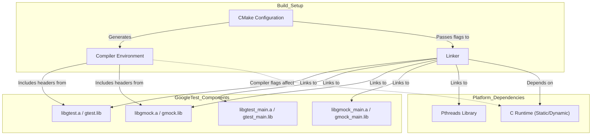

# Troubleshooting Setup Issues

This guide walks you through diagnosing and resolving common installation and configuration problems encountered when setting up GoogleTest and GoogleMock. Whether you face linker errors, missing dependencies, or compiler compatibility issues, here you will find practical solutions backed by clear instructions to get your testing environment operational.

---

## 1. Common Installation and Configuration Problems

### 1.1 Linker Errors

**Symptom:** Linking fails with errors related to missing symbols, such as undefined references to `RUN_ALL_TESTS()`, GoogleMock symbols, or threading libraries.

**Typical causes:**
- Missing or incorrect linkage to GoogleTest or GoogleMock libraries.
- Incompatible runtime linkage on Windows (static vs dynamic CRT).
- Failure to link with pthread library on POSIX systems when thread support is enabled.

---

### 1.2 Missing Dependencies

**Symptom:** Build or runtime errors indicating missing headers, libraries, or features such as pthread support.

**Typical causes:**
- System or compiler does not support C++17, required to build GoogleTest.
- `pthreads` not installed or not linked correctly on Unix-like systems.
- Build environment misconfigured, e.g., CMake cache stale or wrong include/library paths.

---

### 1.3 Compiler Compatibility Issues

**Symptom:** Compilation failures or warnings about deprecated features, macros conflicts, or standard version mismatches.

**Typical causes:**
- Using an outdated or unsupported compiler that lacks full C++17 support.
- Conflicting preprocessor macros or include orders.
- Mixing debug/release or static/dynamic runtimes on Windows leading to ABI incompatibility.

---

## 2. Diagnosing and Resolving Issues

Follow the steps below to pinpoint your setup problem and fix it efficiently.

### Step 1: Verify System and Compiler Requirements

- Ensure your compiler supports C++17. For example, GCC 7+, Clang 5+, MSVC 2017 (version 15.7) or newer.
- Confirm system has pthreads available if running on a POSIX platform.
- Confirm your build environment has internet access if fetching Googletest with CMake.

**Tip:** Use `g++ --version` or `clang++ --version` to check compiler.

---

### Step 2: Confirm Build Configuration

- If using CMake, configure with:

```bash
cmake ..
```

or for building only GoogleTest:

```bash
cmake .. -DBUILD_GMOCK=OFF
```

- For Windows with Visual Studio, make sure to set `gtest_force_shared_crt=ON` in your CMake configuration to avoid runtime conflicts:

```bash
cmake .. -Dgtest_force_shared_crt=ON
```

- Make sure to clean the build directory to avoid stale configuration issues:

```bash
rm -rf *
cmake ..
```

---

### Step 3: Review Linkage and Library Paths

- Ensure your executable links against the appropriate libraries:

  - `gtest` or `gtest_main` for GoogleTest
  - `gmock` or `gmock_main` for GoogleMock

- Check that your linker command includes `-lpthread` on Linux/macOS if using pthread features.
- If using pkg-config, verify that `gmock_main.pc` and related `.pc` files have correct `Libs` and `Cflags`:

```shell
pkg-config --cflags gmock_main
pkg-config --libs gmock_main
```

Example snippet from `gmock_main.pc.in`:

```
Libs: -L${libdir} -lgmock_main @CMAKE_THREAD_LIBS_INIT@
Cflags: -I${includedir} @GTEST_HAS_PTHREAD_MACRO@
```

This shows threading support flags can be injected during installation.

---

### Step 4: Inspect Compiler Flags and Macros

- Ensure no conflicting macros cause trouble, especially on Windows where `UNICODE` and `_tmain` linkage can cause build errors.
- By default, GoogleTest uses `main()`, not `_tmain()`, to avoid MSVC linker bugs.
- Avoid redefining GoogleTest macros unless purposely disabling them (e.g., avoid `-DGTEST_DONT_DEFINE_TEST=1` unless intentional).

---

### Step 5: Validate Your Main Function and Initialization

- If you use your own `main()`, initialize GoogleTest or GoogleMock properly:

```cpp
int main(int argc, char **argv) {
  testing::InitGoogleTest(&argc, argv);
  return RUN_ALL_TESTS();
}
```

- Alternatively, link with `gtest_main` or `gmock_main` libraries, which provide their own `main()`.

- Check your test runner output for messages like “Running main() from gtest_main.cc” to confirm correct runner used.

---

## 3. Troubleshooting Examples and Solutions

### 3.1 Linker Errors on Windows

**Error:**

```
LNK2038: mismatch detected for 'RuntimeLibrary'
```

**Solution:**

- Add `-Dgtest_force_shared_crt=ON` to your CMake options to align runtime linkage.

- Clean cached build files and rebuild all.

---

### 3.2 Undefined Reference to RunAllTests

**Error:**

```
undefined reference to `RUN_ALL_TESTS()`
```

**Solution:**

- Link your test executable with `-lgtest_main` or provide your own `main()` implementing `RUN_ALL_TESTS()`.

- Confirm you include and link GoogleTest properly.

---

### 3.3 Missing Pthread Symbols on Linux/macOS

**Error:**

```
undefined reference to `pthread_create`
```

**Solution:**

- Add `-pthread` to your compiler and linker flags.

- If using CMake, it should set this automatically, but verify with `CMAKE_THREAD_LIBS_INIT`.

---

### 3.4 Compiler Does Not Support C++17

**Error:**

```
error: ‘auto’ not allowed in range-based for loop
```

**Solution:**

- Upgrade your compiler to one supporting C++17.

- Explicitly set C++ standard in your CMakeLists.txt:

```cmake
set(CMAKE_CXX_STANDARD 17)
set(CMAKE_CXX_STANDARD_REQUIRED ON)
```

---

## 4. Additional Tips and Best Practices

- Use the standalone CMake build of GoogleTest unless you need a combined build for your project.
- Always clean your build directory when switching between versions or changing key build flags.
- Use `pkg-config` or CMake's `find_package` to automate locating libraries and dependencies.
- On embedded or special platforms (e.g., ESP8266, ESP32), GoogleTest's `main()` is replaced by `setup()` and `loop()` functions; ensure correct platform macros are defined.
- Check GoogleTest's verbose/debug flags if you want detailed logs on test initialization.

---

## 5. When to Seek Further Help

If you have followed these steps and still encounter issues:

- Review the [Supported Platforms & Requirements](https://github.com/google/googletest/blob/main/docs/prerequisites-installation/supported-platforms-requirements.md) page.
- Check the [Build, Integration, and Compatibility FAQ](https://github.com/google/googletest/blob/main/faq/troubleshooting/build-integration-faq.md).
- Consult community forums or GoogleTest's GitHub issues.

---

## 6. Summary Diagram of Setup Components and Relationships



---

By following this guide, you will be able to systematically resolve setup problems and have a reliable, working GoogleTest and GoogleMock environment for your C++ test development.


---

# Troubleshooting Quick Checklist

| Problem                | Checkpoint                                                   | Solution Reference Section |
|------------------------|--------------------------------------------------------------|----------------------------|
| Linker errors          | Link against correct GoogleTest/GoogleMock libs and pthreads | Section 2, Step 3           |
| Missing dependencies   | Ensure pthreads and C++17 support present                     | Section 2, Step 1           |
| Compiler errors        | Verify compiler version and C++ standard flags                | Section 2, Step 1 & 4       |
| Windows runtime mismatch| Use `gtest_force_shared_crt=ON` option                        | Section 3.1                 |
| No main function       | Link with `gtest_main` or provide own main()                  | Section 2, Step 5           |


---

# Related Documentation

- [Supported Platforms & Requirements](getting-started/prerequisites-installation/supported-platforms-requirements)
- [Installing with CMake and Bazel](getting-started/prerequisites-installation/installing-with-cmake-bazel)
- [Create Your First Test](getting-started/first-test-validation/create-your-first-test)
- [Running Tests](getting-started/first-test-validation/running-tests)
- [Build, Integration, and Compatibility FAQ](faq/troubleshooting/build-integration-faq)

---

# Getting Additional Help

If you continue to experience setup difficulties, visit the [GoogleTest support resources](faq/community-support/support-resources-faq) or ask questions on public forums such as Stack Overflow with the `googletest` tag.

---

<Check>
Ensure you have read this entire troubleshooting checklist before raising issues.
Search existing GitHub issues and FAQs first to avoid duplication.
</Check>

---