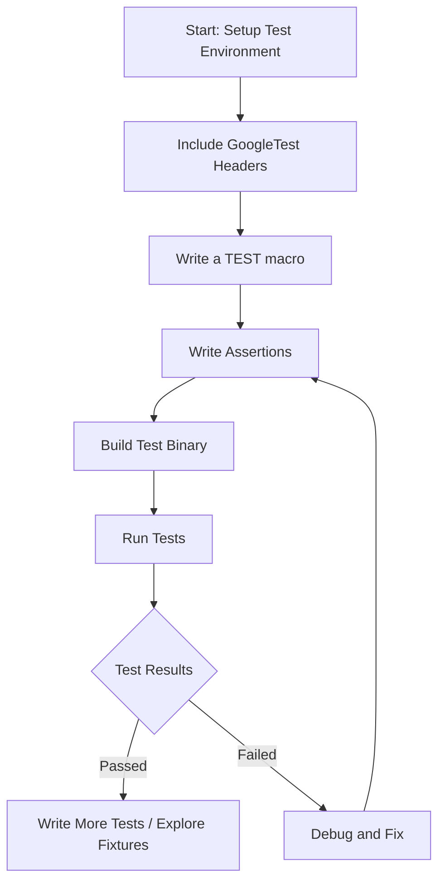

# Writing Your First Test

Welcome to the initial step of mastering GoogleTest. This guide walks you through writing your first simple test, introducing the core syntax and best practices so you can succeed immediately with concise code and a clear outcome.

---

## 1. Prerequisites & Environment Setup

Before you start writing your first test, ensure your environment meets the following requirements:

- **Compiler**: A modern C++17-compliant compiler (e.g., GCC 7+, Clang 5+, MSVC 2017+).
- **GoogleTest and GoogleMock Installed**: Ensure GoogleTest and GoogleMock libraries are installed and accessible in your build environment.
- **Build System Ready**: Ability to compile and link C++ code with GoogleTest; e.g., CMake or Bazel configured for your project.
- **Basic C++ Knowledge**: Familiarity with writing and compiling C++ code.

<Tip>
If you have not installed GoogleTest yet, see the [Installing with CMake](https://github.com/google/googletest/blob/main/docs/installation.md#installing-with-cmake) or [Installing with Bazel](https://github.com/google/googletest/blob/main/docs/installation.md#installing-with-bazel) guides.
</Tip>

---

## 2. Creating Your First Test Case

Follow these steps to create a simple test that checks a basic condition using GoogleTest.

### Step 1: Include GoogleTest Headers
In your test source file, include GoogleTest headers as follows:

```cpp
#include <gtest/gtest.h>
```

### Step 2: Write a Simple TEST Macro
The simplest test is written using the `TEST` macro:

```cpp
TEST(SampleTestSuite, BasicTest) {
  // Expect that true is true.
  EXPECT_TRUE(true);
}
```

- `SampleTestSuite` is the name of the test suite (a logical grouping).
- `BasicTest` is the test name.
- Inside the braces `{}`, you write one or more assertions.

### Step 3: Assertions to Check Conditions
GoogleTest provides various assertions. Here are a few simple ones:

- `EXPECT_EQ(val1, val2)` - Expects `val1 == val2`
- `EXPECT_NE(val1, val2)` - Expects `val1 != val2`
- `EXPECT_TRUE(condition)` / `EXPECT_FALSE(condition)` - Boolean checks

Example:

```cpp
TEST(SampleTestSuite, EqualityTest) {
  int sum = 2 + 2;
  EXPECT_EQ(sum, 4) << "Sum should be 4";
}
```

### Step 4: Build Your Test
Compile the test source file together with GoogleTest and GoogleMock libraries.

Example CMakeLists.txt snippet:

```cmake
find_package(GTest REQUIRED)
include_directories(${GTEST_INCLUDE_DIRS})
add_executable(MyTest test_my_test.cc)
target_link_libraries(MyTest ${GTEST_LIBRARIES} pthread)
```

### Step 5: Run Your Test
Execute your compiled test binary. It will automatically discover and run all tests:

```bash
./MyTest
```

Expected output:

```plaintext
[==========] Running 2 tests from 1 test suite.
[----------] Global test environment set-up.
[----------] 2 tests from SampleTestSuite
[ RUN      ] SampleTestSuite.BasicTest
[       OK ] SampleTestSuite.BasicTest (0 ms)
[ RUN      ] SampleTestSuite.EqualityTest
[       OK ] SampleTestSuite.EqualityTest (0 ms)
[----------] 2 tests from SampleTestSuite (0 ms total)

[----------] Global test environment tear-down
[==========] 2 tests from 1 test suite ran. (0 ms total)
[  PASSED  ] 2 tests.
```

---

## 3. Understanding the Test Structure

GoogleTest tests consist of the following core components:

- **Test Suite**: A named group of related tests.
- **Test**: An individual test function defined by `TEST`.
- **Assertions**: Statements inside tests that check conditions.

The framework runs all tests in all suites by default and reports results.

---

## 4. Best Practices & Tips

- **Name Tests Clearly:** Choose clear test suite and test names to describe what is being tested.
- **Fail Early:** Use `ASSERT_*` assertions if failure should abort the current test to prevent invalid continuation.
- **Use EXPECT_* for Multiple Checks:** Use `EXPECT_*` when you want to continue with multiple checks even if an earlier one fails.
- **One Check per Test:** Ideally write tests that check a single logical condition.
- **Run Tests Frequently:** Confirm your tests pass after writing each new test.

<Tip>
If a test fails, the console output shows the file and line number for easy debugging.
</Tip>

---

## 5. Troubleshooting Common Issues

- **Tests Not Running:** Confirm you call `RUN_ALL_TESTS()` in your main() or link with `gtest_main`.
- **Linker Errors:** Check that GoogleTest libraries are linked correctly.
- **Compiler Errors:** Ensure your compiler supports C++17 or higher.
- **Tests Silently Skipped:** Verify test functions are named correctly with `TEST` macro.

<Note>
Writing a `main()` function for tests is optional if you link with `gtest_main`. Example main if needed:

```cpp
int main(int argc, char **argv) {
  ::testing::InitGoogleTest(&argc, argv);
  return RUN_ALL_TESTS();
}
```
</Note>

---

## 6. Next Steps

Now that you have successfully written and run your first test:

- Explore writing **test fixtures** using `TEST_F` to share setup across tests.
- Learn to mock dependencies using [GoogleMock](gmock_for_dummies.md).
- Deepen your understanding of assertions and matchers with [Using Assertions and Matchers](../guides/core-workflows/using-assertions-and-matchers).
- Explore writing parameterized tests.

For more examples and detailed explanations, visit the [GoogleTest Primer](primer.md) and [gMock for Dummies](gmock_for_dummies.md).

---

## 7. Sample Complete Test File

```cpp
#include <gtest/gtest.h>

// Tests that 1 + 1 equals 2.
TEST(MathTest, BasicAddition) {
  EXPECT_EQ(1 + 1, 2);
}

// Tests that true is true.
TEST(SampleTestSuite, TrueIsTrue) {
  EXPECT_TRUE(true);
}

int main(int argc, char** argv) {
  ::testing::InitGoogleTest(&argc, argv);
  return RUN_ALL_TESTS();
}
```

Running this file will execute both tests and report success.

---

# Additional Resources

- [GoogleTest Primer](primer.md) - Learn basic usage and test writing.
- [GoogleMock for Dummies](gmock_for_dummies.md) - Introduction to mocking with GoogleMock.
- [gMock Cookbook](gmock_cook_book.md) - Recipes and examples for advanced mocking.
- [Mocking Reference](reference/mocking.md) - Detailed API documentation.
- [GoogleTest User's Guide](docs/index.md) - Comprehensive GoogleTest overview.

---

### Summary Diagram



<Check>
This flow ensures you follow a user-centric approach to writing your first tests with immediate feedback.
</Check>
