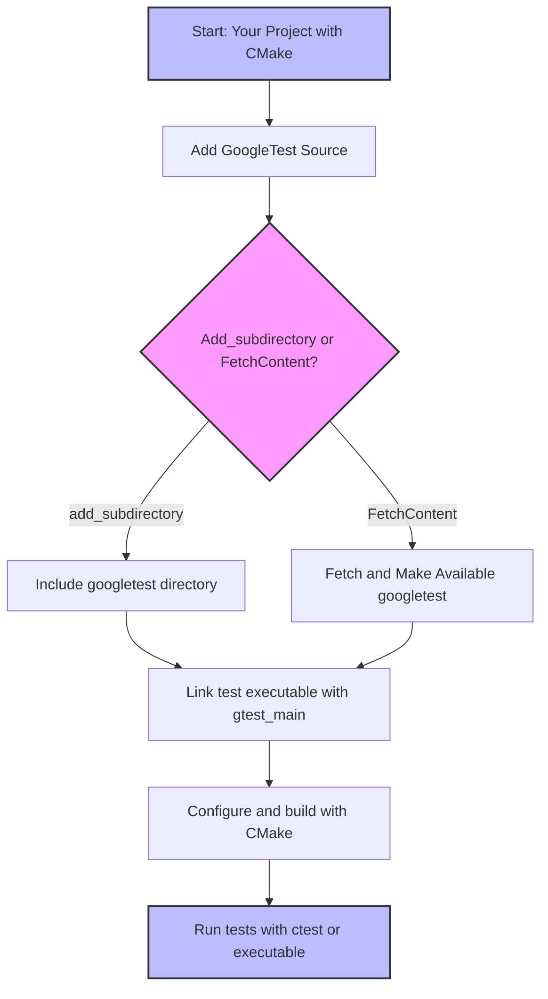

# Install with CMake

This guide provides a practical, step-by-step walkthrough for installing and integrating GoogleTest using CMake. You'll learn how to add GoogleTest as a subdirectory in your project, link to its libraries, and avoid common integration pitfalls to ensure a smooth build process.

---

## 1. Prerequisites

Before starting the installation, make sure your environment meets the following requirements:

- **CMake version**: 3.13 or higher (recommended 3.16+ for best compatibility).
- **C++ compiler**: Must support at least C++17 (as required by GoogleTest).
- **Build environment**: Compatible with your platform (Linux, macOS, Windows), including any IDE or command-line tools.

<Tip>
Confirm CMake is installed by running `cmake --version`.
</Tip>

---

## 2. Adding GoogleTest to Your CMake Project

The recommended way to use GoogleTest with CMake is to add its source code as a subdirectory in your project. This approach ensures that GoogleTest will be built using the same compiler and settings as your project, avoiding common compatibility issues.

### Step 1: Download or Include GoogleTest Source

- Option A: Clone the GoogleTest repository somewhere accessible:

  ```bash
  git clone https://github.com/google/googletest.git
  ```

- Option B: Use GoogleTest as a git submodule:

  ```bash
  git submodule add https://github.com/google/googletest.git external/googletest
  ```

- Option C: Use CMake's FetchContent to automatically download GoogleTest during your build configuration (recommended for modern CMake):

  ```cmake
  include(FetchContent)
  FetchContent_Declare(
    googletest
    URL https://github.com/google/googletest/archive/release-1.16.0.zip
  )
  # For Windows: Prevent overriding the parent project's compiler/linker settings
  set(gtest_force_shared_crt ON CACHE BOOL "" FORCE)
  FetchContent_MakeAvailable(googletest)
  ```

### Step 2: Add GoogleTest as a Subdirectory

If you have the source in your project tree or somewhere local, add this line in your root `CMakeLists.txt`:

```cmake
add_subdirectory(path/to/googletest)
```

Replace `path/to/googletest` with the relative path to the cloned GoogleTest source.

### Step 3: Link Your Test Targets Against GoogleTest

In your `CMakeLists.txt`, after adding GoogleTest, define your test executable and link it:

```cmake
add_executable(my_tests test/my_tests.cpp)
target_link_libraries(my_tests PRIVATE gtest_main)
```

- Use `gtest_main` to link GoogleTest’s main() function, so you don't have to define your own.
- Alternatively, link `gtest` if you provide your own `main()`.

### Step 4: Enable Testing and Add Your Tests

Enable CTest and register your test executable:

```cmake
enable_testing()
add_test(NAME MyTestSuite COMMAND my_tests)
```

---

## 3. Building and Verifying the Installation

### Step 1: Create a Build Directory

Always build outside of the source tree:

```bash
mkdir build
cd build
```

### Step 2: Configure Your Project

Run CMake to generate build files:

```bash
cmake ..
```

If you use FetchContent and specify options, include those here.

### Step 3: Build Your Project

```bash
cmake --build .
```

On Unix-like systems, this usually invokes `make` or Ninja.

### Step 4: Run Your Tests

```bash
ctest
```

or execute your test binary directly:

```bash
./my_tests
```

You should see output indicating test execution results.

<Check>
If tests do not run or GoogleTest is not found:
- Verify the path in `add_subdirectory` is correct.
- Confirm GoogleTest source is present.
- Ensure you link `gtest_main` or `gtest` properly.
</Check>

---

## 4. Advanced Configuration Tips

### Forcing Dynamic Runtime on Windows

By default, GoogleTest links the CRT statically on Windows, which may conflict with your project if it uses dynamic CRT. Enable this option before including GoogleTest:

```cmake
set(gtest_force_shared_crt ON CACHE BOOL "" FORCE)
```

Place this line before the `add_subdirectory(googletest)` or FetchContent commands.

### Disabling GoogleTest's Own Tests and Samples

To speed up build or simplify integration, disable building GoogleTest's internal tests and samples:

```cmake
option(gtest_build_tests "Build GoogleTest's internal tests" OFF)
option(gtest_build_samples "Build GoogleTest example programs" OFF)
```

### Using pkg-config with CMake

If you installed GoogleTest system-wide, you can use pkg-config in your CMakeLists.txt:

```cmake
find_package(PkgConfig REQUIRED)
pkg_check_modules(GTEST REQUIRED gtest_main)

add_executable(my_tests test/my_tests.cpp)
target_compile_options(my_tests PRIVATE ${GTEST_CFLAGS})
target_link_libraries(my_tests PRIVATE ${GTEST_LDFLAGS})
```

<Tip>
Set `PKG_CONFIG_PATH` environment variable to point to the directory containing GoogleTest's `.pc` files if pkg-config cannot find GoogleTest.
</Tip>

---

## 5. Common Pitfalls and Troubleshooting

<AccordionGroup title="Common Issues with CMake Integration">
<Accordion title="GoogleTest Not Found or Linked Correctly">
- Ensure the `add_subdirectory` command uses the correct path.
- Make sure your test target links explicitly with `gtest` or `gtest_main`.
- Check for typos in target names; it is `gtest`, not `gtest_main` if providing your own main.
</Accordion>

<Accordion title="Runtime Library Mismatch on Windows with MSVC">
- This happens when your project uses dynamic CRT but GoogleTest builds with static CRT.
- Fix by setting `gtest_force_shared_crt` to ON before adding GoogleTest.
</Accordion>

<Accordion title="Pthread Link Errors on Unix-like Systems">
- GoogleTest uses pthreads if available.
- Make sure to link your test executable properly, ideally via targets that propagate pthread linkage.
- When writing custom build scripts, include `-pthread`.
</Accordion>

<Accordion title="Build Slow or Includes GoogleTest Tests You Don’t Need">
- Disable GoogleTest’s own tests and samples by setting `gtest_build_tests` and `gtest_build_samples` to OFF.
</Accordion>
</AccordionGroup>

---

## 6. Summary Diagram



---

## 7. Additional Resources

- [GoogleTest Primer](primer.md): Learn how to write your first tests after setup.
- [Integration with Build and CI Systems](overview/integration-adoption/integration-workflow.mdx): For incorporating GoogleTest into larger workflows.
- [Platform-specific Notes](getting-started/installation/platform-specific-notes.mdx): Address OS-specific issues.
- [Using pkg-config with GoogleTest](docs/pkgconfig.md): Explore alternative build system support.

---

## 8. Getting Help

If you encounter issues:

- Verify your environment meets prerequisites.
- Consult the [Common Setup Issues](getting-started/support/common-setup-issues.mdx) page.
- Reach out via community support channels linked in [Getting Help & Further Resources](getting-started/support/finding-help.mdx).

---

By following these steps, you will have successfully installed and integrated GoogleTest into your CMake project, ready to write and run your first tests in a fully compatible and maintainable way.
