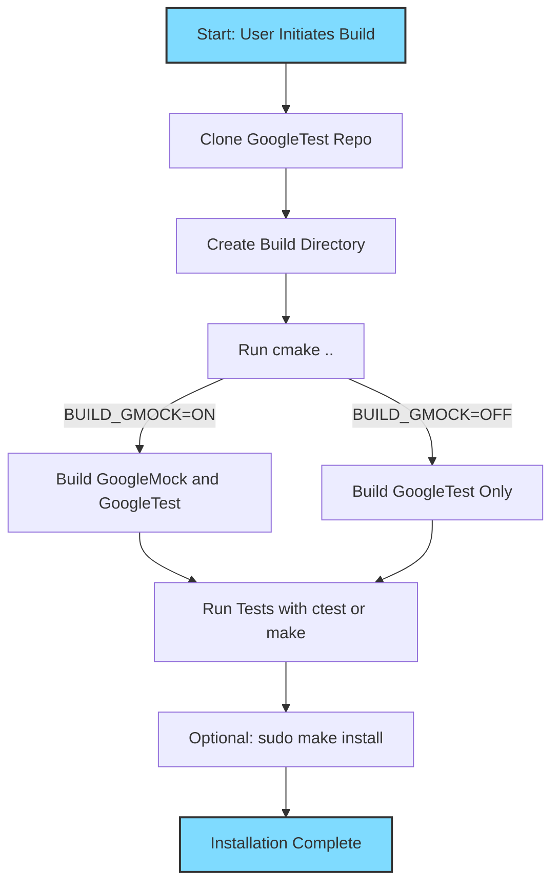

# Installation Methods for GoogleTest and GoogleMock

This guide leads you through practical workflows to install GoogleTest and GoogleMock, covering standalone projects, integrated builds, and dependency management. Whether you want a quick standalone setup or need to integrate the frameworks into an existing CMake project, you'll find step-by-step instructions here.

---

## 1. Prerequisites & Environment Setup

Before you begin installation, ensure your system meets these requirements:

- **C++17 Standard Support:** Your compiler and toolchain must support C++17 or later.
- **Build Tools:** Have CMake (3.13 or newer recommended) installed for cross-platform build configuration.
- **Operating System:** Supported on Linux, Windows, macOS, and various embedded platforms.
- **Threading Support:** Confirm your environment’s pthread support if running multi-threaded tests.

<Info>
Refer to the [Prerequisites & Supported Platforms](https://docs.example.com/getting-started/prereqs-installation/prerequisites) page for detailed environment verification and setup tips.
</Info>

---

## 2. Installing via CMake

Most users will install GoogleTest and GoogleMock using CMake due to its wide platform support and seamless integration.

### 2.1. Standalone Installation (Including GoogleMock)

This method creates an isolated build of GoogleTest and GoogleMock you can use independently.

<Steps>
<Step title="Clone the Repository">
Open your terminal and clone the GoogleTest repository (which includes GoogleMock) at the desired release version:

```bash
git clone https://github.com/google/googletest.git -b v1.17.0
cd googletest
```
</Step>
<Step title="Create a Build Directory">
Create and enter a directory where all build outputs will be generated:

```bash
mkdir build
cd build
```
</Step>
<Step title="Configure the Build with CMake">
Generate native build files with CMake.

```bash
cmake ..
```

This command configures GoogleTest with GoogleMock enabled by default.

<Note>
If you want to build **only GoogleTest** without GoogleMock, run:

```bash
cmake .. -DBUILD_GMOCK=OFF
```
</Note>
</Step>
<Step title="Build the Libraries">
Execute the build command based on your platform:

- On Linux/macOS:

```bash
make
```

- On Windows with Visual Studio:

Open the generated solution file (`gtest.sln`) and build the solution.

- On macOS with Xcode:

Open the `.xcodeproj` file and build.
</Step>
<Step title="(Optional) Install the Libraries">
Optionally, install the headers and binaries system-wide (typically requires admin privileges):

```bash
sudo make install
```

This installs into `/usr/local/` by default.
</Step>
</Steps>

<Tip>
Building and installing GoogleMock alongside GoogleTest allows you to use rich mock features immediately in your projects.
</Tip>

### 2.2. Incorporate into Your Existing CMake Project

For seamless integration and consistent compiler settings, build GoogleTest and GoogleMock as part of your own CMake build.

<Steps>
<Step title="Add GoogleTest as a Subdirectory">
Add the following lines to your `CMakeLists.txt`:

```cmake
include(FetchContent)
FetchContent_Declare(
  googletest
  URL https://github.com/google/googletest/archive/5376968f6948923e2411081fd9372e71a59d8e77.zip
)
set(gtest_force_shared_crt ON CACHE BOOL "" FORCE)  # For Windows dynamic runtime compatibility
FetchContent_MakeAvailable(googletest)
```
</Step>
<Step title="Link Your Test Targets with GoogleTest and GoogleMock">
In your build configuration for your test executable, link to the libraries:

```cmake
add_executable(your_tests test_main.cpp other_tests.cpp)
target_link_libraries(your_tests gtest_main gmock_main)
```

This ensures your test targets have access to GoogleTest and GoogleMock functionality.
</Step>
</Steps>

<Note>
This approach requires CMake 3.14 or later due to `FetchContent_MakeAvailable()`.
</Note>

---

## 3. Alternative Build Systems (Overview)

While this document focuses on CMake, users integrating GoogleTest and GoogleMock in Bazel-based or manual build workflows should consult the respective build system instructions:

- **Bazel:** Use Bazel WORKSPACE and BUILD files to fetch and link GoogleTest and GoogleMock rules.
- **Manual Builds:** Download source, compile `gtest-all.cc` and `gmock-all.cc`, link with your tests.

Refer to the [Integration Points](https://docs.example.com/overview/integration-platforms/integration-points) for detailed guidance on alternative build workflows.

---

## 4. Verification of Installation

After building, verify the installation success by running the supplied GoogleMock tests.

From your build directory (if built standalone):

```bash
ctest -R gmock_test
```

Or run the built test executable directly, for example:

```bash
./test/gmock_test
```

Successful test runs indicate a properly configured and functional installation.

---

## 5. Troubleshooting Common Issues

<Tip>
If you encounter build or linking errors:

- Ensure your compiler supports C++17 and required pthread libraries.
- Check that CMake properly detects pthread support.
- On Windows, use `-DGTEST_FORCE_SHARED_CRT=ON` to adjust runtime linkage.
- Confirm you have run `cmake ..` from a clean build directory.
- Inspect output logs for missing dependencies or permissions issues.
</Tip>

If tests are not running correctly:

- Verify you linked your tests with `gtest_main` and `gmock_main`.
- Confirm there are no conflicting definitions or incompatible compiler flags.

For further help, see the [Setup Troubleshooting](https://docs.example.com/getting-started/troubleshooting-faq/setup-troubleshooting) page.

---

## 6. Next Steps

Once installation is confirmed:

- Explore [Writing and Running Your First Test](https://docs.example.com/getting-started/quickstart-validation/hello-test) to start creating tests.
- Consult the [gMock Cookbook](https://google.github.io/googletest/gmock_cook_book.html) for practical mock examples.
- Dive into [Configuration Basics](https://docs.example.com/getting-started/prereqs-installation/configuration-basics) for environment tuning.

---

## References and Further Reading

- [GoogleMock README](https://github.com/google/googletest/blob/main/googlemock/README.md)
- [GoogleTest Generic Build Instructions](https://github.com/google/googletest/blob/main/googletest/README.md)
- [Integration Points Overview](https://docs.example.com/overview/integration-platforms/integration-points)
- [Installation Troubleshooting](https://docs.example.com/getting-started/troubleshooting-faq/setup-troubleshooting)


---

## Diagram: CMake Build & Installation Flow




---

*This completes the installation methods guide for GoogleTest and GoogleMock.*
