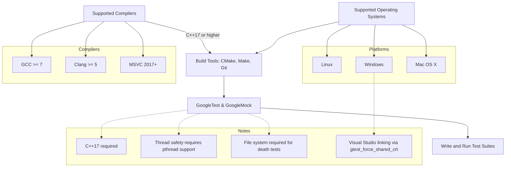

# System Requirements & Supported Platforms

Before you begin installing and using GoogleTest and GoogleMock, ensure that your development environment meets the minimum requirements. This will help avoid compatibility issues and make the integration smooth and efficient.

---

## 1. Minimum C++ Standard

GoogleTest requires your compiler and build environment to support **at least C++17**. This is essential as GoogleTest leverages modern C++ features for performance, maintainability, and user experience.

>**Tip:** Specify your C++ standard in your build configuration explicitly. For CMake, add:
>
>```cmake
>set(CMAKE_CXX_STANDARD 17)
>set(CMAKE_CXX_STANDARD_REQUIRED ON)
>```


## 2. Supported Compilers

GoogleTest and GoogleMock have been verified to work with these major compilers:

- **GCC**: Version 7 or later
- **Clang**: Version 5.0 or later
- **Microsoft Visual C++**: Visual Studio 2017 (MSVC 19.11) or later
- **Apple Clang**: Compatible versions on MacOS

>**Important:**
>- Visual C++ requires at least Visual Studio 2015 to compile GoogleMock.
>- Some compilers might emit warnings or errors on deprecated features; make sure you update to a supported compiler version.


## 3. Supported Operating Systems (Platforms)

GoogleTest is designed and tested to run seamlessly on the following platforms:

- **Linux** (various distributions)
- **Windows** (Desktop editions, MinGW)
- **Mac OS X** (including recent versions)

> GoogleTest supports cross-platform C++ testing with consistent behavior on all supported OSes.


## 4. Build Tools Requirements

To successfully build and integrate GoogleTest and GoogleMock into your projects, make sure you have the following build tools installed:

- **CMake** (version 3.14 or newer recommended)
  - Used for generating native build files
  - Supports building GoogleTest standalone or within your existing project

- **Make** or your platform’s native build system (Visual Studio MSBuild on Windows, Ninja, etc.)

- **Git** (optional but recommended)
  - For cloning the GoogleTest repository and managing versions

>**Tip:** GoogleTest also integrates well with popular build systems like Bazel.


## 5. Additional Environment Settings

- **Threading**: 
  - GoogleTest is fully thread-safe **only** if your platform supports pthreads or equivalent threading libraries.
  - For platforms without pthreads (some embedded or mobile platforms), thread-safety is limited.

- **File System**:
  - A standard file system is required for some GoogleTest features like death tests and output redirection.

- **Exception Handling**:
  - GoogleTest detects and adapts to whether exceptions are enabled in your build.
  - Exception support is recommended but not strictly mandatory.


## 6. Platform-Specific Notes

- On **Windows**, linking against the correct C runtime is important. Use the CMake option `gtest_force_shared_crt` to align runtimes between your application and GoogleTest.

- On **Mac OS**, make sure you're using a supported version of Apple Clang and have developer tools installed.

- On **Linux**, ensure you have a compatible compiler and standard libraries.


## 7. Verification: Check Your Environment

Run the following steps to verify your environment compatibility:

1. Confirm your compiler supports C++17 or later:

   ```bash
   g++ --version  # or clang++ --version
   ```

2. Check your CMake version:

   ```bash
   cmake --version
   ```

3. Verify that your OS is one of the supported platforms.

4. For Windows users, verify linking settings especially when using Visual Studio.


## 8. Troubleshooting Tips

- **Build Fails Due to Compiler Version:** Upgrade your compiler to meet the minimum C++17 standard.

- **Linker Errors on Windows:** Make sure `gtest_force_shared_crt` is set appropriately in CMake to avoid runtime library conflicts.

- **Missing Thread Support:** If your system has no pthreads, multi-threaded tests may be unsafe.

- **File System Issues on Embedded Platforms:** Some features such as death tests won't function without a filesystem.


## 9. Next Steps

Once your environment meets these requirements, proceed to:

- [Installation Methods (CMake, Bazel, Manual)](/getting-started/prerequisites-and-installation/installation-methods)
- [Configuring Your Project](/getting-started/configuration-and-first-run/project-setup)
- [Writing and Running Your First Test](/getting-started/configuration-and-first-run/first-test)


## 10. References & Resources

- [GoogleTest GitHub Repository](https://github.com/google/googletest)
- [CMake Official Website](https://cmake.org/)
- [GoogleMock Documentation Overview](googlemock/README.md)
- [GoogleTest Primer](docs/primer.md)

---

### Diagram: Platform and Tool Support Overview



---