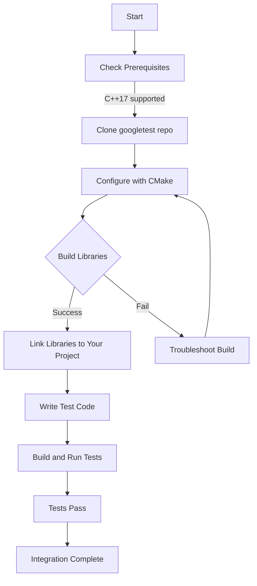

# Installation with CMake

This guide walks you through the complete process of installing GoogleTest and GoogleMock using the popular CMake build system. You'll learn how to fetch the source code, configure your project to use GoogleTest and GoogleMock, and follow best practices to integrate them seamlessly into your C++ projects.

---

## 1. Prerequisites & System Requirements

Before proceeding, ensure your environment meets the following requirements:

- **Operating System:** Linux, macOS, Windows supported.
- **C++ Compiler:** Must support at least C++17.
- **CMake Version:** 3.14 or higher is required to support `FetchContent` module.
- **Build Tools:** Compatible tools like Make, Ninja, or Visual Studio.

If these prerequisites are not met, refer to your platform's installation instructions for CMake and a C++17-compliant compiler.

<Check>
Ensure your compiler supports C++17. For GCC, version 7.0 or later is recommended.
</Check>

---

## 2. Fetching GoogleTest and GoogleMock Source Code

GoogleTest comes bundled with GoogleMock support by default.

### Clone the Repository

Execute the following in your terminal to clone the source code:

```bash
git clone https://github.com/google/googletest.git -b main
cd googletest
```

The `main` branch contains the latest stable sources.

### Directory Overview

- `googletest/` contains GoogleTest sources.
- GoogleMock is integrated alongside GoogleTest.

---

## 3. Configure Your CMakeLists.txt for GoogleTest and GoogleMock

You can integrate GoogleTest & GoogleMock into your project in two primary ways:

### A. Use Pre-Installed or System-Wide Libraries

If GoogleTest/GoogleMock are installed on your system,
use `find_package()` in your `CMakeLists.txt`:

```cmake
find_package(GTest REQUIRED)
# Link against both gtest and gmock libraries
target_link_libraries(your_target PRIVATE GTest::gtest GTest::gmock)
```


### B. Embed GoogleTest & GoogleMock via `FetchContent`

This is the recommended approach for dependency management.

Add the following snippet to your `CMakeLists.txt` to download and make GoogleTest available at configure time:

```cmake
include(FetchContent)
FetchContent_Declare(
  googletest
  URL https://github.com/google/googletest/archive/main.zip
)
# On Windows, prevent overriding compiler/linker settings of parent project.
set(gtest_force_shared_crt ON CACHE BOOL "" FORCE)
FetchContent_MakeAvailable(googletest)

# Now link with gtest and gmock targets
add_executable(your_test_target test_main.cpp)
target_link_libraries(your_test_target PRIVATE gtest gmock)
```

> Replace `your_test_target` and `test_main.cpp` with your own executable name and test source file.

---

## 4. Build GoogleTest and GoogleMock

### Step-by-step Build

From the root of the cloned directory or your project directory containing `CMakeLists.txt`:

```bash
mkdir -p build
cd build
cmake ..
cmake --build .
```

- This configures and compiles GoogleTest and GoogleMock.
- If you want to build only GoogleTest (without GoogleMock), run:

```bash
cmake .. -DBUILD_GMOCK=OFF
cmake --build .
```

### On Unix-like Systems

After build, you can optionally install system-wide (requires admin rights):

```bash
sudo make install
```

or on Windows with CMake generators and Visual Studio, open the generated solution and build.

---

## 5. Verifying the Installation

### Check Installed Libraries

- GoogleMock installs the following libraries:
  - `gmock` (mocking framework without main function)
  - `gmock_main` (mocking framework with a predefined main function)
- They are usually installed in `/usr/local/lib/` or your chosen prefix.
- Include files can be found under `include/gtest` and `include/gmock`.

### Simple Test Run

Create a sample test `hello_test.cpp`:

```cpp
#include <gtest/gtest.h>

TEST(HelloTest, BasicAssertions) {
  EXPECT_STRNE("hello", "world");
  EXPECT_EQ(7 * 6, 42);
}

int main(int argc, char **argv) {
  ::testing::InitGoogleTest(&argc, argv);
  return RUN_ALL_TESTS();
}
```

Compile and link with GoogleTest and GoogleMock libraries as shown above, then run the test executable. Expect the test to pass.

---

## 6. Best Practices for Integration

- When using GoogleMock:
  - Link against `gmock_main` to use the included main() that initializes testing.
  - For more control, link `gmock` + custom main() as needed.
- Always specify C++17 or higher standard in your `CMakeLists.txt`:

```cmake
set(CMAKE_CXX_STANDARD 17)
set(CMAKE_CXX_STANDARD_REQUIRED ON)
```

- Use the `gtest_force_shared_crt` flag on Windows projects to avoid runtime library conflicts.
- For bigger projects, consider adding `gtest_discover_tests()` for automatic test discovery with CTest:

```cmake
include(GoogleTest)
gtest_discover_tests(your_test_target)
```

- To build GoogleMock’s internal tests, set `-Dgmock_build_tests=ON` at configuration.

---

## 7. Troubleshooting Common Issues

### Common Pitfall: Missing pthreads on MinGW

GoogleTest disables pthreads on MinGW; if you see threading-related build errors, ensure you have proper threading support or disable pthread with `-DGTEST_HAS_PTHREAD=0`.

### Linker Errors on Windows

If you get runtime library mismatch errors (`LNK2038`), set `gtest_force_shared_crt` to ON before fetching content.

### Compiler Standard Not Set

Verify `CMAKE_CXX_STANDARD` is set to 17 or above to avoid compilation failures.

### Build Not Picking Up GoogleMock

Make sure you are linking against `gmock` or `gmock_main` and that these libraries have been properly built and included.

---

## 8. Additional Resources

- [GoogleTest Primer](primer.md) to write your first tests.
- [Mocking for Dummies](gmock_for_dummies.md) for learning mocking basics.
- [GoogleMock Reference](docs/reference/mocking.md) for detailed mock documentation.
- [Quickstart with CMake](docs/quickstart-cmake.md) for a full tutorial walkthrough.

---

By following this guide, you will have successfully installed and configured GoogleTest and GoogleMock using CMake and be ready to write and run your first C++ tests and mocks.

---

## Appendix: Sample Minimal `CMakeLists.txt`

```cmake
cmake_minimum_required(VERSION 3.14)
project(my_project)

set(CMAKE_CXX_STANDARD 17)
set(CMAKE_CXX_STANDARD_REQUIRED ON)

include(FetchContent)
FetchContent_Declare(
  googletest
  URL https://github.com/google/googletest/archive/main.zip
)
set(gtest_force_shared_crt ON CACHE BOOL "" FORCE)
FetchContent_MakeAvailable(googletest)

add_executable(hello_test hello_test.cpp)
# Link against GoogleTest and GoogleMock (includes gtest_main)
target_link_libraries(hello_test PRIVATE gtest gmock)

include(GoogleTest)
gtest_discover_tests(hello_test)
```

Replace `hello_test.cpp` with your test source code.

---

## Summary Diagram: Installation and Integration Flow



---

<Tip>
Following the `FetchContent` integration approach keeps your project dependencies self-contained and easier to maintain.
</Tip>

<Note>
Always confirm correct linking order and matching compiler settings between your code and GoogleTest / GoogleMock builds to avoid subtle runtime issues.
</Note>

<Warning>
Avoid manually mixing Debug and Release builds or different runtime libraries between GoogleTest and your project, as this leads to link or runtime errors.
</Warning>
