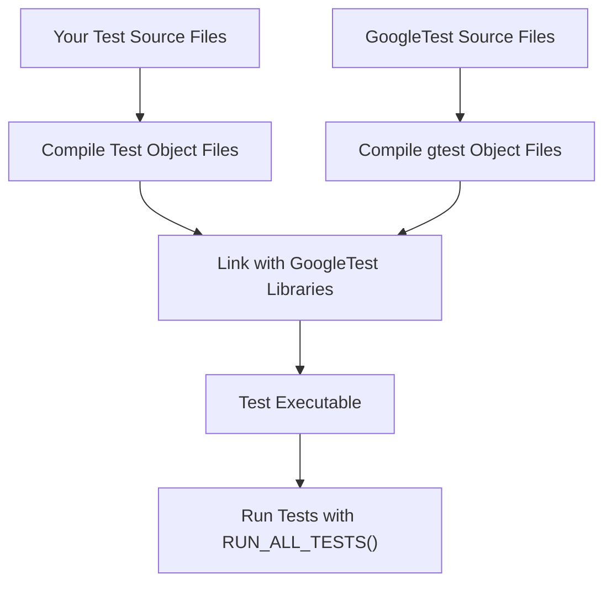

# Integrating GoogleTest with Your Build System

Integrating GoogleTest into your existing C++ projects requires configuring your build system to locate GoogleTest headers and libraries correctly, and linking them with your test binaries. This page offers practical guidance on common integration scenarios including pkg-config support, external project integration, and tips for using GoogleTest in Continuous Integration (CI) pipelines.

---

## 1. Using pkg-config to Locate GoogleTest

GoogleTest supports installation with `pkg-config` metadata files that simplify discovering compiler and linker flags in your build.

### Steps:

1. **Verify pkg-config Installation**
   Make sure `pkg-config` is installed on your system.

   ```bash
   pkg-config --version
   ```

2. **Check GoogleTest Package Availability**
   Confirm the `gtest` package is available.

   ```bash
   pkg-config --modversion gtest
   ```

3. **Compile and Link Using pkg-config**
   Use `pkg-config` to add necessary flags to your compiler and linker commands.

   ```bash
   g++ -std=c++17 -o my_test test.cpp $(pkg-config --cflags --libs gtest)
   ```

4. **Advantages**
   - Portable and automatically picks up include paths and library links.
   - Simplifies upgrades and maintenance.

### Troubleshooting

- If `pkg-config` cannot find `gtest`, ensure the `.pc` files are installed in the correct locations.
- Use environment variables like `PKG_CONFIG_PATH` to point to custom installation directories.

---

## 2. Integrating with CMake Projects

CMake makes integration straightforward. GoogleTest can be added as an external project or found if installed.

### Option A: Using `find_package`

If GoogleTest is installed on the system with CMake config files, add:

```cmake
find_package(GTest REQUIRED)
target_link_libraries(my_test PRIVATE GTest::gtest GTest::gtest_main)
```

### Option B: Adding GoogleTest as a Git Submodule or ExternalProject

Add GoogleTest source in your project tree, then reference it with `add_subdirectory`:

```cmake
add_subdirectory(googletest)
target_link_libraries(my_test PRIVATE gtest gtest_main)
```

### Tips

- Set `CMAKE_CXX_STANDARD` to 17 or greater to meet GoogleTest requirements.
- Use `gtest_main` to avoid having to write your own `main()` function.

### Example CMakeLists.txt snippet

```cmake
cmake_minimum_required(VERSION 3.14)
project(MyTestProject LANGUAGES CXX)

set(CMAKE_CXX_STANDARD 17)

add_subdirectory(googletest)

add_executable(my_test test.cpp)
target_link_libraries(my_test PRIVATE gtest gtest_main)

include(GoogleTest)
gtest_discover_tests(my_test)
```

---

## 3. Integration with Bazel

Bazel build scripts can `deps` on the GoogleTest Bazel targets.

Example `BUILD` file snippet:

```python
cc_test(
    name = "my_test",
    srcs = ["test.cpp"],
    deps = ["@com_google_googletest//:gtest_main"],
)
```

---

## 4. Using GoogleTest in Continuous Integration (CI) Pipelines

GoogleTest returns standard exit codes (`0` on success; non-zero on failure), making it ideal for CI integration.

### Recommendations:

- Always check the return value of `RUN_ALL_TESTS()` in your `main()` to guarantee accurate reporting.
- Configure CI to run tests and report failures based on exit codes.
- Enable XML output for test results for better reporting and integration with CI tools:

```bash
./my_test --gtest_output=xml:report.xml
```

- Use flags like `--gtest_filter` to run a subset of tests.

### Example GitHub Actions

```yaml
jobs:
  test:
    runs-on: ubuntu-latest
    steps:
      - uses: actions/checkout@v2
      - name: Build
        run: cmake --build build
      - name: Run tests
        run: ./build/my_test --gtest_output=xml:test_results.xml
      - name: Publish test results
        uses: actions/upload-artifact@v2
        with:
          name: test-results
          path: test_results.xml
```

---

## 5. Basic Manual Linking Example

When not using build integration helpers, manually compile and link GoogleTest libraries:

1. Compile your test:

```bash
g++ -std=c++17 -I/path/to/googletest/include -pthread -c test.cpp -o test.o
```

2. Compile GoogleTest sources:

```bash
g++ -std=c++17 -I/path/to/googletest/include -pthread -c /path/to/googletest/src/gtest-all.cc -o gtest-all.o
```

3. Link into executable:

```bash
g++ -pthread test.o gtest-all.o -o my_test
```

4. Run the tests:

```bash
./my_test
```

---

## 6. Environment & Security Considerations

- GoogleTest requires C++17 compliance; ensure your compiler and build environment meet this requirement.
- Isolate tests in CI environments, especially when linked with third-party or shared libraries.
- For multi-threaded tests, ensure proper synchronization in test code to avoid flaky results.

---

## 7. Additional Tips

- Use `gtest_main` library to avoid writing boilerplate `main()` functions.
- Wrap mock classes in `NiceMock` or `StrictMock` depending on desired mock behavior in tests.
- Utilize CMake's `gtest_discover_tests()` for automatic test discovery.
- Keep GoogleTest dependencies updated for latest features and fixes.

---

## 8. Troubleshooting Integration Issues

- **Issue:** Compilation errors due to missing headers.
  - Verify include paths; consider using `pkg-config` or CMake's `find_package`.
- **Issue:** Linker errors on gtest symbols.
  - Confirm libraries are linked; check ordering.
- **Issue:** Tests are not running or being detected.
  - Use `gtest_discover_tests()` with CMake or verify test registration.
- **Issue:** CI reports test failures but local tests pass.
  - Check environment differences and test dependencies.

---

## 9. References and Next Steps

- [GoogleTest Primer](primer.md) - Learn to write your first tests.
- [Installation Guide](getting-started/prerequisites-installation/installation-cmake-bazel) - Setup instructions.
- [Writing and Running Your First Test](guides/gtest-core-workflows/writing-and-running-tests) - Step-by-step testing guide.
- [gMock for Dummies](gmock_for_dummies.md) - Mocking basics.

---

### Diagram: Building and Linking Flow with CMake


---

This page equips you with practical, immediately actionable instructions to integrate GoogleTest smoothly with your project's build environment, ensuring fast and reliable test execution.
