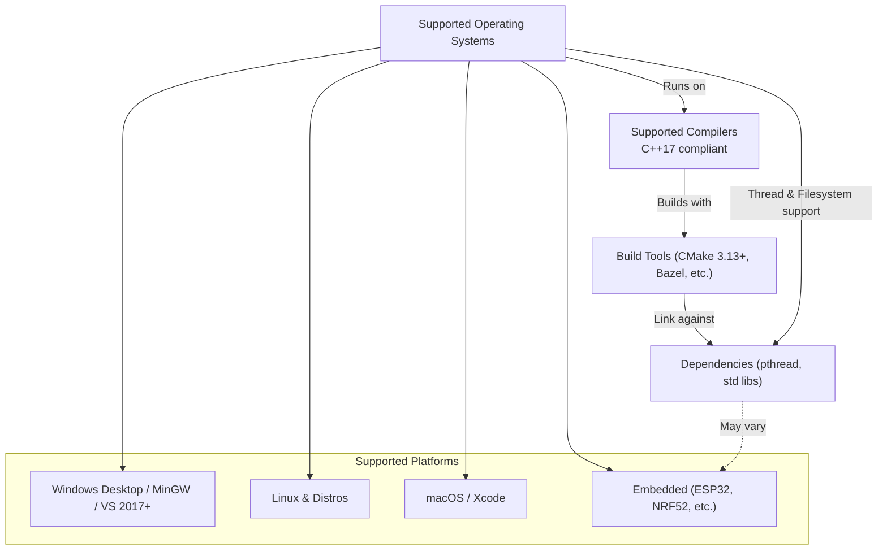

# Supported Platforms & Requirements

This documentation details the officially supported operating systems, compiler versions, and necessary dependencies required to build and use **GoogleTest** and **GoogleMock** effectively. It clarifies the minimum C++ standards supported and provides instructions on verifying your development environment's compatibility.

---

## 1. Supported Operating Systems

GoogleTest aims to provide broad, cross-platform compatibility following Google's [Foundational C++ Support Policy](https://opensource.google/documentation/policies/cplusplus-support). Supported platforms include:

- Windows (desktop, MinGW, Windows mobile variants with some restrictions)
- Linux distributions
- macOS
- FreeBSD, OpenBSD, NetBSD
- Solaris
- AIX
- Android
- Embedded platforms such as ESP32, ESP8266, NRF52

For detailed and up-to-date platform support, refer to the policy and the [Foundational C++ Support Matrix](https://github.com/google/oss-policies-info/blob/main/foundational-cxx-support-matrix.md).

<Check>
Ensure your target platform is listed in the foundational support matrix to guarantee compatibility.
</Check>

## 2. Compiler Support and Minimum Requirements

GoogleTest requires a **C++17 compliant compiler**. This includes but is not limited to:

- MSVC (Visual Studio 2017 Update 3 and later)
- GCC 7.0 and later
- Clang 3.4.1 and later
- Intel LLVM Compiler compatible with C++17


### Key Notes:
- The C++ standard version must be set to at least C++17. Use compiler flags such as `-std=c++17` or equivalent in your build system.
- On MSVC, Visual Studio 2015 (14.0) or newer is mandatory.
- If using an embedded or specialized compiler, verify C++17 support explicitly.

<Note>
Your build environment must set compiler flags to enforce C++17. For CMake projects, this is typically handled by setting:

```cmake
set(CMAKE_CXX_STANDARD 17)
set(CMAKE_CXX_STANDARD_REQUIRED ON)
```

Failure to meet the C++ standard requirement will cause build errors.
</Note>

## 3. Dependencies and Environment Requirements

### Multithreading Support

- GoogleTest is **thread-safe** where pthread libraries are available.
- The macro `GTEST_HAS_PTHREAD` indicates pthread availability. In unusual cases, you can force this macro by adding compiler flags:

```bash
-DGTEST_HAS_PTHREAD=1  # Force enable pthread
-DGTEST_HAS_PTHREAD=0  # Force disable pthread
```

- If pthread is used, ensure your compiler and linker flags include pthread (e.g., `-pthread` for GCC/Clang).

### CMake and Build Tools

- GoogleTest includes CMake scripts to streamline builds.
- CMake version 3.13 or later is required to build GoogleTest.

<Check>
If your environment does not provide pthread or does not support C++17, GoogleTest will fail to build.
</Check>

## 4. How to Verify Your Environment Compatibility

You can validate your environment before building:

1. **Check C++ compiler version:** Run your compiler with the version flag.

   ```bash
   g++ --version    # GCC
   clang++ --version # Clang
   cl               # MSVC command line
   ```

2. **Confirm C++17 support:** Try compiling a sample file with `-std=c++17` or equivalent.

3. **Verify pthread availability:**

   - On Linux/macOS systems, attempt to compile and link a program linking against pthread (e.g., using `-pthread`).

4. **Test GoogleTest build (optional):**

   - Clone the GoogleTest repo
   - Create a build directory
   - Run CMake `cmake ..` and observe configuration logs for warnings/errors about compiler or platform support.

## 5. Platform-Specific Considerations

### Windows

- Visual Studio 2015 or later is required.
- Beware of runtime library mismatches. The `gtest_force_shared_crt` option in CMake can help align runtime linkage.

### Embedded Systems (ESP32, ESP8266, NRF52)

- GoogleTest supports these platforms with some limitations related to threading and file system access.
- Custom build and runtime hooks (e.g. `setup()` and `loop()` functions) align with their frameworks.

### macOS

- Xcode with a modern command-line toolset is supported.

## 6. Common Pitfalls and Troubleshooting Tips

<AccordionGroup title="Common Platform and Build Issues">
<Accordion title="Compiler Version Too Old">
Make sure your compiler supports C++17. Upgrading your compiler or setting the correct std flag usually resolves this.
</Accordion>
<Accordion title="Missing pthread Library">
On Unix-like systems, include pthread flags (`-pthread`) explicitly in build commands or your CMake configuration.
</Accordion>
<Accordion title="Runtime Library Mismatch on Windows">
Use the CMake option `-Dgtest_force_shared_crt=ON` if you encounter linker errors related to runtime libraries.
</Accordion>
<Accordion title="Unsupported Embedded Platform">
Verify that the embedded platform is supported based on GoogleTest's documented compatible platforms and limitations.
</Accordion>
</AccordionGroup>

## 7. Example: Checking C++17 Compliance and pthread on Linux

```bash
# Check gcc version
gcc --version

# Compile a test with C++17
echo 'int main() { return 0; }' > test.cpp
gcc -std=c++17 test.cpp -pthread -o test

# Run the test
./test
```

If compilation and execution succeed without errors, your system meets minimal requirements.

---

## References and Further Reading

- [GoogleTest Foundational C++ Support Policy](https://opensource.google/documentation/policies/cplusplus-support)
- [Foundational C++ Support Matrix](https://github.com/google/oss-policies-info/blob/main/foundational-cxx-support-matrix.md)
- [GoogleTest Build Instructions (README)](https://github.com/google/googletest/blob/main/README.md)
- [CMakeLists.txt for GoogleMock](https://github.com/google/googletest/blob/main/googlemock/CMakeLists.txt)

---

For installation instructions, integration tips, and first test examples, consult the [Installing with CMake and Bazel](../installing-with-cmake-bazel) and [Create Your First Test](../../first-test-validation/create-your-first-test) guides.


---

# Summary Diagram of Supported Platform Layers


