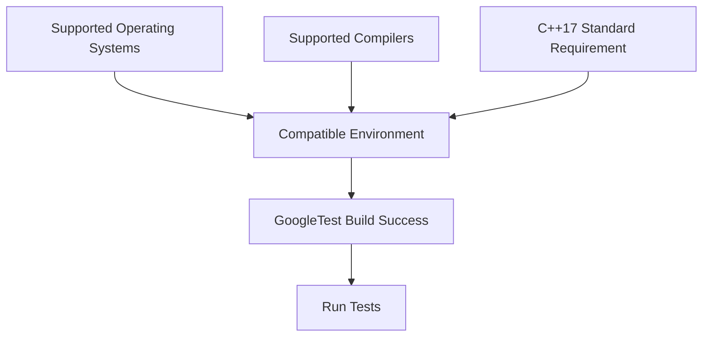

# System Requirements for GoogleTest

GoogleTest is a powerful, portable C++ testing framework designed to work across a variety of development platforms. This page outlines the supported operating systems, compiler versions, and C++ language standards you need to successfully build and run GoogleTest in your environment. Ensuring your system meets these requirements will help you avoid compatibility surprises and get started efficiently.

---

## Supported Platforms

GoogleTest has been tested and verified on the following operating systems:

- **Linux** (various distributions)
- **Windows** (including Windows 10 and Windows Server editions)
- **macOS** (modern supported versions)

The framework is designed for broad portability and should work on any standard-compliant platform that supports a modern C++ compiler.

## Supported Compilers

To build and use GoogleTest, your C++ compiler must meet the minimum feature and version requirements:

- **GCC** (GNU Compiler Collection): Version 7.0.0 or newer is recommended to ensure compliant C++17 support and avoid warnings/errors.
- **Clang**: Fully supported; versions compatible with C++17.
- **MSVC (Microsoft Visual C++)**: Minimum required version is Visual Studio 2015 (compiler version 14.0). Early versions such as MSVC 2013 or earlier will not compile GoogleTest.
- **Intel compilers** and other major compilers that support C++17 should work, provided they meet or exceed the minimum C++17 standard.


<Check>
Note: If you are using MSVC earlier than 2015, the build will fail with an error indicating the minimum version requirement.
</Check>

## Required C++ Standard Version

GoogleTest requires at least the **C++17** standard to be supported and enabled in your build environment. This is due to the use of modern C++ features for robustness and portability.

**How to ensure C++17 is enabled:**

- When using **CMake**, add the following lines to your top-level `CMakeLists.txt`:

  ```cmake
  set(CMAKE_CXX_STANDARD 17)
  set(CMAKE_CXX_STANDARD_REQUIRED ON)
  ```

- If you cannot use CMake or have a C project, pass the equivalent flags directly to the compiler, for example:

  - For GCC and Clang:
    ```bash
    -std=c++17
    ```

  - For MSVC, use `/std:c++17` or ensure your Visual Studio project is configured to use the C++17 standard.

## Additional Tooling and Requirements

- **Build System:** GoogleTest supports building with [CMake](https://cmake.org/) and is compatible with many build environments.

- **Threading:** GoogleTest is thread-safe on platforms with pthread support. When pthread is available, relevant compiler and linker flags must be added (usually handled automatically by CMake).

- **Runtime:** On Windows, it’s recommended to configure the runtime linking correctly (see Visual Studio dynamic vs static runtimes in the CMake build docs) to avoid linker errors.


## Summary Table

| Requirement                    | Details                                               |
|-------------------------------|-------------------------------------------------------|
| Operating Systems Supported    | Linux, Windows, macOS                                 |
| Minimum Compiler Versions      | GCC >=7.0, Clang (latest), MSVC >= 2015 (v14.0)       |
| C++ Language Standard          | C++17 minimum, required                               |
| Build Tools                   | CMake 3.13 or later recommended                        |
| Threading                     | Requires pthread support for thread safety on Linux/macOS |

---

## Troubleshooting Compatibility Issues

- **Compiler Version Errors:** If your build fails with errors about unsupported compiler versions, verify your compiler version and update if necessary.

- **C++17 Support Missing:** Ensure that your build flags explicitly specify C++17 or later.

- **MSVC Linker Errors:** On Windows, enable `gtest_force_shared_crt` in CMake to match runtime library linkage.

- **Pthread Flags:** If you receive errors related to pthread symbols on Linux/macOS, verify your linker flags include `-lpthread`. Using CMake should handle this automatically.


For detailed installation instructions and build configuration examples, please visit the [Installation with CMake guide](/getting-started/prerequisites-installation/install-via-cmake).

To verify your environment is compatible, see the [Validating Your Setup](/getting-started/troubleshooting-validation/validate-setup) documentation.


---

## Further Reading and References

- [GoogleTest Primer](../../docs/primer.md): Learn how to write tests once your environment is set up.
- [GoogleMock README](../../googlemock/README.md): If using mocking capabilities along with GoogleTest.
- [Build system integration](../../guides/integration-and-optimization/build-system-integration.md): For details on integrating GoogleTest into your projects.


<Note>
This page focuses specifically on the foundational system requirements that ensure GoogleTest builds and runs reliably. For configuration steps or troubleshooting, consult the related getting started and troubleshooting documentation.
</Note>


---

## Summary Diagram: Compatibility Overview




---

*Last Updated: Based on GoogleTest Version 1.17.0 and above.*

---

<Source url="https://github.com/google/googletest" paths={[{"path": "googletest/README.md", "range": "1-200"},{"path": "googletest/cmake/internal_utils.cmake", "range": "1-150"},{"path": "googlemock/include/gmock/internal/gmock-port.h", "range": "20-90"}]} />