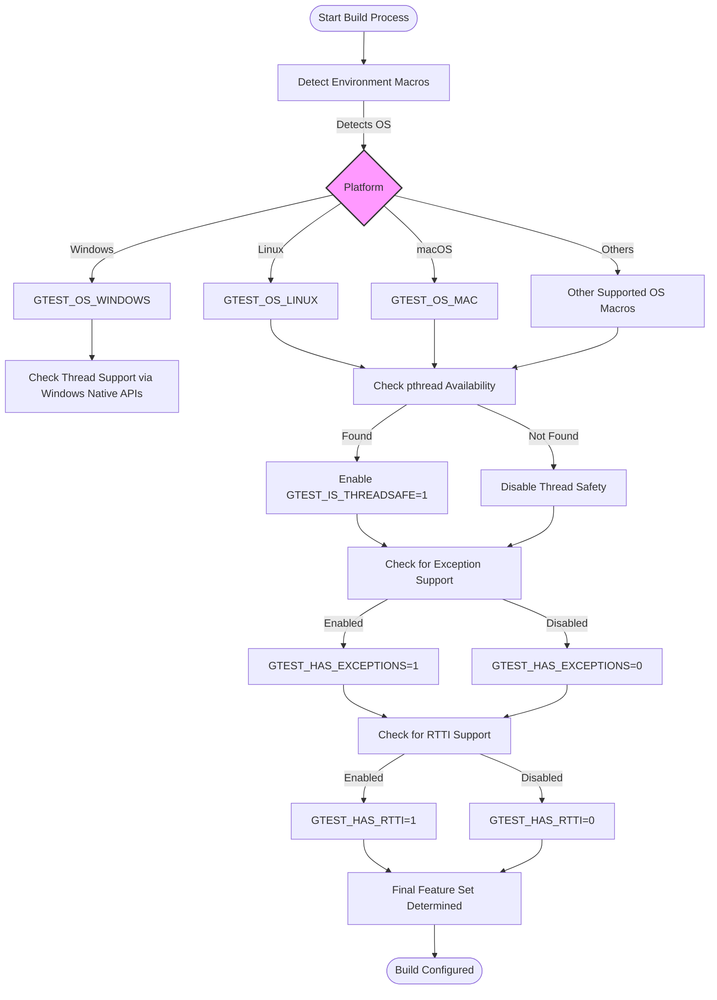

# System Requirements for GoogleTest and GoogleMock

Understanding the system requirements and compatibility of GoogleTest and GoogleMock is essential to ensure a smooth setup and successful integration. This guide outlines the supported platforms, required compilers, minimum C++ standard, and library dependencies you need before building and running tests with GoogleTest.

---

## 1. Supported Platforms

GoogleTest is designed to be portable across a wide range of operating systems and platforms. It follows Google's [Foundational C++ Support Policy](https://opensource.google/documentation/policies/cplusplus-support).

### Officially Supported Platforms Include:

- **Linux** (various distributions)
- **Windows** (including Desktop and MinGW environments)
- **macOS**
- Several BSD variants (FreeBSD, OpenBSD, NetBSD)
- Other Unix-like environments including Solaris, AIX

> See the detailed platform compatibility matrix here: [Supported Platforms Table](https://github.com/google/oss-policies-info/blob/main/foundational-cxx-support-matrix.md)

### Platform Notes:

- Some platforms like Cygwin, Linux Android, and Windows Mobile have tailored support, and some features might be limited or unavailable.
- Mobile, embedded, or less common platforms may have reduced or unstable support.

## 2. Compiler and Language Standards

### Minimum Required Compiler Versions:

- GCC 7.0 or later
- Clang 3.4 or later
- MSVC 2017 Update 3 (MSVC 19.11) or later
- Intel LLVM variants consistent with C++17 support

### C++ Standard Requirement

GoogleTest requires **C++17** or higher for successful compilation. Ensure your build environment specifies this, for example using:

- In CMake:  
  ```cmake
  set(CMAKE_CXX_STANDARD 17)
  set(CMAKE_CXX_STANDARD_REQUIRED ON)
  ```
- Compiler flags:
  - GCC/Clang: `-std=c++17`
  - MSVC: Ensure project settings use at least C++17

### Exception and RTTI Support

- GoogleTest detects exception support automatically but can be manually overridden with macros like `-DGTEST_HAS_EXCEPTIONS=1` or `-0`.
- RTTI is required by default but can be disabled with careful use of `-DGTEST_HAS_RTTI=0`.

## 3. Library Dependencies

### Threading Support

- GoogleTest is thread-safe on platforms where the POSIX Threads (pthreads) library is available.
- On Windows, native threading APIs are used.
- If the platform lacks threading support, thread safety and certain features (e.g., death tests) may be limited.

### Regular Expression Libraries

- GoogleTest utilizes different regular expression implementations based on platform and build options:
  - RE2 (via Abseil) if configured
  - POSIX regex where available
  - A built-in simple regex engine as fallback

### Build Tools

- **CMake** (minimum version 3.14 for some build features) is the primary supported build system.
- **pkg-config** support is included to ease integration and dependency management.

## 4. Environment and Platform Macros

GoogleTest uses a set of predefined macros to detect platform capabilities and features:

- Operating system macros like `GTEST_OS_LINUX`, `GTEST_OS_WINDOWS`, `GTEST_OS_MAC`, etc.
- Feature flags such as `GTEST_HAS_PTHREAD`, `GTEST_HAS_EXCEPTIONS`, `GTEST_HAS_RTTI`, and `GTEST_HAS_DEATH_TEST`.
- These macros are defined automatically, but they can be overridden if needed via compiler flags for customization.

## 5. Summary Table of Critical Requirements

| Requirement                      | Detail                                           |
|---------------------------------|--------------------------------------------------|
| C++ Standard                    | C++17 or newer                                   |
| Minimum Compiler Versions       | GCC ≥ 7.0, Clang ≥ 3.4, MSVC 2017 Update 3      |
| Supported OSes                  | Linux, Windows, macOS, BSD variants, Solaris    |
| Threading Support               | pthreads on Unix; Windows native threads         |
| Exception Handling              | Enabled by default; can disable via macro        |
| RTTI Support                   | Enabled by default; can disable via macro        |
| Build Tools                     | CMake (≥3.14 for FetchContent), pkg-config       |

## 6. Additional Notes

- **Multi-threaded tests:** GoogleTest is thread-safe only when pthreads or native threading libraries are present and enabled.
- **Shared library builds:** When building as shared libraries (DLLs) on Windows, specific macros like `-DGTEST_CREATE_SHARED_LIBRARY=1` must be added.
- **Wide string support:** GoogleTest supports wide strings on platforms that provide them (mostly desktop environments).

## 7. Troubleshooting System Compatibility

If you encounter build or runtime issues related to platform or compiler incompatibilities:

- Verify that your compiler supports C++17 features required by GoogleTest.
- Confirm threading libraries and POSIX features are available and properly linked.
- Check that environment-specific macros haven't been manually overridden.
- Consult the GoogleTest [Supported Platforms](https://github.com/google/googletest/blob/main/docs/platforms.md) documentation.
- Adjust compiler and linker flags as needed, especially for threading and exception support.

## 8. References and Links

- [GoogleTest Supported Platforms](https://github.com/google/googletest/blob/main/docs/platforms.md)
- [GoogleTest Primer](https://github.com/google/googletest/blob/main/docs/primer.md) 
- [Building and Configuring GoogleTest](https://github.com/google/googletest/blob/main/README.md)
- [GoogleTest CMake Build Instructions](https://cmake.org/)
- [Foundational C++ Support Policy](https://opensource.google/documentation/policies/cplusplus-support)

---

## Diagram: GoogleTest Platform and Feature Detection Flow



---

## Next Steps

- Confirm your development environment meets these requirements.
- Proceed to [Installation on Linux, macOS, and Windows](../prerequisites-installation/installation-platforms) guide.
- Explore building and configuring your project with GoogleTest using CMake as detailed in the [Building and Configuring Your Project](../prerequisites-installation/building-configuring-project) guide.

---

<Check>
Make sure your compiler supports C++17 and that appropriate threading libraries are available to leverage full GoogleTest capabilities.
</Check>

<Note>
Using the provided CMake build scripts will automatically manage most platform-specific flags and dependencies.
</Note>
