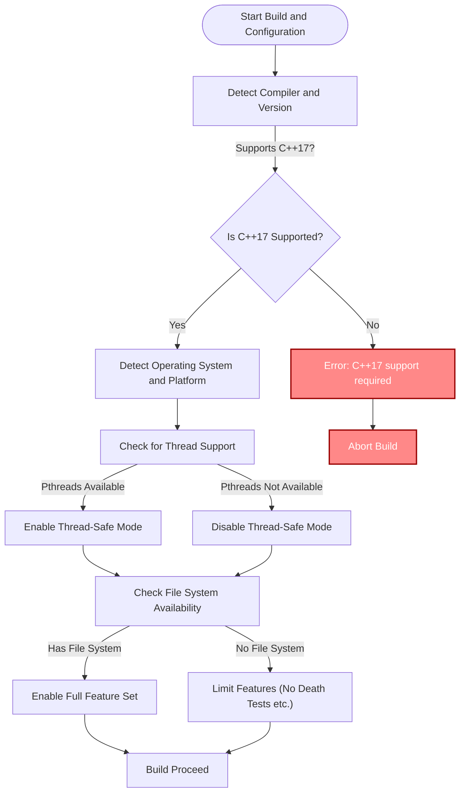

# System Requirements & Supported Platforms

GoogleTest requires a suitably configured development environment to build and run successfully. This page summarizes the essential system prerequisites, supported compilers, C++ standards, and operating systems to ensure GoogleTest operates as expected.

---

## 1. Required C++ Standard

GoogleTest mandates C++17 or later for its build and runtime environment. Attempts to compile GoogleTest with earlier C++ standards will fail with an error indicating insufficient C++ language support.

### Key Points:
- The minimum required standard is **C++17**.
- Ensure your compiler is configured to support C++17 by setting appropriate flags (e.g., `-std=c++17` for GCC/Clang or `/std:c++17` for MSVC).
- GoogleTest code explicitly prevents compilation with C++ versions prior to C++17.

## 2. Supported Operating Systems and Platforms

GoogleTest maintains broad platform compatibility, including popular desktop and server operating systems:

- **Windows** (Desktop editions with MSVC, MinGW)
- **Linux** (including GNU/Linux distributions and Android variants)
- **macOS** (including recent versions and iOS for Apple platforms)
- Several BSD variants (FreeBSD, OpenBSD, NetBSD, DragonFlyBSD)
- Others like Solaris, AIX, Haiku, QNX, GNUs Hurd, Fuchsia, Native Client, and z/OS with varying degrees of maturity

> <Callout>
> Windows Mobile and embedded platforms like ESP8266 and Xtensa have limited or no support due to platform restrictions.
> </Callout>

## 3. Compiler Support and Toolchains

GoogleTest officially supports a variety of compilers that comply with C++17, including:

- **GCC** (4.9 and later versions with C++17 support)
- **Clang** (version 3.8+)
- **MSVC** (Visual Studio 2017 Update 3, version 19.11, and later)
- **Intel LLVM**
- **SunPro**, **IBM Visual Age**, **HP aCC** compilers with C++17 support

### Notes:
- For MSVC users, Visual Studio 2017 Update 3 or newer is required.
- Compiler warnings and flags are configured for stricter conformance and better diagnostics.
- Compiler flags and linker adjustments are preset for typical build environments but may be customized in build scripts.

## 4. Multi-threading and Thread-Safety

GoogleTest is thread-safe on platforms where the pthreads library (or adequate threading primitives) is available:

- Platforms such as Linux, macOS, BSD variants, Solaris, and Windows (excluding Windows Mobile) support this.
- On pthread-enabled platforms, additional compiler and linker flags may be needed to link the pthreads library.
- Thread safety includes test execution synchronization and internal resource management.

### Macros to control thread support:
- You can explicitly enable or disable pthread support with `-DGTEST_HAS_PTHREAD=1` or `-DGTEST_HAS_PTHREAD=0`.

## 5. Exception and RTTI Support

GoogleTest adapts to environments where exceptions and Run-Time Type Information (RTTI) are available or disabled:

- Builds can opt to enable or disable C++ exceptions. GoogleTest tries to detect this automatically.
- RTTI support is similarly detected or can be forced with build macros.
- Some compilers, platforms, or configurations might require manual macro overrides.

## 6. Filesystem and Stream Redirection

- Platforms must provide a file system to utilize features like death tests and output capture.
- Stream redirection (for capturing stdout/stderr during tests) is supported on most host platforms but disabled on certain embedded or mobile platforms without a filesystem.

## 7. Building and Linking Considerations

- GoogleTest can be built as a static or shared library (DLL on Windows).
- To build as a shared library, define `-DGTEST_CREATE_SHARED_LIBRARY=1` and for tests using it, `-DGTEST_LINKED_AS_SHARED_LIBRARY=1`.
- The build system (usually CMake) prepared with GoogleTest sets reasonable defaults for compiler flags and linker settings but allows for customization.
- Be mindful of runtime library compatibility, especially on Windows (see CMake's `gtest_force_shared_crt` option).

## 8. Summary Table of Key Requirements

| Aspect                      | Requirement/Support                         |
|-----------------------------|--------------------------------------------|
| C++ Standard                | C++17 or higher                            |
| Compilers                  | GCC 4.9+, Clang 3.8+, MSVC 2017 Update 3+ |
| Operating Systems          | Windows (Desktop), Linux, macOS, BSD, etc. |
| Multithreading             | Requires pthread support or Windows primitives |
| Exception Handling         | Optional, autodetected, can be disabled    |
| RTTI Support               | Optional, autodetected, can be disabled    |
| Filesystem                 | Required for death tests, output capturing |
| Stream Redirection         | Supported on host OS, limited on embedded  |

---

## Practical Tips

- Before building, ensure your compiler and toolchain support C++17 and include pthreads if applicable.
- On embedded or mobile platforms, some GoogleTest features like death tests or stream capturing may not work.
- Use build system options (such as CMake flags) to explicitly set or override platform-specific macros if auto-detection is incorrect.
- Running `gtest-port.h`'s environment macros manually can help diagnose platform mismatches.

---

## Troubleshooting Common Environment Issues

<AccordionGroup title="Common Environment Issues and Solutions">
<Accordion title="Compiler Does Not Support C++17">
Ensure that your compiler version is sufficiently recent. For example, on GCC run `g++ --version` and upgrade if below 4.9. Set appropriate compiler flags for C++17 explicitly.
</Accordion>
<Accordion title="Threading Not Detected">
If your build environment does not link pthreads automatically, add `-pthread` to both compiler and linker flags or use CMake's `find_package(Threads)` to resolve.
</Accordion>
<Accordion title="Filesystem or Feature Not Supported on Embedded Platform">
Limited features such as death tests require file system support which may be unavailable on platforms like ESP8266, QURT, or others. Consider disabling these test features or using an alternative environment.
</Accordion>
<Accordion title="Windows Runtime Library Mismatch">
Use the CMake option `-Dgtest_force_shared_crt=ON` to match your Visual Studio runtime linkage if you encounter LNK2038 errors about mismatched RuntimeLibrary.
</Accordion>
<Accordion title="GoogleTest Fails Due to Missing Macros">
Confirm that your build defines/overrides necessary macros like `GTEST_HAS_PTHREAD` if auto-detection fails. This can be done by passing `-DGTEST_HAS_PTHREAD=1` or `-DGTEST_HAS_PTHREAD=0`.
</Accordion>
</AccordionGroup>

---

## Next Steps

- Review the [Installation Overview](/getting-started/prerequisites-installation/installation-overview) to prepare and build GoogleTest in your environment.
- Explore the [Supported Platforms & Ecosystem](/overview/introduction-and-value/supported-platforms-and-ecosystem) for deeper platform compatibility details.
- Check out [Integration Story](/overview/getting-started-and-integration/integration-story) for guidance integrating GoogleTest with your build and CI systems.

---

## References

- [GoogleTest GitHub Repository](https://github.com/google/googletest)
- CMakeLists.txt and build configuration in the googletest repository
- Compiler and platform-specific documentation for C++17 support

---

## Summary Diagram: Platform Support Detection Flow

---

##### Documentation prepared for the page "System Requirements & Supported Platforms" summarizing compiler versions, platform support, build requirements, and expected environment capabilities needed to build and run GoogleTest effectively.
