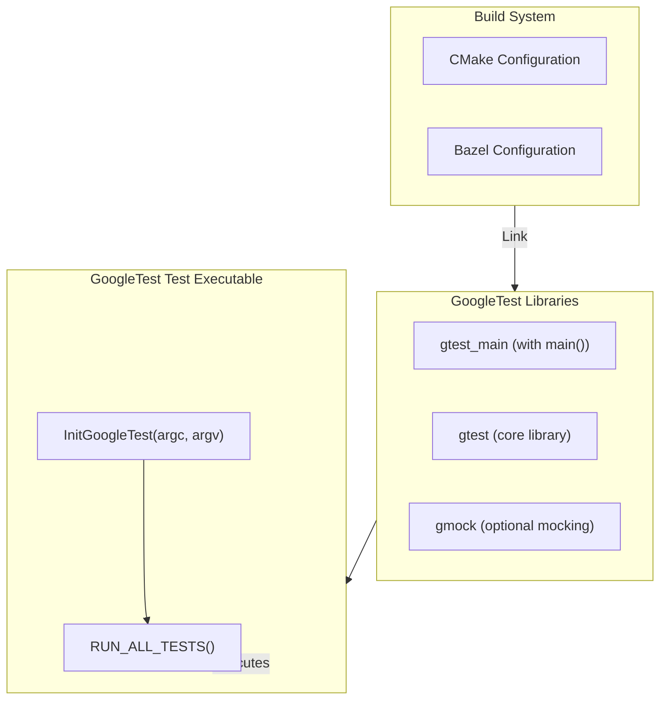

# Environment Configuration

After installing GoogleTest, configuring your test environment is the essential next step to start writing and running tests effectively. This page guides you through connecting GoogleTest with your build system, setting up automatic test discovery, and structuring your tests for maintainability.

---

## 1. Linking GoogleTest Libraries

GoogleTest provides multiple libraries for integration depending on your project needs:

- **gtest**: The core testing framework without a main function.
- **gtest_main**: GoogleTest core plus a main() entry point for running tests.
- **gmock** and **gmock_main**: GoogleMock libraries that include mocking support;
  `gmock_main` includes a main() function.

### Linking With CMake

To link GoogleTest in a CMake project after installation, you typically use `find_package` and link the desired library targets. Example:

```cmake
find_package(GTest CONFIG REQUIRED)

add_executable(my_tests test_main.cpp other_test_files.cpp)
target_link_libraries(my_tests PRIVATE GTest::gtest_main)

# Enables adding tests to CTest
include(CTest)
add_test(NAME MyTests COMMAND my_tests)
```

This approach uses the installed GoogleTest targets, ensuring proper include paths and linker settings.

### Tips:
- Use `GTest::gtest_main` to avoid writing your own `main()`.
- For mocking, link with `GTest::gmock` or `GTest::gmock_main`.

---

## 2. Setting Up Test Discovery

GoogleTest automatically discovers tests declared via its macros such as `TEST()` and `TEST_F()`. However, to ensure smooth discovery and execution:

1. Organize your test source files into dedicated directories (e.g., `tests/` or `unittests/`).
2. Include GoogleTest headers (`#include <gtest/gtest.h>`) in those test files.
3. Use CMake or your build system to compile all test files into one or multiple executables.

### Example Test Declaration

```cpp
#include <gtest/gtest.h>

TEST(MathTests, Addition) {
  EXPECT_EQ(2 + 2, 4);
}

class MyTestFixture : public ::testing::Test {
protected:
  void SetUp() override { /* setup code if needed */ }
};

TEST_F(MyTestFixture, UsingFixture) {
  EXPECT_TRUE(true);
}
```

GoogleTest will discover and run these tests automatically once linked and executed.

---

## 3. Integrating GoogleTest with Your Build System

### CMake Integration

- Use `find_package(GTest CONFIG REQUIRED)` after installing GoogleTest.
- Link test executables against `GTest::gtest` or `GTest::gtest_main`.
- Use `add_test()` to register executable for `ctest`.

#### Minimal Example

```cmake
cmake_minimum_required(VERSION 3.14)
project(MyProject LANGUAGES CXX)

find_package(GTest CONFIG REQUIRED)

add_executable(tests test_main.cpp)
target_link_libraries(tests PRIVATE GTest::gtest_main)

include(CTest)
add_test(NAME RunAllTests COMMAND tests)
```

---

### Bazel Integration

GoogleTest integrates smoothly with Bazel. Use `cc_test` with `gtest` dependencies.

Example:

```python
cc_test(
    name = "my_tests",
    srcs = ["my_tests.cc"],
    deps = ["@com_google_googletest//:gtest_main"],
)
```

Refer to the [Installing with Bazel](/getting-started/prerequisites-installation/installation-bazel) page for detailed guidance.

---

## 4. Organizing Your Tests

Well-structured tests enhance maintainability and speed up debugging. Follow these best practices:

- **Group related tests into test suites** using the `TEST()` macro’s first argument for logical grouping.
- **Use test fixtures (`TEST_F()`)** when tests share common setup or teardown routines.
- **Separate test code from production code** in your project directory hierarchy.
- **Name your tests descriptively** for clarity in reports.

Example:

```cpp
TEST(StringTests, EmptyStringHasLengthZero) {
  EXPECT_EQ(std::string("".length()), 0);
}

class DatabaseTest : public ::testing::Test {
  // Setup DB connection here
};

TEST_F(DatabaseTest, QueryReturnsCorrectResult) {
  // Test DB query
}
```

---

## 5. Configuring GoogleTest Flags

GoogleTest accepts runtime flags to control test behavior. Common flags include:

- `--gtest_filter`: Run a subset of tests matching filter patterns.
- `--gtest_output`: Control output format (e.g., `xml:` for CI systems).
- `--gtest_repeat`: Repeat tests multiple times for reliability checks.

These can be passed to your test executable on the command line:

```bash
./my_tests --gtest_filter=StringTests.*
./my_tests --gtest_output=xml:report.xml
```

### Programmatic Access & Override

Initialize GoogleTest in your main with:

```cpp
int main(int argc, char** argv) {
  ::testing::InitGoogleTest(&argc, argv);
  return RUN_ALL_TESTS();
}
```

You can modify or query flags programmatically if needed.

---

## 6. Troubleshooting Common Configuration Issues

<AccordionGroup title="Troubleshooting Environment Configuration">
<Accordion title="Linker Errors: Undefined Reference to GoogleTest Symbols">
Ensure you:

- Link your test executable against the correct GoogleTest library `gtest` or `gtest_main`.
- Have included the GoogleTest headers properly.
- Use compatible compiler flags and C++ standards (minimum C++17).
</Accordion>
<Accordion title="Tests Not Running or Discovered">
- Confirm tests use GoogleTest macros like `TEST()` or `TEST_F()`.
- Verify your build system compiles all test source files.
- Avoid defining your own conflicting `main()` if using `gtest_main`.
</Accordion>
<Accordion title="Incorrect Test Listing or Filtering">
- Check command line flags passed to tests for typos.
- Use `--gtest_list_tests` to verify detected tests.
</Accordion>
</AccordionGroup>

<Warning>
Always use the same compiler and runtime settings for your tests and GoogleTest to prevent subtle linking or runtime errors.
</Warning>

---

## 7. Next Steps

After configuring your environment:

- Proceed to [Writing and Running Your First Test](/getting-started/quickstart-usage/writing-first-test) to create practical tests.
- Explore [Validating Your Setup](/getting-started/quickstart-usage/quick-validation) to confirm your environment is working.
- For advanced integration, see [Continuous Integration and Automation](/guides/advanced-usage/ci-integration).

---

## References

- [Installing with CMake](/getting-started/prerequisites-installation/installation-cmake)
- [Installing with Bazel](/getting-started/prerequisites-installation/installation-bazel)
- [Common Setup Issues](/getting-started/troubleshooting-support/common-setup-issues)
- Official GoogleTest repo: https://github.com/google/googletest

---

## Summary Diagram



