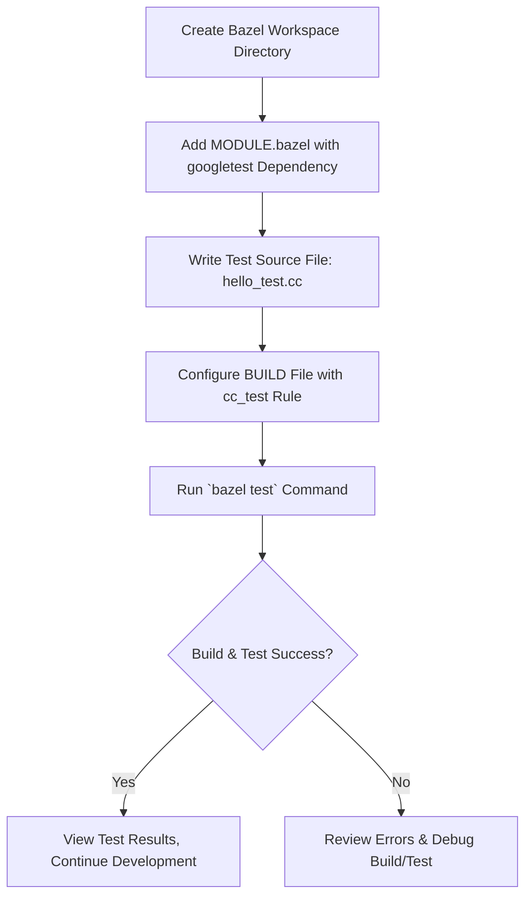

# Installation with Bazel

This guide walks you through the detailed steps to integrate, build, and run GoogleTest using Bazel, the recommended build system for modern C++ projects and Google-internal workflows. You'll learn how to create a Bazel workspace, configure dependencies, write test code, and execute tests seamlessly.

---

## 1. Prerequisites & Setup

Before starting, ensure your environment meets the following requirements:

- **Operating System:** Linux, macOS, or Windows.
- **C++ Compiler:** Must support C++17 standard or higher.
- **Bazel:** Version 7.0 or later installed on your system.

If you don't have Bazel installed, see the [Bazel installation guide](https://bazel.build/install) for detailed instructions.

<Note>
Make sure your compiler uses the C++17 standard to avoid build errors with GoogleTest. Bazel flags to enforce this will be shown later.
</Note>

---

## 2. Setting Up Your Bazel Workspace

A Bazel workspace is the root directory where you organize source files and configuration for your project.

### Step 1: Create a workspace directory

Open your terminal and run:

```bash
mkdir my_workspace && cd my_workspace
```

This creates and navigates into your project's workspace.

### Step 2: Define GoogleTest as a dependency in `MODULE.bazel`

In your workspace root directory, create a file named `MODULE.bazel`:

```bash
touch MODULE.bazel
```

Add the following content to this file to declare GoogleTest as an external dependency using the Bazel Central Registry:

```python
# MODULE.bazel

bazel_dep(name = "googletest", version = "1.17.0")
```

<Info>
You can update the `version` string to the latest GoogleTest release available at https://registry.bazel.build/modules/googletest.
</Info>

---

## 3. Writing Your First Test

Create a C++ source file named `hello_test.cc` inside your workspace directory:

```cpp
#include <gtest/gtest.h>

// Sample test demonstrating basic GoogleTest assertions.
TEST(HelloTest, BasicAssertions) {
  EXPECT_STRNE("hello", "world");  // Expect strings not to be equal.
  EXPECT_EQ(7 * 6, 42);              // Expect equality.
}
```

This test verifies simple string inequality and numeric equality.

---

## 4. Configuring the Bazel Build File

Bazel uses `BUILD` files to define build rules. Create a file named `BUILD` in the root of your workspace:

```bash
touch BUILD
```

Add the following to your `BUILD` file to declare a C++ test target that compiles and links your test with GoogleTest:

```python
cc_test(
    name = "hello_test",
    size = "small",
    srcs = ["hello_test.cc"],
    deps = [
        "@googletest//:gtest",
        "@googletest//:gtest_main",
    ],
)
```

- `name`: The Bazel target name (your test binary).
- `srcs`: Source files to compile.
- `deps`: Dependencies including GoogleTest libraries.

---

## 5. Building and Running Tests

### Step 1: Build and run your tests with Bazel

Use the following command to build and test, specifying C++17 standard for compatibility:

```bash
bazel test --cxxopt=-std=c++17 --test_output=all //:hello_test
```

Expected output snippet demonstrating successful build and run:

```
INFO: Analyzed target //:hello_test ...
INFO: Found 1 test target...
INFO: From Testing //:hello_test:
Running main() from gmock_main.cc
[==========] Running 1 test from 1 test suite.
[----------] Global test environment set-up.
[----------] 1 test from HelloTest
[ RUN      ] HelloTest.BasicAssertions
[       OK ] HelloTest.BasicAssertions (0 ms)
[----------] 1 test from HelloTest (0 ms total)
[----------] Global test environment tear-down
[==========] 1 test from 1 test suite ran. (0 ms total)
[  PASSED  ] 1 test.
```

### Step 2: Verify the test passes

The key indicators of success are the status message `[  PASSED  ] 1 test` and no build errors.

---

## 6. Visual Studio and Platform Notes

- On Windows with Visual Studio, Bazel integration works with the standard workflow.
- If using MSVC compiler, Bazel automatically picks the right compiler runtime.

<Tip>
To ensure compatibility with MSVC runtime linkage, Bazel configures GoogleTest to match your project's runtime dynamically.
</Tip>

---

## 7. Best Practices & Tips

- Regularly update the GoogleTest version in `MODULE.bazel` to get the latest fixes and features.
- Use Bazel's native test flags (`--test_output=all`) to see detailed test logs.
- Organize your tests into subdirectories and multiple `BUILD` files for larger projects.

---

## 8. Troubleshooting Common Issues

<AccordionGroup title="Common Bazel Installation Issues">
<Accordion title="Build fails due to missing C++17 support">
Ensure you specify the C++17 standard explicitly with `--cxxopt=-std=c++17` for GCC/Clang or `--cxxopt=/std:c++17` for MSVC when running Bazel.
</Accordion>
<Accordion title="Test target not found or errors loading GoogleTest dependency">
Check your `MODULE.bazel` syntax and verify network connectivity to download dependencies. Run `bazel clean --expunge` to reset Bazel's cache if problems persist.
</Accordion>
<Accordion title="Linker errors related to runtime mismatch on Windows">
Make sure Bazel uses the same dynamic or static runtime for your project and GoogleTest. The `gtest_force_shared_crt` option is handled internally in the Bazel build of GoogleTest.
</Accordion>
</AccordionGroup>

---

## 9. Next Steps

- Explore writing more complex test cases using [GoogleTest Primer](primer.md).
- Learn how to mock dependencies with GoogleMock.
- Check out [Installation with CMake](installation-cmake.md) if you need alternative build methods.
- Visit the [Core Features at a Glance](overview/product-intro-value/core-features-at-a-glance.md) to understand all capabilities.

---

Congratulations! You now have GoogleTest integrated and running in your Bazel build environment.


---

### Diagram: Bazel Integration Workflow


