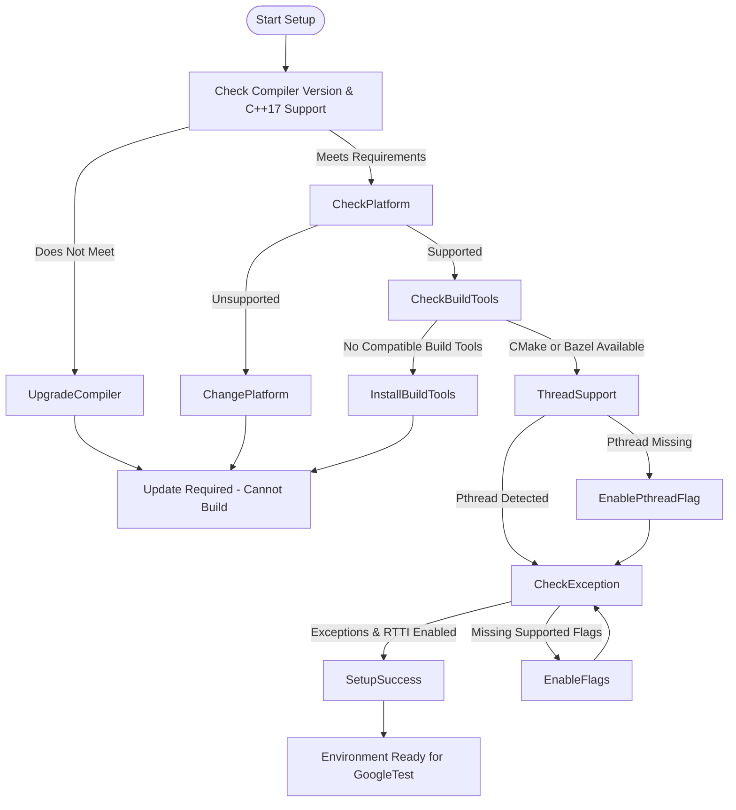

# System Requirements for GoogleTest

This page explains the minimum compiler versions, C++ standard requirements, and the supported platforms and build tools necessary for successfully building and running GoogleTest. Confirming your development environment matches these prerequisites ensures a smooth setup and reliable test execution.

---

## 1. Compiler and Language Standards

GoogleTest requires a modern C++ development environment supporting at least **C++17**. This standard is essential as the framework utilizes language features introduced in C++17.

- **Minimum C++ Standard**: C++17 or newer

### Supported Compiler Versions:
- **GCC**: Version 7 or later
- **Clang**: Version 5 or later
- **MSVC (Microsoft Visual C++)**: Visual Studio 2017 Update 3 (MSVC 19.11) or later
  - For GoogleMock, Visual C++ 2015 (version 14.0) is the absolute minimum.


### Enforcing C++17 in Your Build

Ensure your build system sets the C++ standard explicitly. For example, with **CMake**, add:

```cmake
set(CMAKE_CXX_STANDARD 17)
set(CMAKE_CXX_STANDARD_REQUIRED ON)
```

If you cannot modify your project’s CMakeLists.txt directly, specify the standard via compiler flags when configuring your build:

```bash
cmake .. -DCMAKE_CXX_FLAGS="-std=c++17"
```

Failing to comply with this requirement will cause build errors, as GoogleTest’s code uses modern language constructs.

<Warning>
Older compiler versions and C++ standards less than C++17 are **not supported** and will cause build failures.
</Warning>

---

## 2. Supported Platforms and Operating Systems

GoogleTest supports a wide range of platforms, aligned with Google's Foundational C++ Support Policy. Confirm your environment is included in the supported list below.

### Supported Platforms

- **Linux** (modern distributions)
- **Mac OS X** (including recent versions and derivatives)
- **Windows**
  - Desktop versions
  - MinGW
  - Windows Mobile (with some limitations)
- **BSD variants** (FreeBSD, NetBSD, OpenBSD, DragonFlyBSD)
- **Others:** IBM AIX, Solaris, Android, and embedded platforms such as ESP8266, ESP32 are supported with some caveats.


For the full detailed matrix of supported compilers, platforms, and build tools, see the official table hosted in the GoogleTest OSS policy repository:

[Foundational C++ Support Matrix](https://github.com/google/oss-policies-info/blob/main/foundational-cxx-support-matrix.md)

<Info>
GoogleTest automatically detects many platform characteristics during compilation. However, you may need to manually define certain macros in rare cases — especially if using less common or embedded platforms.
</Info>

---

## 3. Build Tools Compatibility

GoogleTest integrates smoothly with these common build systems:

- **CMake** (recommended, cross-platform)
- **Bazel**
- Traditional build tools (Makefiles, Visual Studio projects)

### Notes on CMake
- GoogleTest's provided `CMakeLists.txt` supports a wide variety of platforms and configurations.
- You can build GoogleTest as a standalone project or incorporate it into your existing CMake project (see [Installation with CMake](../requirements-installation/installation-cmake) for details).

### Visual Studio Considerations
- Visual Studio 2017 or later supports required standards.
- Be mindful of runtime library linkage mismatch issues when building GoogleTest (use `gtest_force_shared_crt` CMake option to align runtimes).

### Threading Libraries
- GoogleTest supports multithreaded tests on platforms with pthread support.
- If pthread detection fails, you can force it via compiler flags:

```bash
-DGTEST_HAS_PTHREAD=1
```

or

```bash
-DGTEST_HAS_PTHREAD=0
```

---

## 4. Additional Environment Requirements

### Exception Support

GoogleTest requires exception handling support enabled in your compiler (most environments enable this by default).

### RTTI (Run-Time Type Information)

RTTI is highly recommended and expected for GoogleTest to function correctly.

### File system and I/O

A functioning file system is required for output capturing, logging, and death test support.

---

## 5. Summary Checklist Before Installing GoogleTest

<Steps>
<Step title="Check compiler version and C++ standard">Confirm your compiler supports at least C++17 and meets the minimum version requirements.</Step>
<Step title="Validate platform support">Make sure your OS and platform are listed in the supported platforms matrix.</Step>
<Step title="Prepare build tools">Ensure you have an installation of CMake (preferably 3.14 or later) or compatible build systems.</Step>
<Step title="Verify threading support">Confirm pthread (POSIX threads) availability if planning multithreaded tests.</Step>
<Step title="Confirm exception and RTTI support">Verify compiler flags allow exceptions and RTTI.</Step>
</Steps>

<Check>
Following this checklist will prevent common build and runtime issues before you begin installing and using GoogleTest.
</Check>

---

## 6. Troubleshooting Common Environment Issues

### Build Fails Due to Unsupported Compiler Version

- Upgrade your compiler to meet the minimum supported versions.
- Explicitly set the C++ standard to 17 as shown above.

### Threading Support Detection Issues

- If GoogleTest mistakenly disables threading support, forcibly enable it via `-DGTEST_HAS_PTHREAD=1`.
- On Windows, ensure pthreads are provided or use compatible threading models.

### Linking Errors in Visual Studio

- Enable `gtest_force_shared_crt` option in your CMake configuration to avoid runtime library mismatches.

### Missing File System or Limited Embedded Platform Support

- Some embedded platforms have limited or no file system support, which disables certain GoogleTest features like death tests.
- Review platform-specific limitations.

---

## 7. Additional Resources

- [Installation with CMake](/getting-started/requirements-installation/installation-cmake)
- [Installation with Bazel](/getting-started/requirements-installation/installation-bazel)
- [Integration & Dependencies Overview](/overview/architecture-concepts/integration-and-dependencies)
- [Platform Support Matrix](https://github.com/google/oss-policies-info/blob/main/foundational-cxx-support-matrix.md)

---

## 8. Summary Diagram: Environment Compatibility Flow



---