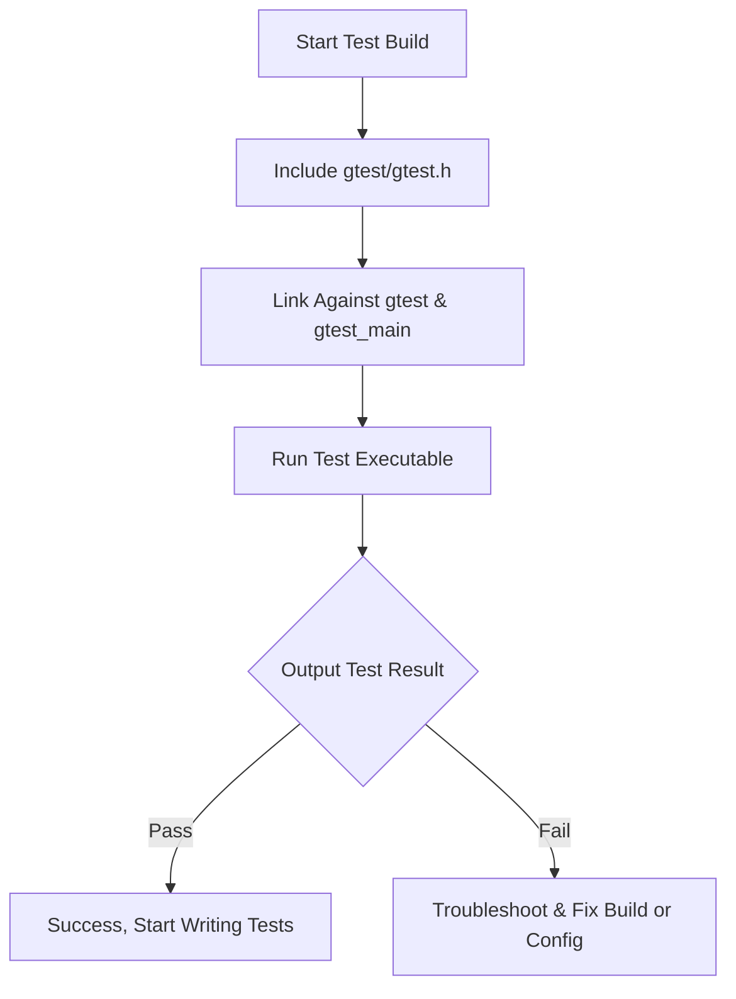

# Configuration & Verification

After installing GoogleTest, the crucial next step is to configure your project to include the framework properly and verify that the setup is working as expected. This page guides you through linking your project with GoogleTest libraries, including necessary headers, and running validation checks to confirm everything is integrated before you begin writing tests.

---

## 1. Prerequisites

Before proceeding with integration, ensure the following are met:

- You have built or obtained the GoogleTest libraries (`libgtest.a` or `.lib`).
- Your project supports C++17 or later, as GoogleTest requires at least C++17.
- Your compiler, platform, and build system are compatible with GoogleTest. Refer to the [Prerequisites & System Requirements](./prerequisites-system-requirements.md) page for details.

---

## 2. Include GoogleTest in Your Project

To use GoogleTest in your code, you need to include its public headers. The primary header to include is:

```cpp
#include <gtest/gtest.h>
```

This header grants you access to all core GoogleTest features such as test macros, assertions, and basic utilities.

If you plan to use GoogleMock (the mocking extension), include additionally:

```cpp
#include <gmock/gmock.h>
```

where `gmock.h` itself includes `gtest.h`.

**Tip:** Add `using ::testing::...;` declarations in your source files to make the code more readable, for example:

```cpp
using ::testing::EXPECT_TRUE;
using ::testing::Test;
```

---

## 3. Linking GoogleTest Libraries

### a. Static Libraries

If you built GoogleTest as static libraries (`libgtest.a` and `libgtest_main.a`), link them with your test binary.

**Example (using g++):**

```bash
g++ my_test.cc -lgtest_main -lgtest -pthread -o my_test
```

Ensure the linker can locate these libraries via your library search path (`-L`).

### b. Dynamic Libraries

If you built GoogleTest as dynamic/shared libraries, link accordingly and ensure the dynamic linker can find the shared objects at runtime.

---

## 4. Basic Verification Check

Before writing actual tests, verify that GoogleTest is working by compiling and running a simple test:

```cpp
#include <gtest/gtest.h>

TEST(SanityTest, BasicAssertions) {
  EXPECT_EQ(1, 1);
  EXPECT_TRUE(true);
}

int main(int argc, char** argv) {
  ::testing::InitGoogleTest(&argc, argv);
  return RUN_ALL_TESTS();
}
```

### Steps:

1. Save this as `sanity_test.cc`.
2. Compile with GoogleTest linked (see linking instructions).
3. Run the executable:

    ```bash
    ./my_test
    ```

4. You should see output indicating the test passed:

    ```
    [==========] Running 1 test from 1 test suite.
    [----------] Global test environment set-up.
    [----------] 1 test from SanityTest
    [ RUN      ] SanityTest.BasicAssertions
    [       OK ] SanityTest.BasicAssertions (0 ms)
    [----------] 1 test from SanityTest (0 ms total)
    [----------] Global test environment tear-down
    [==========] 1 test from 1 test suite ran. (0 ms total)
    [  PASSED  ] 1 test.
    ```

If this works, your installation is correctly configured.

---

## 5. Integrating With Your Build System

Depending on your build system (Makefiles, CMake, Bazel, etc.), you need to:

- Add `-I` flags pointing to the GoogleTest include directories.
- Add `-L` flags for library search paths.
- Link with `-lgtest`, `-lgtest_main`, and `-pthread` as appropriate.

### Example CMake Snippet

```cmake
find_package(GTest REQUIRED)
include_directories(${GTEST_INCLUDE_DIRS})
target_link_libraries(my_test PRIVATE ${GTEST_LIBRARIES} pthread)
```

---

## 6. Troubleshooting

### Common Issues

- **Linker errors (undefined references):**
  - Ensure the correct GoogleTest libraries are linked (`gtest` and `gtest_main`).
  - Confirm your linker search path includes the directories containing these libraries.

- **Compiler errors regarding `gtest/gtest.h`:**
  - Verify the include paths are set correctly (`-I` flags).
  - Check that the GoogleTest headers are installed or built properly.

- **Runtime errors or test failures immediately:**
  - Make sure the libraries and headers correspond to the same GoogleTest version.
  - Rebuild GoogleTest from scratch if your build environment changed.

### Verifying Flag Settings

GoogleTest uses flags for verbosity and behavior control; the default verbosity level is "warning" which suppresses overly verbose messages but provides warnings for suspicious behavior.

You can change verbosity at runtime using command-line flags:

```bash
./my_test --gmock_verbose=info
```

or within code by setting:

```cpp
::testing::FLAGS_gmock_verbose = "info";
```

---

## 7. Next Steps

Once your environment is validated:

- Proceed to [Writing Your First Test](../first-test-experience/writing-your-first-test.md) to learn test definition.
- Explore [Mocking in GoogleMock](../../api-reference/mocking-apis/mock-classes-methods.md) for mocking classes and methods.
- Review [Setting Expectations and Actions](../../api-reference/mocking-apis/mock-expectations-actions.md) to craft precise mocks.

---

## Additional Tips

- Always build GoogleTest and your tests with the same compiler and compatible settings.
- For multi-threaded code, ensure linking with pthreads or equivalent.
- Use the GoogleTest verbose flag to debug confusing results.
- Regularly run `Mock::VerifyAndClearExpectations()` if your mocks outlive the scope where you set expectations.

---

# References

- [GoogleTest Prerequisites & System Requirements](./prerequisites-system-requirements.md)
- [Writing Your First Test](../first-test-experience/writing-your-first-test.md)
- [Mocking APIs](../../api-reference/mocking-apis/mock-classes-methods.md)
- [Setting Expectations and Actions](../../api-reference/mocking-apis/mock-expectations-actions.md)

---

# Diagram: Basic Test Setup Flow


