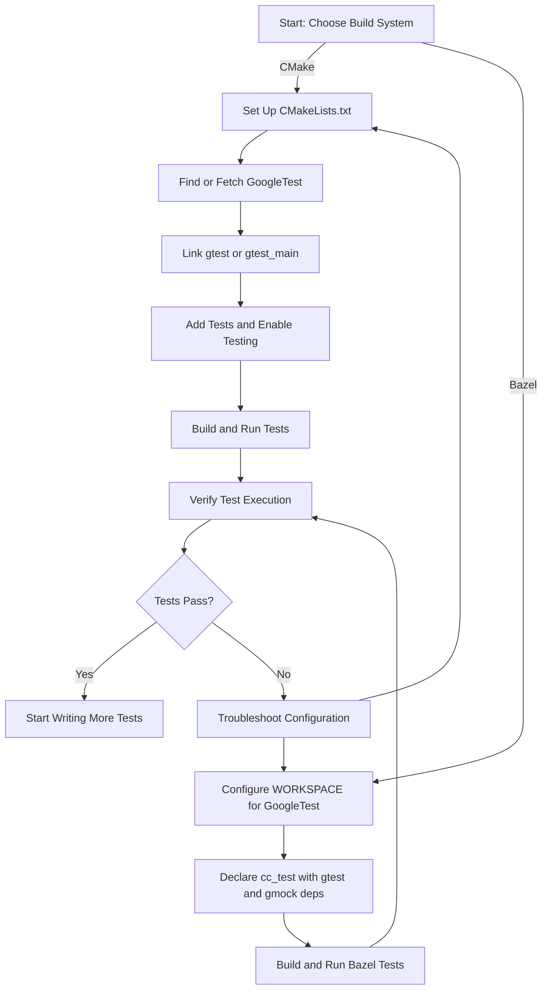

# Initial Configuration

Set up your project to effectively use GoogleTest and GoogleMock by configuring your build system, linking the libraries, and adjusting essential options. This page guides you through the critical steps for configuring both CMake and Bazel-based projects to ensure smooth compilation and execution of your tests.

---

## 1. Understanding Your Build Environment

Before integrating GoogleTest and GoogleMock into your project, determine your build system and platform to apply the right configuration steps.

- **CMake Users:** Configure your `CMakeLists.txt` with appropriate commands to find and link libraries.
- **Bazel Users:** Ensure your Bazel workspace is properly set up for both GoogleTest and GoogleMock.

<Check>
If you have not yet installed GoogleTest, please see [Installation Methods](/getting-started/setup-and-installation/installation-methods) before proceeding.
</Check>

---

## 2. Configuring GoogleTest with CMake

GoogleTest provides dedicated CMake integration designed for C++17 and later standards.

### Step 1: Include GoogleTest in Your Project

If GoogleTest is installed system-wide or available via a package manager, include it using `find_package`:

```cmake
cmake_minimum_required(VERSION 3.14)  # Minimum for FetchContent_MakeAvailable
project(YourProject LANGUAGES CXX)

# Find installed GoogleTest package
find_package(GTest CONFIG REQUIRED)

add_executable(your_test_executable test_main.cc)

target_link_libraries(your_test_executable PRIVATE GTest::gtest_main)

# Enable testing features
include(CTest)
enable_testing()
add_test(NAME YourTest COMMAND your_test_executable)
```

### Step 2: Using `FetchContent` to Include GoogleTest

If GoogleTest is not installed on your system or you prefer embedding it:

```cmake
include(FetchContent)
FetchContent_Declare(
  googletest
  URL https://github.com/google/googletest/archive/release-1.17.0.zip
)
FetchContent_MakeAvailable(googletest)

add_executable(your_test_executable test_main.cc)

target_link_libraries(your_test_executable PRIVATE gtest_main)

enable_testing()
add_test(NAME YourTest COMMAND your_test_executable)
```

### Step 3: Configure Compiler and Linker Flags

- GoogleTest automatically detects and configures threading support (i.e., pthreads on Unix-like systems).
- Ensure your project uses C++17 or later:

```cmake
set(CMAKE_CXX_STANDARD 17)
set(CMAKE_CXX_STANDARD_REQUIRED ON)
```

- If building on Windows with MSVC, consider the `gtest_force_shared_crt` option to manage runtime linkage.

---

## 3. Key Build Options and Macros

GoogleTest provides several macros and options to customize your build and runtime behavior.

| Macro/Option                | Description                                                       |
|----------------------------|-------------------------------------------------------------------|
| `GTEST_HAS_PTHREAD`        | Enabled automatically if pthreads are available.                  |
| `GTEST_CREATE_SHARED_LIBRARY=1` | Compile GoogleTest as shared library (DLL).                 |
| `GTEST_LINKED_AS_SHARED_LIBRARY=1` | For tests that link with the shared GoogleTest library.    |
| `gtest_force_shared_crt`   | Forces GoogleTest to link the runtime dynamically on MSVC.        |

### Best Practices

- Prefer building and linking GoogleTest as a **static library** to simplify deployment unless you have a specific requirement for shared libraries.
- If using shared libraries on Windows, consistently apply the `gtest_force_shared_crt` option to avoid runtime conflicts.

---

## 4. Configuring Bazel Projects for GoogleTest

For Bazel users, follow the steps below to integrate GoogleTest and GoogleMock.

### Step 1: Add GoogleTest and GoogleMock to Your `WORKSPACE`

```python
http_archive(
    name = "com_github_google_googletest",
    url = "https://github.com/google/googletest/archive/release-1.17.0.tar.gz",
    strip_prefix = "googletest-release-1.17.0",
)

load("@com_github_google_googletest//bazel:googletest.bzl", "gtest_repositories")
gtest_repositories()
```

### Step 2: Declare Dependencies in `BUILD.bazel`

```python
cc_test(
    name = "your_test",
    srcs = ["your_test.cc"],
    deps = [
        "@com_github_google_googletest//googletest/gtest",
        "@com_github_google_googletest//googletest:gmock",
    ],
)
```

### Step 3: Use the Provided Macros

- Use `gtest_main` to link tests if you want a default main function.
- Add flags in your Bazel build to specify C++17 support, e.g., `/std:c++17` on Windows.

<Tip>
Bazel’s workspace and build setup allows flexible control over GoogleTest versions and dependencies. Keeping the URL and versions consistent with your project version is essential.
</Tip>

---

## 5. Linking GoogleTest and GoogleMock

### Linking Your Tests

- Link your test executables against `gtest` or `gtest_main` libraries.
- If you want to write your own `main()` function, link only with `gtest`.
- Otherwise, link with `gtest_main` for automatic main function inclusion.

```cmake
# Link example with gtest_main
target_link_libraries(your_test PRIVATE gtest_main)
```

### Including GoogleMock

- To use mocking features, link with both `gtest` and `gmock` libraries.
- For example:

```cmake
target_link_libraries(your_test PRIVATE gmock gtest_main)
```

<Tip>
Ensure you have set up both GoogleTest and GoogleMock properly, especially if building manually or integrating sources.
</Tip>

---

## 6. Common Configuration Options and Adjustments

### Runtime Threading Support

- GoogleTest automatically detects pthread availability on Unix-like systems.
- On Windows, pthreads are disabled; GoogleTest uses native Windows threading primitives.

### Compiler Warnings and Flags

- GoogleTest enforces stricter compiler warnings when building its libraries.
- Customize or override these flags if necessary via the CMake variable `cxx_strict` or your build system's equivalent.

### Build Types

- You can build GoogleTest as a static or shared library by setting standard CMake variables like `BUILD_SHARED_LIBS`.
- `gtest_build_tests` and `gtest_build_samples` can be enabled for building GoogleTest's own tests and sample programs.

---

## 7. Verification and Troubleshooting

### Verifying Your Configuration

- Confirm your executable links against `gtest` or `gtest_main` by checking linker flags.
- Run your test binary; it should execute your tests and report results.
- Use `ctest` or equivalent build system commands to run tests if available.

### Common Issues

| Problem                         | Solution                                                            |
|-------------------------------|--------------------------------------------------------------------|
| Linker errors for pthread      | Ensure pthreads are available or explicitly disable with `gtest_disable_pthreads`.
| Conflicts in runtime linkage on Windows | Use `gtest_force_shared_crt` option to unify runtime linkage.
| Tests fail to discover properly | Check your test registration and ensure linking against `gtest_main` or provide `main()`.

<AccordionGroup title="Troubleshooting Tips and Best Practices">
<Accordion title="Dealing With Runtime Linker Errors on Windows">
Use the CMake option `-Dgtest_force_shared_crt=ON` to ensure GoogleTest and your project use the same runtime linkage model. This prevents errors like 'mismatch detected for RuntimeLibrary'.
</Accordion>
<Accordion title="Building Without Pthreads">
On platforms where pthreads are unavailable or not desired (e.g., MinGW), disable threading support explicitly with the CMake option `-Dgtest_disable_pthreads=ON`.
</Accordion>
<Accordion title="Properly Declaring Tests">
If tests are not being recognized or run, verify that your tests are registered correctly with macros like `TEST()`, `TEST_F()`, or that your executable links with `gtest_main` which provides the main test runner.
</Accordion>
</AccordionGroup>

---

## 8. Next Steps

After successful configuration:

- Proceed to write and organize tests using GoogleTest primitives.
- See [Writing Your First Test](/getting-started/first-test-experience/hello-test) to start creating test cases.
- Explore [Building and Running Tests](/getting-started/first-test-experience/building-and-running-tests) for executing and automating your suites.


---

## References and Further Reading

- [Installation Methods](/getting-started/setup-and-installation/installation-methods)
- [GoogleTest Primer](docs/primer.md)
- [CMakeLists.txt in GoogleTest source](https://github.com/google/googletest/blob/main/googletest/CMakeLists.txt)
- [Pkg-config Usage](docs/pkgconfig.md)
- [Advanced Configuration and Flags](docs/advanced.md)


---

*This completes the initial configuration guide for setting up GoogleTest and GoogleMock in your project.*

---

## Summary Diagram: High-Level GoogleTest Build Configuration Flow


