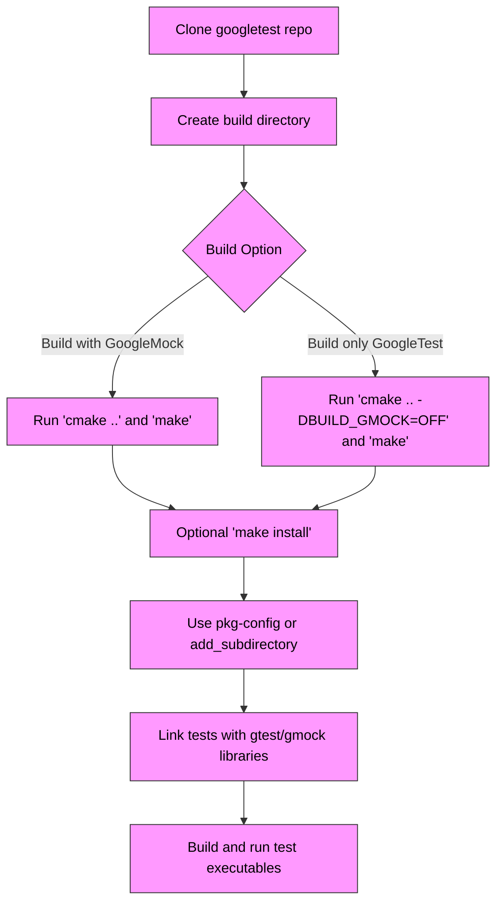

# Installation from Source

This guide walks you through installing GoogleTest and GoogleMock directly from source. It covers manual build approaches and configuration tips for custom or legacy project setups where package managers or pre-built binaries are not suitable.

---

## 1. Prerequisites & System Requirements

Before you start, ensure your environment meets these criteria:

- **C++17 Support Required**: Your compiler must support C++17 standard.
- **CMake Version 3.13 or Higher**: GoogleTest uses CMake for configuring builds.
- **Git Installed**: Needed to clone the source repository.
- **Build Tools**: `make` on Unix/Linux, Visual Studio on Windows, or Xcode on macOS.
- **Threading Support**: Pthreads on Unix-like platforms or Windows threading primitives.

<Tip>
It’s best to verify your compiler supports C++17 explicitly. For example, GCC 7.0+ or MSVC 2017+.
</Tip>

## 2. Cloning the Source Code

Begin by cloning the GoogleTest repository:

```bash
git clone https://github.com/google/googletest.git -b main
cd googletest
```

This fetches the latest version (main branch) containing both GoogleTest and GoogleMock sources.

---

## 3. Building GoogleTest and GoogleMock

GoogleTest provides a CMake project with options to build test libraries, samples, and GoogleMock included.

### Standalone Build (Including GoogleMock)

1. Create and enter a build directory inside the cloned repo:

   ```bash
   mkdir build && cd build
   ```

2. Generate platform-specific build files with CMake:

   ```bash
   cmake ..
   ```

   This will configure GoogleTest and GoogleMock with default options.

3. Build the libraries:

   ```bash
   make
   ```

   On Windows, open the generated `.sln` file in Visual Studio and build.

4. (Optional) Install to system directories:

   ```bash
   sudo make install
   ```

   This installs headers and libraries (default to `/usr/local`). Use this if you want system-wide access.

### Build GoogleTest Only

If you want only GoogleTest without GoogleMock, run:

```bash
cmake .. -DBUILD_GMOCK=OFF
make
```

### Building on Windows

Use the Visual Studio solution file generated by CMake (e.g., `gtest.sln`) and build using Visual Studio IDE or

```powershell
cmake --build . --config Release
```

### Customize Build Options

- To build GoogleTest’s own samples and tests, enable `gtest_build_samples` and `gtest_build_tests` flags.
- To link dynamically (DLL on Windows), add `-DGTEST_CREATE_SHARED_LIBRARY=1` to compiler flags.
- Use `-Dgtest_force_shared_crt=ON` on Windows to enforce dynamic CRT linkage and prevent runtime conflicts.

<Tip>
For projects embedding GoogleTest, consider building it with the same compiler and linker settings, or include it directly using `add_subdirectory()` to avoid incompatibilities.
</Tip>

---

## 4. Installing GoogleTest for Use in Your Projects

GoogleTest installs headers, libraries (like `libgtest.a`, `libgtest_main.a`), and pkg-config files for easy integration.

### Understanding the Installed pkg-config Files

Three key `.pc` files support flexible linking:

- **gtest.pc** - for GoogleTest core (without main function)
- **gtest_main.pc** - GoogleTest with main function included
- **gmock.pc** and **gmock_main.pc** - GoogleMock counterparts

Each contains paths and linking flags such as `-I` include paths and library `-L` and `-l` flags that `pkg-config` can provide.

### Using pkg-config in Your Build System

You can use `pkg-config` to query the necessary compiler and linker flags.

Example for a sample test source `samples/sample3_unittest.cc` with CMake:

```cmake
find_package(PkgConfig)
pkg_search_module(GTEST REQUIRED gtest_main)

add_executable(testapp samples/sample3_unittest.cc)
target_compile_options(testapp PRIVATE ${GTEST_CFLAGS})
target_link_libraries(testapp PRIVATE ${GTEST_LDFLAGS})

enable_testing()
add_test(NAME sample_test COMMAND testapp)
```

<Tip>
If `pkg-config` cannot find GoogleTest, ensure your `PKG_CONFIG_PATH` includes the directory where the `.pc` files were installed (usually `/usr/local/lib/pkgconfig` or `/usr/local/lib64/pkgconfig`).
</Tip>

---

## 5. Incorporating GoogleTest Into Existing CMake Projects

For legacy or custom projects, embedding GoogleTest source directly ensures compiler/linker ABI compatibility.

### Method 1: Using `add_subdirectory()`

1. Download or clone the GoogleTest source somewhere inside your project, e.g., `third_party/googletest/`.
2. In your `CMakeLists.txt`, add:

```cmake
add_subdirectory(third_party/googletest)

add_executable(my_tests test/my_tests.cpp)
target_link_libraries(my_tests gtest_main)
```

This builds GoogleTest together with your project using consistent settings.

### Method 2: Using FetchContent

Using CMake 3.14+ `FetchContent` to automatically download and build GoogleTest:

```cmake
include(FetchContent)
FetchContent_Declare(
  googletest
  URL https://github.com/google/googletest/archive/5376968f6948923e2411081fd9372e71a59d8e77.zip
)
set(gtest_force_shared_crt ON CACHE BOOL "" FORCE) # On Windows to match CRT linkage
FetchContent_MakeAvailable(googletest)

add_executable(my_tests test/my_tests.cpp)
target_link_libraries(my_tests gtest_main)
```

### Important Notes

- Setting `gtest_force_shared_crt` ON on Windows prevents runtime library mismatches that cause linker errors.
- Your project must use C++17 or higher.

---

## 6. Running Your First GoogleTest Build

After building and linking, compile your test executable.

Example command for standalone build:

```bash
g++ -std=c++17 -isystem /usr/local/include -pthread \
    test/sample_test.cpp -L/usr/local/lib -lgtest_main -o sample_test
```

Run your test binary:

```bash
./sample_test
```

Expected output shows test cases run and their pass/fail status.

<Tip>
If you see linking errors about missing pthread or other flags, verify your build uses `-pthread` or equivalent on your system.
</Tip>

---

## 7. Troubleshooting Common Issues

<AccordionGroup title="Common Installation Issues">
<Accordion title="pkg-config cannot find GoogleTest">
Check your `PKG_CONFIG_PATH` environment variable points to the directory containing GoogleTest `.pc` files (e.g., `/usr/local/lib/pkgconfig`). After installation, run:

```bash
export PKG_CONFIG_PATH=/usr/local/lib/pkgconfig:$PKG_CONFIG_PATH
```

and retry `pkg-config --libs gtest`.
</Accordion>
<Accordion title="RuntimeLibrary mismatch on Windows (LNK2038 error)">
Set `-Dgtest_force_shared_crt=ON` in your CMake configuration. This ensures GoogleTest uses dynamic CRT linkage matching your project.
</Accordion>
<Accordion title="Missing pthread linkage errors">
Make sure compiler and linker flags include `-pthread` (Linux/macOS). If you build manually, add `-pthread` to compile and link flags.
</Accordion>
<Accordion title="Compiler does not support C++17">
Upgrade your compiler to at least GCC 7, Clang 5, or MSVC 2017. GoogleTest requires C++17 for its implementation.
</Accordion>
</AccordionGroup>

---

## 8. Next Steps

- Explore the [Project Configuration](../configuration-and-first-use/project-configuration) page to learn how to set up your build system for tests.
- Proceed to [Writing and Running Your First Test](../configuration-and-first-use/writing-first-test) for hands-on test development.
- If mocking is needed, see [Basic Mocking with GoogleMock](../configuration-and-first-use/using-googlemock-basics).
- For integration with Bazel, review the [Installing with Bazel](../setup-and-installation/installing-with-bazel) guide.

---

## References

- [GoogleTest GitHub Repository](https://github.com/google/googletest)
- [CMake Official Website](https://cmake.org/)
- [GoogleTest README on Building and Usage](https://github.com/google/googletest/blob/main/README.md)
- [Pkg-Config Usage Guide](../pkgconfig)

---

## Summary Diagram of Installation Workflow



---