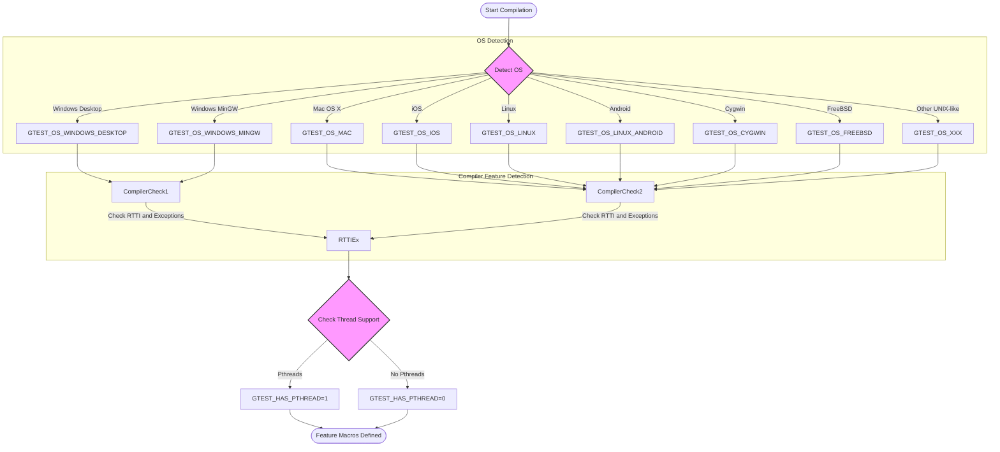

# System Requirements & Supported Platforms

This page provides a comprehensive overview of the system requirements, supported platforms, compiler compatibility, and C++ standard prerequisites for running GoogleTest and GoogleMock. It serves as a vital foundation before installation and integration, ensuring your environment can support the framework reliably and efficiently.

---

## 1. C++ Standard Version Requirement

GoogleTest requires an environment that supports **C++17 or later**. Attempting to build or use GoogleTest with older C++ standards is unsupported and will result in build failures.

### Recommendations

- When using CMake, specify the C++ standard explicitly at your project’s top-level CMakeLists.txt:

```cmake
set(CMAKE_CXX_STANDARD 17)
set(CMAKE_CXX_STANDARD_REQUIRED ON)
```

- If you cannot specify it globally (e.g., in mixed-language projects), add the appropriate compiler flags manually:

```bash
# Example for GCC or Clang
-std=c++17

# For MSVC
/std:c++17
```

Failure to meet this minimum version will cause explicit errors, such as:

```
#error C++ versions less than C++17 are not supported.
```

---

## 2. Supported Operating Systems

GoogleTest supports an extensive range of platforms, reflecting Google's broad development environment requirements. The detection and support are handled internally by macros defined during compilation.

| Platform                | Supported Macro (GTEST_OS_*)         | Notes                       |
|-------------------------|-------------------------------------|-----------------------------|
| Windows (Desktop)       | `GTEST_OS_WINDOWS_DESKTOP`           | Includes native Windows APIs |
| Windows (MinGW)         | `GTEST_OS_WINDOWS_MINGW`             | GCC-based Windows builds    |
| macOS                   | `GTEST_OS_MAC`                      | Apple macOS                 |
| iOS                     | `GTEST_OS_IOS`                      | Apple iOS                   |
| Linux                   | `GTEST_OS_LINUX`                    | Broad Linux distributions   |
| Android (Linux-based)   | `GTEST_OS_LINUX_ANDROID`            | Google Android OS           |
| Cygwin                  | `GTEST_OS_CYGWIN`                   | POSIX emulation on Windows  |
| FreeBSD                 | `GTEST_OS_FREEBSD`                  | BSD variant                 |
| OpenBSD                 | `GTEST_OS_OPENBSD`                  | BSD variant                 |
| NetBSD                  | `GTEST_OS_NETBSD`                   | BSD variant                 |
| Solaris                 | `GTEST_OS_SOLARIS`                  | Oracle Solaris              |
| AIX                     | `GTEST_OS_AIX`                      | IBM AIX                    |
| HP-UX                   | `GTEST_OS_HPUX`                     | Hewlett-Packard Unix        |
| z/OS                    | `GTEST_OS_ZOS`                      | IBM mainframe OS            |
| DragonFlyBSD            | `GTEST_OS_DRAGONFLY`                | BSD variant                 |
| Fuchsia                 | `GTEST_OS_FUCHSIA`                  | Google's microkernel OS (Not officially supported) |
| GNU/Hurd                | `GTEST_OS_GNU_HURD`                 | GNU Unix-like OS            |
| GNU/kFreeBSD            | `GTEST_OS_GNU_KFREEBSD`             | GNU Unix BSD variant        |
| Native Client (NaCl)    | `GTEST_OS_NACL`                     | Google Native Client        |
| QNX                     | `GTEST_OS_QNX`                     | RTOS                       |
| Haiku                   | `GTEST_OS_HAIKU`                   | BeOS-inspired OS           |
| Embedded (ESP8266/ESP32)| `GTEST_OS_ESP8266`, `GTEST_OS_ESP32`| Embedded platforms          |
| Xtensa                  | `GTEST_OS_XTENSA`                  | Embedded DSP architecture   |
| Qualcomm Hexagon        | `GTEST_OS_QURT`                    | DSP OS                    |
| NXP QN9090              | `GTEST_OS_NXP_QN9090`              | Embedded MCU                |
| Nordic NRF52            | `GTEST_OS_NRF52`                   | Embedded MCU                |

<Info>
GoogleTest has the broadest level of stable support on Windows, macOS, Linux, and Cygwin environments. Other platforms may have limited or community-driven support.
</Info>

---

## 3. Compiler Compatibility

GoogleTest supports most modern C++ compilers meeting the C++17 requirement, including but not limited to:

- **GCC** (4.8+ recommended, newer versions preferred)
- **Clang/LLVM** (3.4.1+ recommended)
- **MSVC** (Visual Studio 2017 Update 3 / MSVC 19.11+)
- **Intel C++ Compiler**
- **Sun Pro CC**
- **IBM XL C++**
- **Borland C++** (with some limitations)

### Version Checks and Errors

- Trying to build with MSVC versions less than 2015 will produce an error, e.g.,

```
#error "At least Visual C++ 2015 (14.0) is required to compile Google Mock."
```

- Compiler flags related to RTTI and exception handling will be set or are expected to be set in typical configurations. Avoid disabling RTTI or exceptions as GoogleTest requires these features.

### Special Notes

- GoogleTest detects compiler features like exception support, RTTI availability, and threading via macros during compilation.

- It defines internal flags such as `GTEST_HAS_EXCEPTIONS`, `GTEST_HAS_RTTI`, and `GTEST_HAS_PTHREAD` accordingly.

- You can override or tweak these configurations by manually defining macros (e.g., via `-DGTEST_HAS_PTHREAD=1` or `0`) in your build.


---

## 4. Threading and Synchronization

- GoogleTest is **thread-safe** if pthreads or native Windows threading APIs are available.
- Thread safety detection is automatic, but can be overridden by defining `GTEST_HAS_PTHREAD`.
- When enabled, GoogleTest uses mutexes, thread-local storage, condition variables, and other synchronization primitives internally.

<Note>
Ensure that your build system links against the pthread library (`-pthread`) if required, as failing to do so will cause linker errors.
</Note>

---

## 5. Platform-Specific Features and Support

### POSIX Regular Expressions

- GoogleTest uses enhanced POSIX Extended Regular Expressions on supported platforms.
- On some platforms (Windows, embedded, etc.), it falls back to a simplified regex implementation.

### Stream Redirection

- GoogleTest supports redirection of stdout and stderr for death tests on most desktop platforms.
- Stream redirection is disabled on mobile and embedded platforms such as Windows Mobile, Windows Phone, Windows RT, ESP8266, and others.

### Death Tests

- Enabled on platforms with file system support and certain OS types, including Linux, macOS (not iOS), Windows Desktop editions, FreeBSD, and others.

---

## 6. Filesystem and Path Support

- GoogleTest assumes the presence of a POSIX-like file system on most platforms.
- Windows-specific support uses native Windows calls for file operations.
- Use of wide strings (UTF-16) is standard on Windows; UTF-8 paths on POSIX systems.

---

## 7. Build System Integration Tips

- **CMake** (recommended): GoogleTest requires C++17 and threading support; CMake scripts handle most platform and compiler quirks automatically.
- **Bazel**: Platform-specific configurations and macros ensure proper detection of threading and compiler features.
- **pkg-config**: Provided `.pc` files help configure compile and link flags to satisfy platform-specific requirements.

<Tip>
When integrating GoogleTest into custom build systems, ensure your compiler and linker flags include appropriate threading libraries (`-pthread` or equivalent) and define necessary macros for your platform.
</Tip>

---

## 8. Troubleshooting Common Compatibility Issues

| Issue                                   | Cause                                      | Resolution                                  |
|-----------------------------------------|--------------------------------------------|---------------------------------------------|
| Build fails with C++ version errors     | C++ standard less than 17                   | Use `-std=c++17` or higher compiler flag     |
| Linker errors related to pthread        | Missing pthread linking flags               | Add `-pthread` to compiler and linker flags  |
| MSVC build errors about runtime library | Mismatch between static and dynamic CRT    | Use `-Dgtest_force_shared_crt=ON` or align runtimes |
| Undefined macros like `GTEST_OS_WINDOWS`| Build system does not correctly detect OS  | Verify compiler defines; define macros if necessary |

---

## 9. References and Further Reading

- Google’s [Foundational C++ Support Policy](https://opensource.google/documentation/policies/cplusplus-support)
- Official [Platform and Compiler Matrix](https://github.com/google/oss-policies-info/blob/main/foundational-cxx-support-matrix.md)
- Internal platform macro definitions in `gtest-port-arch.h`
- Build and integration examples:
  - [Build with CMake](https://github.com/google/googletest/blob/main/googletest/README.md)
  - [Build with Bazel](https://github.com/google/googletest/blob/main/BUILD.bazel)
- Pkg-config usage guidance in [docs/pkgconfig.md](https://github.com/google/googletest/blob/main/docs/pkgconfig.md)

---

For detailed instructions on installing and configuring GoogleTest, visit the related Getting Started and Installation Guides.

---

### See Also

- [Getting Started / Prerequisite Tools & Dependencies](https://docs/getting-started/setup-foundations/prerequisites)
- [Getting Started / Install with CMake](https://docs/getting-started/installation-quickstart/install-cmake)
- [Supported Platforms Summary](https://docs/overview/integration-ecosystem/supported-platforms)


---

# Summary Diagram: Platform Detection Process


---

# Additional Tips

- Regularly verify your build environment matches the required C++17 standard level.
- For cross-compilation, explicitly confirm your toolchain supports all GoogleTest features.
- Consult the official platform matrix for the latest supported versions of compilers and OS.

---

For the most reliable results, build and test GoogleTest within supported environments and maintain alignment with recommended compiler versions and configurations.
