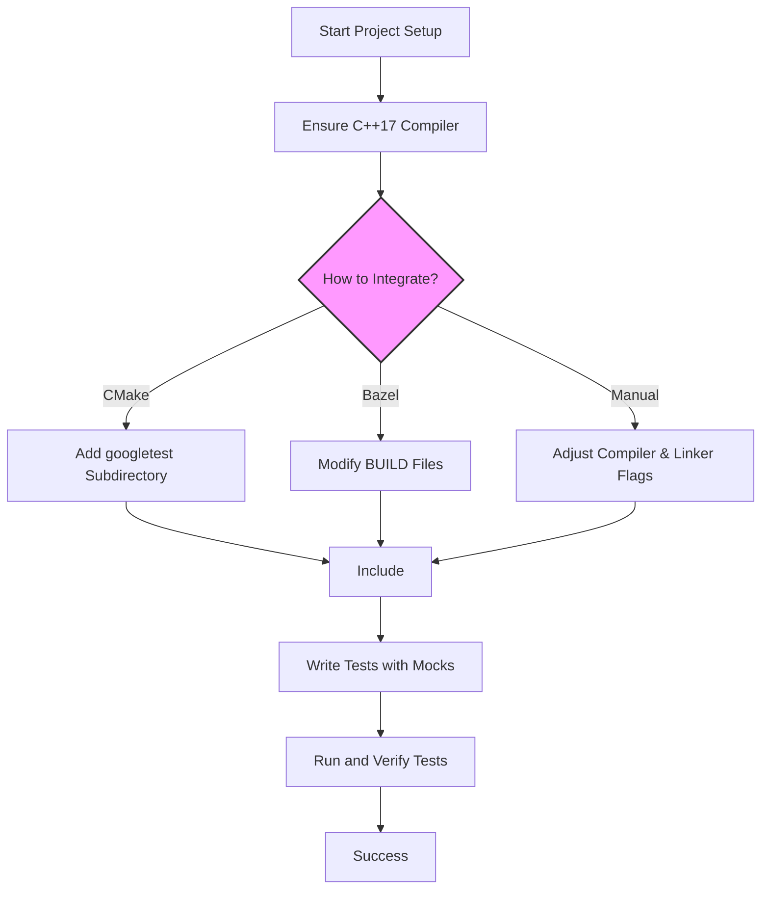

# Configuration and Project Setup

Integrating GoogleTest and GoogleMock into your C++ projects involves setting up the necessary header inclusion and linking libraries correctly. This guide provides clear, actionable steps and practical examples for common build systems to help you get started without hassle.

---

## 1. Prerequisites

Before starting, ensure the following prerequisites are met:

- You have C++17 or later enabled in your project settings.
- Compatible compiler installed (GCC 7.1+, Clang 5.0+, MSVC 2017+).
- GoogleTest/GoogleMock source code or prebuilt libraries available.

> <Check>
> Verify your compiler supports C++17:
> ```
> g++ --version  # >= 7.1
> clang++ --version  # >= 5.0
> cl  # MSVC 2017 or later
> ```
> 
> If not, update your build environment accordingly.
> </Check>

---

## 2. Including GoogleTest/GoogleMock Headers

To use GoogleMock alongside GoogleTest, include the main mock header in your test source files:

```cpp
#include <gmock/gmock.h>
```

This single header imports all necessary GoogleTest and GoogleMock functionality.

> <Tip>
> Always include `gmock.h` instead of `gtest.h` directly when working with mocks.
> </Tip>

---

## 3. Linking GoogleTest and GoogleMock Libraries

Your project must link against the GoogleTest and GoogleMock libraries. The linking step depends on how you installed or built GoogleTest/GoogleMock.

### Common Scenarios:

| Scenario                        | Notes                                                |
| ------------------------------- | ------------------------------------------------------ |
| Using prebuilt static/shared libs | Link against `gmock`, `gmock_main`, `gtest`, and `gtest_main` (as needed) and their dependencies. |
| Building from source with CMake  | Use the exported targets from CMake (`gmock`, `gmock_main`) to link.
| Using Bazel                      | Add `@com_google_googletest//:gmock` or `gmock_main` as a dependency. |

> <Note>
> If linking manually, be sure to link all transitive dependencies as documented in the build system.
> </Note>

---

## 4. Example Build Configurations

### 4.1. CMake Example

Add GoogleTest/GoogleMock to your project (either by downloading or as a git submodule):

```cmake
# Assuming googletest is downloaded to 'external/googletest'
add_subdirectory(external/googletest)

# Your test executable
add_executable(my_tests test/my_tests.cpp)

target_link_libraries(my_tests PRIVATE gmock_main)

# Optional: Enable C++17
set_target_properties(my_tests PROPERTIES 
    CXX_STANDARD 17
    CXX_STANDARD_REQUIRED ON
)
```

Then use `my_tests` as your test binary.

### 4.2. Bazel Example

In your `BUILD` file, add:

```python
cc_test(
    name = "my_tests",
    srcs = ["my_tests.cc"],
    deps = ["@com_google_googletest//:gmock_main"],
)
```

Make sure the `googletest` external repository is set up.

### 4.3. Manual Makefile Example

```makefile
GTEST_DIR = /path/to/googletest
GMOCK_DIR = /path/to/googlemock
CXXFLAGS += -isystem $(GTEST_DIR)/include -isystem $(GMOCK_DIR)/include -std=c++17
LDFLAGS += \
    $(GTEST_DIR)/lib/libgtest.a \
    $(GMOCK_DIR)/lib/libgmock.a \
    -pthread

my_tests: test/my_tests.o
	$(CXX) $^ $(LDFLAGS) -o $@
```

Adjust paths and libraries as per your installation.

---

## 5. Best Practices

- **Set Expectations Before Test Execution**: Always call `EXPECT_CALL()` before exercising your mocks.
- **Use `gmock_main` for Convenience**: Linking `gmock_main` provides a main function that initializes GoogleTest and GoogleMock.
- **Enable C++17 Standard**: GoogleTest and GoogleMock require C++17; ensure your compiler flags reflect this.
- **Be Consistent with Build System Usage**: Prefer using your build system's integration approach to avoid manual errors.
- **Handle Include Paths Properly**: Use system include paths (`-isystem`) to avoid polluting your build with warnings from third-party headers.

---

## 6. Troubleshooting Common Issues

<AccordionGroup title="Troubleshooting Common Build and Configuration Issues">
<Accordion title="Cannot Find gmock/gmock.h Header">
Verify that the include paths given to the compiler contain the path to your GoogleMock `include` directory. Check the spelling and the directory structure.
</Accordion>
<Accordion title="Linker Errors on GoogleTest/GoogleMock Symbols">
Ensure that you link against the correct GoogleTest and GoogleMock libraries, respecting their dependencies. In CMake and Bazel, use the recommended targets. In manual builds, make sure all `*.a` or `*.lib` files are passed to the linker.
</Accordion>
<Accordion title="Compiler Reports C++17 Features Missing">
Check that your compiler and standard flags enable at least C++17.
</Accordion>
<Accordion title="Test Executable Does Not Run or Fails to Initialize">
Link with `gmock_main` or call `testing::InitGoogleMock()` explicitly in your `main()`.
</Accordion>
</AccordionGroup>

---

## 7. Next Steps

- Explore [Writing and Running Your First Test](/getting-started/first-experience/writing-first-test).
- Learn about [Adding Mocks to Your Tests](/gtest-guides/getting-started/adding_mocks).
- Troubleshoot using [Troubleshooting Common Setup Issues](/getting-started/first-experience/common-setup-issues).


---

## References

- Google Test & Mock Official GitHub: [https://github.com/google/googletest](https://github.com/google/googletest)
- [GoogleTest Primer](https://github.com/google/googletest/blob/main/docs/primer.md)
- [gMock Cookbook](https://github.com/google/googletest/blob/main/docs/gmock_cook_book.md)

---

<Check>
For detailed platform-specific setup, consult the [Supported Platforms & Build Integration](/overview/integration-and-ecosystem/platforms-integration) documentation.
</Check>

---

## Summary Diagram



---
