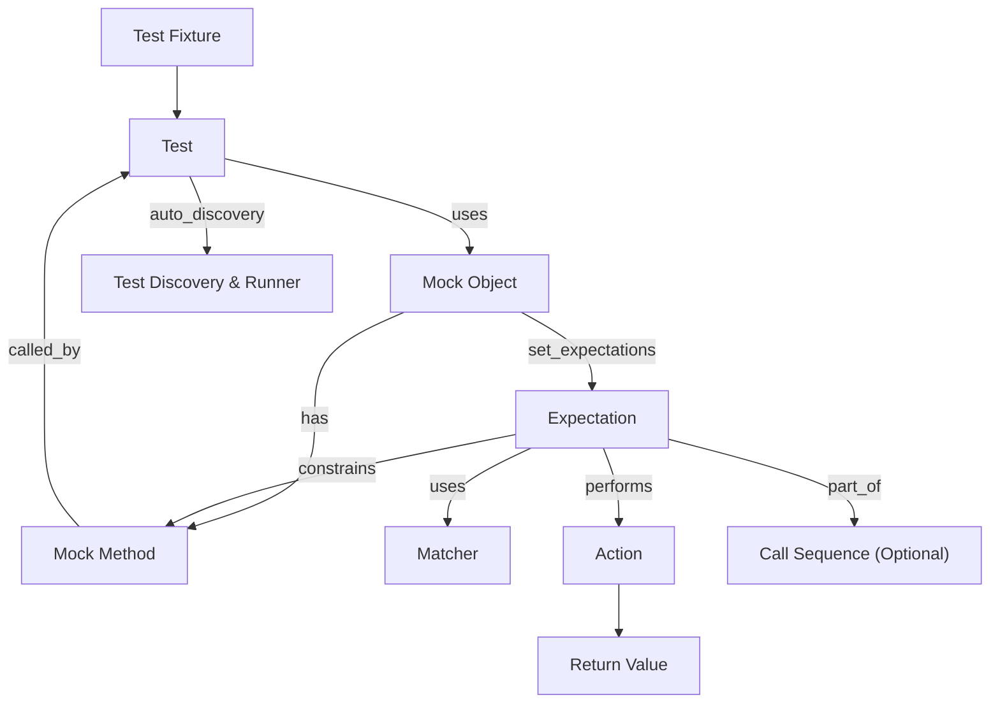

# Core Concepts & Terminology

Welcome to the essential guide for understanding the foundational terms and concepts that GoogleTest and GoogleMock revolve around. Mastering these will empower you to write precise tests and effective mocks, boosting productivity and test robustness.

---

## Test Fixtures

Test fixtures represent a fixed environment in which tests run. They are classes that prepare and clean up the context for executing tests, allowing you to reuse setup code efficiently.

For instance, if you test a class `MyClass`, you may define a fixture:

```cpp
class MyClassTest : public ::testing::Test {
 protected:
  void SetUp() override {
    // Code here runs before each test.
  }

  void TearDown() override {
    // Code here runs after each test.
  }

  MyClass instance_;
};
```

Each test method using this fixture automatically has `SetUp()` invoked before and `TearDown()` after.

<Check>
Always ensure your fixture class has a virtual destructor if inheriting.
</Check>

## Assertions

Assertions specify expected outcomes within tests. GoogleTest provides a rich set of assertions that verify conditions. For example:

```cpp
EXPECT_EQ(expected, actual); // Checks equality, continues on failure
ASSERT_TRUE(condition);     // Checks truth, aborts on failure
```

Use assertions to validate code under test and catch failures early.

## Mock Objects

Mocks simulate behavior of real objects and allow you to specify expectations on method calls, argument values, call frequencies, and returned results.

You create mock classes using the `MOCK_METHOD` macros to declare mocked methods:

```cpp
class MockFoo {
 public:
  MOCK_METHOD(int, GetSize, (), (const, override));
  MOCK_METHOD(std::string, Describe, (int type), (override));
};
```

Mock objects enable interaction-based testing, focusing on how your code collaborates with dependencies.

## Expectations

Expectations control how mocks are allowed or required to behave. Using `EXPECT_CALL`, you specify:

- Which methods will be called.
- The argument matchers for those methods.
- How many times (cardinalities) they will be called.
- The return value or actions on invocation.

Example:

```cpp
EXPECT_CALL(mock_foo, GetSize())
    .Times(2)
    .WillOnce(Return(10))
    .WillOnce(Return(20));
```

Here `GetSize()` is expected twice, returning 10 the first time, then 20.

### Advanced expectation clauses

- `.With(matcher)`: Matches combined arguments as a tuple.
- `.InSequence(seq1, seq2, ...)`: Enforces call ordering.
- `.After(expectation1, expectation2, ...)`: Requires call to happen after others.
- `.WillOnce(action)`: Specifies the behavior for the next matching call.
- `.WillRepeatedly(action)`: Specifies default behavior for subsequent calls.
- `.RetiresOnSaturation()`: Retires expectation once it reaches its call limit, useful to manage overlapping expectations.

## Test Discovery

GoogleTest auto-discovers tests in your code based on the `TEST()` and `TEST_F()` macros without requiring explicit registration.

Simply naming tests appropriately and linking test binaries enable your preferred test runner to run all tests.

## Common User Flows

### Creating and Using a Mock

1. Define the mock class using `MOCK_METHOD` to simulate virtual methods.
2. Instantiate the mock in your test.
3. Set default actions via `ON_CALL` and expectations via `EXPECT_CALL`.
4. Exercise production code that uses the mock.
5. Automatic verification occurs on mock destruction or via explicit calls.

### Handling Uninteresting Calls

If a mock method is called without an expectation (`EXPECT_CALL`), it is an uninteresting call. By default, gMock issues warnings for these. To manage this behavior:

- Use `NiceMock<T>` to suppress warnings on uninteresting calls.
- Use `NaggyMock<T>` (default) to print warnings.
- Use `StrictMock<T>` to treat uninteresting calls as failures.

### Sequence and Partial Ordering

To enforce call order, wrap expectations in a sequence context:

```cpp
{
  InSequence seq;
  EXPECT_CALL(mock, First());
  EXPECT_CALL(mock, Second());
}
```

For complex partial orders, use `.InSequence()` with multiple sequences or `.After()` clauses to define dependencies between expectations.

## Best Practices

- Use `ON_CALL` to set default mock behavior without imposing call expectations.
- Set expectations only when you want to verify specific interactions.
- Avoid overspecifying mocks; only constrain what matters to your tests.
- Use matchers (`_`, `Eq()`, `NotNull()`, etc.) to describe expected argument values flexibly.
- Prefer `NiceMock` for general testing to minimize warnings from uninteresting calls.
- Use sequences conservatively to avoid brittle tests that break on harmless order changes.

## Troubleshooting

### Common Issues

- **Uninteresting calls warnings**: Either add expectations for calls you expect or switch to `NiceMock` to silence warnings.
- **Unexpected call errors**: You have an `EXPECT_CALL` but the code is calling with unexpected arguments. Use `--gmock_verbose=info` to trace matching.
- **Call order failures**: Check if sequences or `.After()` clauses overly constrain your tests.
- **Mock method not called**: Verify your `EXPECT_CALL` cardinalities and usage.
- **Missing virtual destructors**: Mocked classes must have virtual destructors to avoid leaks and undefined behavior.

### Tools

- Use `Mock::VerifyAndClearExpectations(mock_object)` to explicitly verify calls and reset expectations mid-test.
- Use `Mock::AllowLeak(mock_object)` to suppress errors from leaked mocks when destruction can't be guaranteed.

---

## Summary Diagram of Concept Relationships



## Final Notes

This terminology is the lingua franca of GoogleTest/GoogleMock. Understanding it deeply pays off in writing maintainable, flexible, and powerful tests. For deeper guidance and specific workflows, consult the linked guides.

---

## References and Further Reading

- [gMock Cheat Sheet](https://google.github.io/googletest/gmock_cheat_sheet.html)
- [gMock Cookbook](https://google.github.io/googletest/gmock_cook_book.html)
- [Core Concepts & Terminology (this page)](/overview/core-concepts-and-architecture/core-terminology)
- [Basics of Mocking Functions and Classes](/guides/mocking-best-practices/basics-of-mocking)
- [Specifying Behavior: Actions, Matchers, and Sequences](/guides/mocking-best-practices/actions-matchers-sequences)
- [Strict, Nice, and Naggy Mocking Modes](/api-reference/gmock-api/strictness-and-mock-behavior)

<Tip>
To become productive quickly, start writing simple mocks and expectations, and iteratively explore advanced matchers, sequences, and actions as needed.
</Tip>

<Note>
Remember that GoogleMock is part of GoogleTest and requires compiling with virtual methods and C++17. Ensure prerequisites are met (see Prerequisites & System Requirements).
</Note>