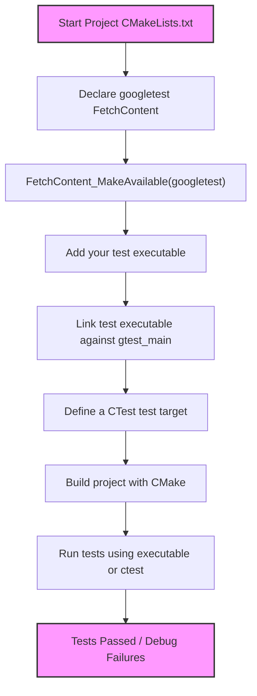

# Configuring Your Project to Use GoogleTest

This guide walks you through integrating GoogleTest (and optionally GoogleMock) into your user project using popular build systems, specifically **CMake** and **Bazel**. You'll learn how to add GoogleTest as a dependency, initialize testing in your build configuration, and verify the correct linkage of GoogleTest headers and libraries. 

---

## 1. Prerequisites & System Requirements

Before integrating GoogleTest, ensure the following prerequisites are met:

- **C++17 or higher compiler support** (required to build and run GoogleTest).
- **CMake 3.14 or later** when using CMake-based integration.
- Internet access or local source copies of the GoogleTest repository.
- Basic familiarity with CMake or Bazel build systems.

<Tip>
If your build environment or platform requires using GoogleMock alongside GoogleTest, the following instructions cover setup for both.
</Tip>

---

## 2. Integrating GoogleTest With CMake

GoogleTest supports two main approaches with CMake:

### A. Use Installed GoogleTest Libraries

If you have installed GoogleTest on your system (e.g., via package manager or manually), you can use `find_package` to locate the libraries.

1. Add the following to your project's `CMakeLists.txt`:

```cmake
find_package(GTest CONFIG REQUIRED)

add_executable(your_test_executable test_file.cpp)
target_link_libraries(your_test_executable GTest::gtest GTest::gtest_main)

add_test(NAME your_test COMMAND your_test_executable)
```

2. Configure your project as usual with CMake.

3. Build and run your tests.

### B. Embed GoogleTest via FetchContent

For tighter integration and consistent compiler/linker settings, embed GoogleTest as part of your build.

1. Add this snippet near the top of your `CMakeLists.txt`:

```cmake
include(FetchContent)

FetchContent_Declare(
  googletest
  URL https://github.com/google/googletest/archive/5376968f6948923e2411081fd9372e71a59d8e77.zip
)

# For Windows: link shared CRT dynamically
set(gtest_force_shared_crt ON CACHE BOOL "" FORCE)

FetchContent_MakeAvailable(googletest)
```

2. Then add your test executable and link to GoogleTest libraries:

```cmake
add_executable(example_test example_test.cpp)
target_link_libraries(example_test gtest_main)

add_test(NAME example_test COMMAND example_test)
```

3. Generate your build system and build your tests (e.g., `cmake --build .`), then run tests.

<Tip>
When embedding GoogleTest, GoogleMock is also included by default if you require mocking support—simply link with `gmock` or `gmock_main` similarly.
</Tip>

---

## 3. Integrating GoogleTest With Bazel

While not explicitly detailed here, typical Bazel usage to incorporate GoogleTest involves:

- Adding `googletest` as a Bazel external repository.
- Declaring your test targets with the appropriate `deps` on `@com_google_googletest//...`.

Refer to the Bazel documentation or the [GoogleTest Bazel integration guide](https://github.com/google/googletest/tree/main/googletest#bazel) for detailed steps.

---

## 4. Verifying Correct Include and Link Setup

After setting up your build system, verifying that GoogleTest headers and libraries are properly found and linked is critical.

### Steps to Verify:

1. **Build your test executable** using your configured build system.
2. Ensure the build completes without errors related to missing headers like `gtest/gtest.h` or unresolved library symbols.
3. **Run the test executable**; it should execute all included GoogleTest tests.
4. If using CTest or `ctest`, run tests by executing `ctest` from your build directory.

### Troubleshooting Common Issues:

- **Header Not Found**:
  - Ensure your include directories point to GoogleTest’s include path.
  - If embedding via `FetchContent`, verify GoogleTest was downloaded and propagated.

- **Linker Errors**:
  - Confirm target linkage includes `gtest` or `gtest_main`.
  - On Windows, use `gtest_force_shared_crt` option to avoid CRT linkage mismatches.

- **Runtime Errors / Tests Not Running**:
  - Confirm you called `testing::InitGoogleTest(&argc, argv)` or let `InitGoogleMock()` handle it if using GoogleMock (see below).

---

## 5. Initializing GoogleTest and GoogleMock in Your Code

To run your tests correctly, initialization of GoogleTest (and GoogleMock if used) is required.

### Initialization Pattern

In your test driver, typically `main.cpp`, initialize GoogleTest:

```cpp
#include <gtest/gtest.h>

int main(int argc, char** argv) {
  ::testing::InitGoogleTest(&argc, argv);
  return RUN_ALL_TESTS();
}
```

When you include GoogleMock in your project, you should initialize GoogleMock instead, which also initializes GoogleTest for you:

```cpp
#include <gmock/gmock.h>

int main(int argc, char** argv) {
  ::testing::InitGoogleMock(&argc, argv);
  return RUN_ALL_TESTS();
}
```

### Key Points:

- `InitGoogleTest` and `InitGoogleMock` parse command-line flags related to the testing framework.
- They remove any recognized flags from `argv` and update the count accordingly.
- Use `InitGoogleMock` **only if using GoogleMock features**, else `InitGoogleTest` suffices.

---

## 6. Handling Special Build Situations

### Visual Studio CRT Linkage

If you build on Windows with Visual Studio, you may encounter linker errors due to mismatched C runtime libraries. Fix this by enabling dynamic CRT linkage for GoogleTest/GoogleMock in your `CMakeLists.txt`:

```cmake
set(gtest_force_shared_crt ON CACHE BOOL "" FORCE)
```

This ensures consistent runtime linkage and avoids errors like:

```
gtest.lib(gtest-all.obj) : error LNK2038: mismatch detected for 'RuntimeLibrary'
```

### Shared Library Build

By default, GoogleTest builds as a static library, which is simpler and recommended. To build GoogleTest as a shared library (DLL):

- Add the compiler flag `-DGTEST_CREATE_SHARED_LIBRARY=1`.
- Tell your linker to produce a shared library.
- When compiling tests against the shared library, use `-DGTEST_LINKED_AS_SHARED_LIBRARY=1`.

Consider if your environment benefits from shared libraries before opting in.

---

## 7. Summary of Typical CMake Setup Workflow

<Steps>
<Step title="Clone GoogleTest">
Clone the official GoogleTest repository or ensure you have the source zip archive.
</Step>
<Step title="Setup CMake FetchContent">
Add the `FetchContent_Declare` and `FetchContent_MakeAvailable` commands to your `CMakeLists.txt`.
</Step>
<Step title="Add Test Executable">
Create an executable target for your tests and link with `gtest_main`.
</Step>
<Step title="Initialize Testing in Code">
In your test `main`, call `InitGoogleTest` or `InitGoogleMock`.
</Step>
<Step title="Build and Run Tests">
Build your project and run tests using the generated executable or with CTest.
</Step>
</Steps>

---

## 8. Additional Tips and Best Practices

- Always specify C++17 standard in your `CMakeLists.txt` to ensure compatibility:

```cmake
set(CMAKE_CXX_STANDARD 17)
set(CMAKE_CXX_STANDARD_REQUIRED ON)
```

- Prefer embedding GoogleTest in your project build for consistent compiler and linker options, especially for multi-configuration builds (Debug/Release).
- When using GoogleMock, link your test executables with `gmock_main` to include GoogleMock's main function.
- Keep your GoogleTest version in sync by regularly updating the `URL` in `FetchContent` or your submodule SHA.

---

## 9. Troubleshooting Common Issues

<AccordionGroup title="Troubleshooting Section">
<Accordion title="GoogleTest Headers Not Found">
Verify your build configuration includes GoogleTest's include directories.
Check `target_include_directories` or `include_directories`.
If using fetch content, confirm GoogleTest sources download correctly.
</Accordion>
<Accordion title="Linker Errors for GoogleTest Symbols">
Ensure test targets link explicitly against `gtest`, `gtest_main`, or `gmock_main` as needed.
Use `target_link_libraries(your_test gtest_main)`.
On Windows, try `set(gtest_force_shared_crt ON CACHE BOOL "" FORCE)`.
</Accordion>
<Accordion title="Tests Run But No Output or Tests Found">
Make sure `InitGoogleTest` or `InitGoogleMock` is called in your test `main`.
Confirm your tests are properly defined with macros like `TEST(...)`.
Check that your test executable is built and run correctly.
</Accordion>
</AccordionGroup>

---

## 10. Where to Go Next

Once your project is configured and tests run successfully:

- Proceed to [Writing Your First Test Case](https://google.github.io/googletest/getting-started/first-test-validation/writing-first-test-case) to learn how to write effective tests.
- Explore [Running Tests and Interpreting Results](https://google.github.io/googletest/getting-started/first-test-validation/running-tests-and-interpreting-results) for detailed guidance on test execution.
- For advanced mocking capabilities, see the [Mocking Framework](https://google.github.io/googletest/api/gmock.html) documentation.

---

<Note>
This page focuses exclusively on project configuration and build integration. For deeper understanding of writing tests or mocking, consult the related getting started and guides sections.
</Note>

---

*Source and additional details can be found in the official [googletest README](https://github.com/google/googletest/blob/main/googletest/README.md) and related CMake files.*

---

# Summary Diagram: GoogleTest CMake Integration Flow


