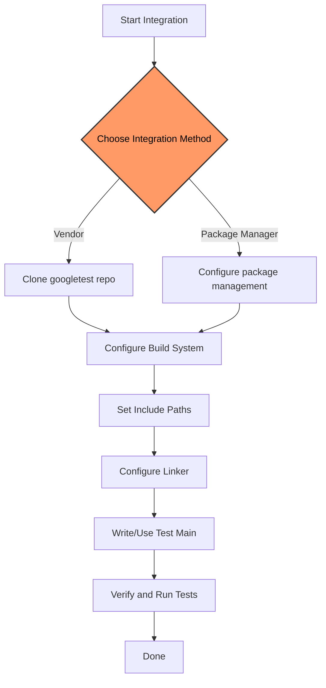

# Integrating with Your Project

This guide explains how to add **GoogleTest** and **GoogleMock** to your existing C++ projects. It covers both methods of integrating the libraries as vendored components within your source tree and as external dependencies managed by your build system. Additionally, it details how to configure include directories, linker settings, and handle any necessary environment or configuration variable adjustments to use GoogleTest and GoogleMock effectively.

---

## 1. Prerequisites

Before integration, ensure the following prerequisites are met:

- Your compiler supports **C++17** or newer, as GoogleTest requires this standard.
- Your platform is among the supported operating systems: Linux, Windows, or macOS.
- Build tools such as CMake or Bazel are installed and configured (if you use them).
- For multi-threaded tests, confirm threading support is enabled.

<Tip>
Having a consistent and modern development environment ensures smooth integration and avoids compatibility issues.
</Tip>

## 2. Choosing Your Integration Strategy

You can integrate GoogleTest and GoogleMock in two main ways:

### A. Vendoring GoogleTest/GoogleMock into Your Project

This involves including the GoogleTest source code inside your project's source tree.

**Advantages:**

- Greater control over the dependency.
- Easy to apply patches or fork versions.
- No external dependencies at build time beyond the vendored source.

**Recommended When:**

- You want a completely self-contained build.
- Your environment restricts use of external package managers.

### B. Using External Dependencies via Package Managers or Build Systems

Leverage your existing package manager or build system to pull GoogleTest and GoogleMock automatically.

**Advantages:**

- Automatic updates and dependency management.
- Cleaner separation of third-party code.
- Simplifies your source tree.

**Recommended When:**

- You already use package managers like vcpkg, Conan, or system packages.
- Your build system supports external project dependencies (e.g., CMake's `FetchContent`).


## 3. Vendoring GoogleTest/GoogleMock into Your Project

### 3.1 Cloning GoogleTest

Download the GoogleTest source code (which includes GoogleMock) from the official repository:

```bash
git clone https://github.com/google/googletest.git third_party/googletest
```

Place it inside your project's `third_party` directory or equivalent.

### 3.2 CMake Integration Example

If your project uses CMake, here’s how to include the vendored GoogleTest:

```cmake
# Add the googletest directory
add_subdirectory(third_party/googletest)

# Add your test executable
add_executable(my_test test/my_test.cc)

# Link against gtest and gmock
target_link_libraries(my_test PRIVATE gtest gmock)

# Include directories are automatically added by the targets
```

<Tip>
Set <code>gtest_force_shared_crt</code> to <code>ON</code> if you want GoogleTest to use the shared C Runtime on Windows:
<pre><code class="language-cmake">
set(gtest_force_shared_crt ON CACHE BOOL "Use shared CRT")
</code></pre>
</Tip>

### 3.3 Bazel Integration Example

If you use Bazel, import GoogleTest in your workspace:

```starlark
http_archive(
    name = "com_google_googletest",
    urls = ["https://github.com/google/googletest/archive/release-1.12.1.tar.gz"],
    sha256 = "<SHA256_HASH>",
)
```

In your BUILD file:

```starlark
cc_test(
    name = "my_test",
    srcs = ["my_test.cc"],
    deps = ["@com_google_googletest//:gmock_main"],
)
```

Check the GoogleTest README and Bazel documentation for the latest URL and hash.

## 4. External Dependency Management

### 4.1 Using Package Managers

Popular C++ package managers can simplify integration:

- **vcpkg:**
  ```bash
  vcpkg install googletest
  ```

- **Conan:** Add to your `conanfile.txt`:
  ```ini
  [requires]
googletest/1.12.1

[generators]
cmake
  ```

After installing, configure your build to find the packages.

### 4.2 CMake’s FetchContent Module

Use CMake's `FetchContent` module to download and integrate GoogleTest on configure:

```cmake
include(FetchContent)

FetchContent_Declare(
  googletest
  GIT_REPOSITORY https://github.com/google/googletest.git
  GIT_TAG release-1.12.1
)

FetchContent_MakeAvailable(googletest)

add_executable(my_test test/my_test.cc)
target_link_libraries(my_test PRIVATE gtest gmock)
```

## 5. Configuring Include Directories and Linker Settings

### 5.1 Include Directories

When linking against GoogleTest/GoogleMock:

- Include paths to `googlemock/include` and `googletest/include` must be visible.
- If using CMake targets (`gtest` and `gmock`), include directories propagate automatically.

If integrating manually, specify include paths explicitly:

```bash
-I/path/to/googletest/include -I/path/to/googlemock/include
```

### 5.2 Linker Settings

Link the necessary libraries:

- When linking tests, link both `gtest` and `gmock` libraries.
- If using the combined main, link `gmock_main` instead of writing your own main function.

Example linking:

```bash
-lgmock_main -lgmock -lgtest -pthread
```

Make sure to include your platform’s thread libraries (`-pthread` on Linux).

<Tip>
If you define your own `main()`, do **not** link `gmock_main`.
</Tip>

## 6. Adjusting Environment and Configuration Variables

GoogleMock and GoogleTest provide flags to adjust runtime behavior:

- `--gmock_verbose`: controls the verbosity of mock call logging; values are `info`, `warning` (default), or `error`.

Example: run your test with

```bash
./my_test --gmock_verbose=info
```

- `--gmock_catch_leaked_mocks=0`: disables reporting leaked mocks as failures.

You can also set flags programmatically inside tests before calling `RUN_ALL_TESTS()`, e.g.,

```cpp
GMOCK_FLAG_SET(verbose, "info");
GMOCK_FLAG_SET(catch_leaked_mocks, true);
```

## 7. Writing Your Own Test Entry Point

You can link against `gmock_main` which provides a built-in main function to run tests.

Alternatively, you can write your own main function like this:

```cpp
#include <gmock/gmock.h>

int main(int argc, char** argv) {
  testing::InitGoogleMock(&argc, argv);
  return RUN_ALL_TESTS();
}
```

If you do this, link your test executable to `gmock` and `gtest` libraries, but **not** `gmock_main`.

## 8. Verification

GoogleMock automatically verifies that all expectations are satisfied when the mock object is destructed.

If you want to force verification earlier, use:

```cpp
using ::testing::Mock;

ASSERT_TRUE(Mock::VerifyAndClearExpectations(&mock_object));
```

Avoid setting new expectations after verification.

## 9. Troubleshooting Common Issues

<AccordionGroup title="Common Integration Issues">
<Accordion title="Build errors related to C++ standard">
Ensure your project and all dependencies are compiled with at least C++17. Use `-std=c++17` or equivalent compiler flag.
</Accordion>
<Accordion title="Linker errors for gmock or gtest symbols">
Verify you linked against the correct libraries (`gtest`, `gmock`, `gmock_main` if using built-in main).
Check correct order of libraries; usually GoogleMock depends on GoogleTest.
</Accordion>
<Accordion title="Include file not found errors">
Confirm your include paths include both `googletest/include` and `googlemock/include`. When using CMake targets, this is automatic.
</Accordion>
<Accordion title="Multiple definitions of main()">
If you link `gmock_main` but also define your own `main()`, the linker will report errors. Remove either your `main()` or the `gmock_main` library.
</Accordion>
</AccordionGroup>

<Tip>
Always confirm you initialize GoogleMock via `testing::InitGoogleMock()` before running tests.
</Tip>

## 10. Next Steps

- Start writing your first unit tests. See [Writing Your First Test](/getting-started/first-test-validation/writing-your-first-test).
- Understand mocking and setting proper expectations using GoogleMock. See [Mock Object and Method API](/api-reference/gmock-api/mock-object-api).
- Integrate GoogleTest within your build system for continuous testing.


---

## References and Further Reading

- [GoogleTest (gTest) Primer](https://google.github.io/googletest/primer.html)
- [gMock Cheat Sheet](https://google.github.io/googletest/gmock_cheat_sheet.html)
- [gMock Cookbook](https://google.github.io/googletest/gmock_cook_book.html)
- Integration Workflows: /overview/system-architecture-integrations/integration-and-workflows

You may find these useful to deepen your understanding of mocking and test integration.

---

## Code Example: Minimal Test CMakeLists.txt

```cmake
cmake_minimum_required(VERSION 3.14)
project(MyProject CXX)

# Add GoogleTest vendored subdirectory
add_subdirectory(third_party/googletest)

add_executable(my_test test/my_test.cc)
# Link GoogleTest and GoogleMock
target_link_libraries(my_test PRIVATE gtest gmock)

enable_testing()
add_test(NAME MyTest COMMAND my_test)
```

---

## Visual Summary

