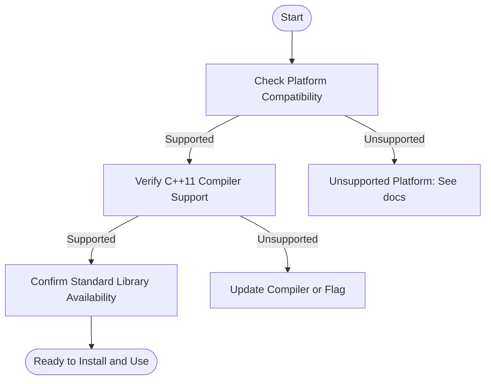

# Prerequisites & System Requirements

Ensure your development environment aligns with GoogleTest and GoogleMock's requirements before installation and use. This page details the supported platforms, language standards, compiler versions, and third-party dependencies necessary to use GoogleTest effectively in your C++ projects.

---

## 1. Supported Platforms
GoogleTest and GoogleMock support a wide range of platforms where C++ compilers are available. The framework has been tested and is compatible with these environments:

- Linux (various distributions)
- Windows (MSVC and MinGW)
- macOS
- Other Unix-like systems with modern C++ compilers

Compatibility extends across desktop and server-class systems where standard C++ development is possible.

## 2. Compiler Requirements and C++ Language Standards

GoogleTest and its mocking counterpart GoogleMock require compiler support for at least C++11.

- **Minimum C++ Standard:** C++11 (or later recommended)
- **Compiler Support:** Recent versions of GCC, Clang, MSVC fully support necessary C++11 features.

> **Tip:** Use the latest stable compiler versions when possible to ensure full compatibility and performance improvements.

### Notable Language Features Used
- Modern template features
- Lambda expressions (C++11)
- Smart pointers (C++11)

Be sure your compiler is invoked with flags enabling at least C++11 features, e.g., `-std=c++11` for GCC and Clang, or `/std:c++11` (or later) for MSVC.

## 3. Third-Party Dependencies

GoogleTest and GoogleMock are designed to be lightweight and do not depend on external third-party libraries. However, they leverage portions of the Standard C++ Library.

- **Standard Library:** Full C++ Standard Library
- **No Additional Libraries Needed:** You can use GoogleTest and GoogleMock without installing any external dependencies.

## 4. System Requirements

To compile and run GoogleTest and GoogleMock, ensure your system meets minimum resource needs:

- **Memory:** 512 MB RAM (typical) or more recommended for compiling tests
- **Disk Space:** At least 50 MB free for source and build artifacts

Your environment should have access to a reasonably updated C++ build toolchain (compiler, linker, build tools).

## 5. Access and Permissions

- **Accounts:** No special user accounts needed to use GoogleTest/GoogleMock
- **Permissions:** Normal user permissions sufficient for building and running tests

In environments with restricted firewall or network access, external network connectivity is not mandatory for GoogleTest usage as it is a standalone library.

---

## Summary

This page ensures you prepare your environment properly before installation and usage of the GoogleTest and GoogleMock frameworks. Verify your platform compatibility, confirm that your compiler supports C++11 or above, and that you have no missing dependencies.

---

## Additional Tips

- Older or non-standard-compliant compilers may cause build failures.
- For best results, build with compiler optimizations appropriate for your platform.
- Consider reviewing our [Installing GoogleTest](../setup-prerequisites-installation/installing-googletest.md) guide next for detailed installation steps.

---

## Troubleshooting Common Prerequisite Issues

<AccordionGroup title="Common Prerequisite Issues">
<Accordion title="Compiler Does Not Support C++11 or Later">
Ensure your compiler is updated and invoked with the proper standard flag.

Example for GCC or Clang:

```bash
g++ -std=c++11 -o test test.cc
```

Example for MSVC:

```powershell
cl /std:c++11 test.cc
```

If your compiler is too old, upgrade to a newer version.
</Accordion>
<Accordion title="Missing Standard Library Support">
Confirm that the Standard Library is installed and accessible by your compiler.

On Linux, install development packages for libstdc++ (GCC) or libc++ (Clang).
</Accordion>
<Accordion title="Unsupported Platform">
GoogleTest has broad platform support but may not work on extremely niche or obsolete operating systems.

If your platform is unsupported, consider using a compatible environment or container with supported tools.
</Accordion>
</AccordionGroup>

---

## Related Documentation

- [Installing GoogleTest](../setup-prerequisites-installation/installing-googletest.md)
- [Configuration Basics](../setup-prerequisites-installation/configuration-basics.md)
- [gMock Cookbook](https://google.github.io/googletest/gmock_cook_book.html)
- [Mocking Reference](../reference/mocking.md)

---

For full product introduction and core concepts, see our [What is GoogleTest & GoogleMock?](../../../overview/product-intro/what-is-googletest.md) and [Core Concepts & Terminology](../../../overview/product-intro/core-concepts-terminology.md) pages.


---

## Summary diagram for user setup flow



---