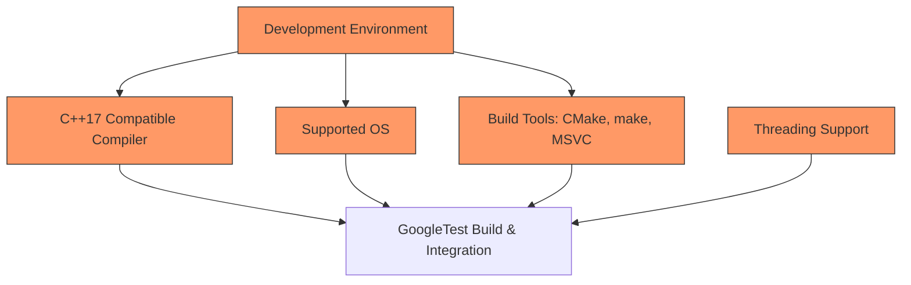

# Prerequisites & System Requirements

Before you begin integrating GoogleTest into your C++ projects, it's crucial to ensure your development environment meets the necessary baseline requirements. This page guides you through the essential platform compatibilities, compiler versions, and build tools that GoogleTest supports, enabling a smooth setup and build process.

---

## 1. C++ Standard Requirement

GoogleTest requires a modern C++ compiler compatible with **C++17** or higher. Make sure your compiler flags explicitly enable C++17 support or later.

### How to Confirm C++17 Support

- For GCC and Clang, use the flag:
  ```sh
  -std=c++17
  ```
- For MSVC, ensure that your version corresponds to Visual Studio 2017 or later.

### Important Note

Attempting to compile GoogleTest with earlier C++ standards will result in errors; the framework depends on features introduced in C++17.

---

## 2. Supported Compiler Versions

GoogleTest officially supports the following compilers:

| Compiler                  | Minimum Version                 | Notes                                         |
|---------------------------|--------------------------------|-----------------------------------------------|
| **GCC (GNU Compiler)**    | 7.0 or later                   | Recommended to use latest stable release      |
| **Clang**                 | 5.0 or later                   | Compatible with Apple Clang and LLVM Clang    |
| **MSVC (Visual Studio)**  | Visual Studio 2017 (15.3) or later | VS2017 and beyond fully supported               |

### Compiler Considerations

- For **MSVC**, GoogleTest requires **Visual C++ 2015 (version 14.0)** or newer. Older versions are not compatible.
- The system attempts to detect compiler features automatically but some environments may require manual flag settings.

---

## 3. Platform Compatibility

GoogleTest supports a wide variety of operating systems and environments, including but not limited to:

- Windows (Desktop and Server editions)
- Linux distributions
- macOS
- Various Unix-like platforms

It also supports embedded hardware platforms conditionally when the environment provides required C++ features.

### Reflection

GoogleTest internally uses platform detection macros to adjust for specific system capabilities. These include thread support detection, filesystem availability, and compiler specifics.

---

## 4. Threading and Library Dependencies

To maximize thread safety and performance, GoogleTest:

- Detects if your platform supports **pthreads** (POSIX threads).
- Enables thread-safe features only if pthreads or equivalent threading support is available.
- Includes necessary compiler flags, for example `-pthread` on Linux builds, to support threading.

If your platform lacks threading support, GoogleTest disables related thread-safe features gracefully but you lose multi-threaded test execution benefits.

---

## 5. Build Tool Compatibility

GoogleTest is compatible with the following build tools and systems:

- **CMake** (recommended modern build system)
- Native compilation with **make** or **ninja**
- IDE integrations including Visual Studio and Xcode

### CMake Integration Tips

- GoogleTest’s repository contains `CMakeLists.txt` that you can include or invoke directly.
- Minimal CMake version required typically is 3.14+ (due to dependencies on `FetchContent` for externals).

For extensive build system instructions, refer to [Installation: Linux, macOS, and Windows](https://github.com/google/googletest/blob/main/README.md).

---

## 6. System Requirements Summary

| Requirement             | Detail                                      |
|------------------------|---------------------------------------------|
| **OS**                  | Linux, Windows, macOS, UNIX variants        |
| **Compiler**            | GCC 7+, Clang 5+, MSVC 2017+                 |
| **C++ Standard**        | Must support C++17 or higher                  |
| **Threading**           | POSIX threads support recommended            |
| **Build System**        | CMake 3.14+, make, Visual Studio, Xcode      |

---

## 7. Best Practices & Troubleshooting Tips

- **Verify your compiler version and flags** before attempting to build GoogleTest.
- **Ensure your build system includes threading flags** (`-pthread` for GCC/Clang).
- Use the pre-packaged pkg-config files provided for easier integration with CMake or other tools.
- On Windows with MSVC, pay attention to linking runtime libraries statically or dynamically to avoid conflicts.

<Tip>
If you encounter errors related to API incompatibility or missing C++17 features, double-check your compiler version and ensure the standard is set to at least C++17.
</Tip>

<Tip>
When cross-compiling or using non-standard environments, be sure to configure threading and filesystem macros appropriately as some embedded systems may lack these.
</Tip>

---

## 8. Additional References

- [GoogleTest Main Repository & README](https://github.com/google/googletest)
- [Configuring Projects with GoogleTest](https://github.com/google/googletest/blob/main/docs/configuring-projects-with-googletest.md)
- [Using GoogleTest with CMake and pkg-config](https://github.com/google/googletest/blob/main/docs/pkgconfig.md)
- Compiler and Platform Support FAQs

---

This page sets the foundation to confirm that your environment is ready to build and run GoogleTest. For detailed installation and step-by-step integration guidance, proceed to the [Installation: Linux, macOS, and Windows](https://github.com/google/googletest/blob/main/getting-started/setup-prerequisites-installation/installing-on-linux-macos-windows.md) page.


---

## Related Documentation Pages

- [Installation: Linux, macOS, and Windows](https://github.com/google/googletest/blob/main/getting-started/setup-prerequisites-installation/installing-on-linux-macos-windows.md)
- [Configuring Projects with GoogleTest](https://github.com/google/googletest/blob/main/getting-started/setup-prerequisites-installation/configuring-projects-with-googletest.md)
- [Writing Your First Test](https://github.com/google/googletest/blob/main/guides/getting-started/writing-your-first-test.md)
- [Supported Platforms & Integrations](https://github.com/google/googletest/blob/main/overview/architecture-features-integrations/supported-platforms-integrations.md)

---

## Quick Overview Diagram



---

# Summary

You now understand the minimum environment requirements to use GoogleTest:

- Requires C++17 support
- Compatible with GCC 7+, Clang 5+, and MSVC 2017+
- Supports major OS platforms like Windows, Linux, and macOS
- Works with common build tools such as CMake
- Thread support (pthreads) highly recommended for full functionality

Ensure your system meets these requirements before moving to installation and integration. For detailed next steps, consult the Installation and Configuration guides.

---