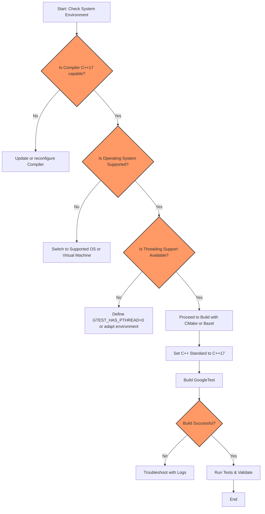

# System Requirements for GoogleTest

This guide details the essential platform, compiler, and build tool prerequisites necessary to successfully compile and run GoogleTest. Ensuring your environment meets these requirements guarantees a smooth installation and reliable operation of the GoogleTest framework.

---

## 1. Minimum C++ Standard

GoogleTest strictly requires a compiler that supports **C++17** or later. This is foundational, as GoogleTest leverages modern C++17 language features extensively.

### How to ensure compliance:
- For CMake projects, explicitly set the standard:

```cmake
set(CMAKE_CXX_STANDARD 17)
set(CMAKE_CXX_STANDARD_REQUIRED ON)
```

- Alternatively, for manual compiler invocation, add the appropriate flag:
  - GCC/Clang: `-std=c++17`
  - MSVC: `/std:c++17`

<Tip>
Attempting to compile with a pre-C++17 standard will fail, generating errors related to unsupported language features.
</Tip>

---

## 2. Supported Operating Systems

GoogleTest has stable and tested support on the following operating systems:

- **Linux** (including various distributions such as Ubuntu, Fedora, CentOS)
- **Windows**
  - Desktop versions including Visual Studio toolchain
  - Cygwin and MinGW environments
- **macOS** (including versions supporting Xcode toolchains)

<LesserSupportedPlatforms>
FreeBSD, Solaris, and others, but these may have less stable support due to limited testing.
</LesserSupportedPlatforms>

<Warning>
Unsupported or embedded platforms (e.g., Windows Mobile, native clients like NaCl) may lack core features such as file systems or threading support, potentially limiting GoogleTest usage.
</Warning>

---

## 3. Compiler Compatibility

GoogleTest has been verified on the following compilers:

- **GCC** (version 7.3 or newer recommended)
- **Clang** (version 5.0 or newer recommended)
- **Microsoft Visual Studio** (Visual Studio 2017 Update 3 or newer)
- **Intel C++ Compiler** (equivalent to supported GCC versions)

These compilers must support C++17 features and standard library implementations compatible with GoogleTest.

<Info>
GoogleTest also detects specific compiler capabilities such as:
- RTTI (Run-Time Type Information)
- Exception handling
- Threading support through pthreads or native mechanisms

It adapts its behavior accordingly but expects these features to be available for full functionality.
</Info>

---

## 4. Build Tools and Integration

### CMake

- GoogleTest includes a **CMakeLists.txt** file providing standardized build scripts.
- Requires CMake version **3.13** or higher.
- When integrating, set the `CMAKE_CXX_STANDARD` to 17 as shown earlier.
- You can build GoogleTest as a standalone or include it in your existing CMake project using `add_subdirectory()`.

### Bazel

- GoogleTest supports integration with Bazel, facilitating build automation and CI/CD.
- Follow instructions in the Integration & Workflows guide for details on Bazel setup.

### Other Build Systems

- If you use other build systems (Makefiles, custom scripts), ensure that:
  - Compiler flags include C++17 support
  - Necessary linker flags for pthread (on Unix) or threading libraries (on Windows) are provided

<Tip>
CMake users should rely on the provided scripts to automatically handle pthread linking where applicable.
</Tip>

---

## 5. Threading and Synchronization Support

GoogleTest detects availability of threading libraries to enable thread-safe operation:

- On Unix-like systems, **pthreads** support is required and typically available.
- On Windows, native threads and mutexes are used.

You can override default detection by defining `-DGTEST_HAS_PTHREAD=1` or `0` to force enable or disable pthread usage.

<Warning>
GoogleTest is thread-safe only when threading support is available.
Without it, concurrent GoogleTest assertions may lead to undefined behavior.
</Warning>

---

## 6. File System and I/O Support

- File system presence is necessary for functionality such as test report generation and death tests.
- Platforms lacking a file system or stream redirection support (e.g., some embedded platforms) may have limited or no GoogleTest support.

---

## 7. Optional but Recommended C++ Features

- **RTTI (Run-Time Type Information)**
- **Exception handling** enabled in compilers.

GoogleTest handles scenarios where RTTI or exceptions are disabled but some advanced features (like typed tests or catching assertion failures) may be limited.

---

## 8. Helpful Links for Compatibility Information

- [GoogleTest Release Notes](https://github.com/google/googletest/releases/tag/v1.17.0) — C++17 requirement information.
- [Supported Platforms Matrix](https://github.com/google/oss-policies-info/blob/main/foundational-cxx-support-matrix.md) — comprehensive list of supported compiler and platform versions.
- [Integration & Workflows Guide](/overview/system-architecture-integrations/integration-and-workflows) — instructions for build tool integration.

---

## Troubleshooting Common Issues

<AccordionGroup title="Common Platform and Compiler Issues">
<Accordion title="Compiler Errors Due to Missing C++17">
Ensure your compiler flags enable C++17. Verify with `gcc --version` or `clang --version`. Update your compiler if it's older than required.
</Accordion>
<Accordion title="Threading Linker Errors on Linux">
If you see undefined references related to pthread, add `-pthread` to both compiler and linker flags or rely on CMake's automatic pthread handling.
</Accordion>
<Accordion title="Unsupported Platform Errors">
Check whether you are targeting an unsupported platform like Windows Mobile or embedded devices without file system support, which GoogleTest cannot fully support.
</Accordion>
</AccordionGroup>

---

## Summary

Meeting these system requirements will ensure that GoogleTest builds and runs smoothly on your environment. Always verify your toolchain versions, set the proper C++ standard, and select supported platforms for best results.

For setting up GoogleTest, follow the comprehensive [Installing GoogleTest (CMake & Bazel)](/getting-started/setup-prerequisites-installation/installation-cmake-bazel) guide after confirming your system meets these prerequisites.

---

## Additional Resources

- [GoogleTest Primer](https://google.github.io/googletest/primer.html) — Learn to write your first tests once setup is complete.
- [Core Concepts & Terminology](/overview/intro-product-basics/core-concepts-terminology)
- [Integration & Typical Workflows](/overview/system-architecture-integrations/integration-and-workflows)
- [Supported Platforms](/docs/platforms.md)

---

For any build or environment specific questions, consult the community or file issues at the GoogleTest GitHub repository: https://github.com/google/googletest/issues


<Check>
Ensure your compiler supports C++17 and that your platform is one of the supported OSes before proceeding to build and use GoogleTest.
</Check>


---

