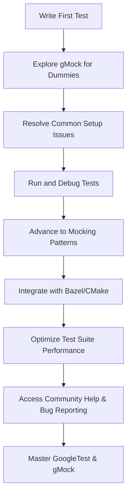

# Where to Find Help & Next Steps

Welcome to the final step in your initial journey with GoogleTest and GoogleMock. This page guides you to essential resources and community support that will help you deepen your knowledge, troubleshoot advanced scenarios, and extend your testing capabilities beyond the basics. Whether you’ve just written your first test or have encountered obstacles, this guide points you toward what’s next.

---

## 1. Comprehensive Documentation & Guides

GoogleTest provides a rich set of authoritative guides and reference materials designed to support your testing growth.

- **GoogleTest Primer**: Start here if you want a foundational refresher or missed initial onboarding concepts.
- **Mocking for Dummies**: The definitive introduction to GoogleMock, teaching you how to design and use mocks effectively in C++.
- **gMock Cookbook & Cheat Sheet**: Detailed recipes and quick-reference resources for mastering advanced mock behaviors, matchers, actions, and cardinalities.
- **GoogleTest FAQ & gMock FAQ**: Get answers to frequent questions and troubleshoot common issues encountered in real-world usage.

Use these resources to build better tests, apply best practices, and explore sophisticated testing techniques at your own pace.

## 2. Community Support & Interaction

Engage with the wider GoogleTest community to share insights, report bugs, or request features.

- **Support Channels**: Visit the official support pages and mailing lists for professional help and announcements.
- **Bug Reporting**: Found a defect or unexpected behavior? Visit the GitHub repository [Issue Tracker](https://github.com/google/googletest/issues) to report it clearly and help the community improve.
- **Community Guides**: Explore community-maintained tutorials, blogs, and videos that often provide practical, example-driven insights.

Community engagement is invaluable to keep your testing skills sharp and your tools up-to-date.

## 3. Advanced Topics & Next Steps

After you have mastered the basics, consider these areas to expand your proficiency:

- **Writing Your First Test & Organizing Tests**: Explore organizing and structuring test suites for scalable projects.
- **Assertion Best Practices**: Learn to craft precise assertions and understand failure modes.
- **Mocking Advanced Scenarios**: Dive into setting expectations, actions, and strictness models within mocks.
- **Integration with Build Systems**: Understand how to integrate GoogleTest with Bazel, CMake, and CI pipelines.
- **Test Performance Optimization**: Best practices to increase test suite speed and reliability.

Refer to the dedicated documentation sections listed below to deepen your expertise.

## 4. Troubleshooting & Common Pitfalls

Encountering issues is part of mastering testing, but the right help expedites your progress.

- **Common Setup Issues & Solutions**: Diagnoses installation and integration headaches.
- **Diagnosing Test Failures**: Techniques to understand and fix failing tests effectively.
- **Understanding Mock Strictness**: Manage unexpected and uninteresting mock calls to maintain test hygiene.

Use these insights early to avoid common traps and to maintain a stable testing environment.

## 5. Useful Links & Resources

| Resource                                         | Path / URL                                                             |
|-------------------------------------------------|------------------------------------------------------------------------|
| GoogleTest Primer                               | [GoogleTest Primer](/overview/product-intro-core-concepts/what-is-googletest) |
| Mocking for Dummies                             | [gMock Guide](https://google.github.io/googletest/gmock_for_dummies.html) |
| gMock Cookbook                                 | [gMock Cookbook](https://google.github.io/googletest/gmock_cook_book.html) |
| gMock Cheat Sheet                              | [gMock Cheat Sheet](https://google.github.io/googletest/gmock_cheat_sheet.html) |
| Common Setup Issues & Solutions                 | [/getting-started/troubleshooting-faq/common-setup-issues](../common-setup-issues) |
| Support & Bug Reporting                         | [GitHub Issues](https://github.com/google/googletest/issues)            |

---

## Tips for Successful Onboarding

- **Consult the Primer and gMock for Dummies first** when advancing from beginner to intermediate.
- **Use the FAQ and Cookbook** to quickly resolve issues and learn idiomatic mock usage.
- **Participate in the community early** to benefit from real-world tips and stay current.
- **Approach tests incrementally**: start simple, then add mock expectations and sequences.

By following these steps, you ensure a smooth transition from initial setup to expert proficiency.

---

**Congratulations** on completing the initial onboarding! Keep these resources handy as your testing journey continues—we’re excited to see what you build with GoogleTest.

---

### Related Documentation to Explore Next

- [Writing Your First Test Case](/getting-started/configuring-using-tests/write-first-test-case)
- [Organizing and Running Test Suites](/guides/core-testing-workflows/organizing-and-running-tests)
- [Assertions and Best Practices](/guides/core-testing-workflows/assertions-best-practices)
- [Getting Started with Mocks](/guides/mocking-and-advanced-scenarios/mocking-basics)
- [Integration with Bazel and CMake](/guides/integration-and-best-practices/build-system-integration)
- [Optimizing Test Performance and Troubleshooting](/guides/integration-and-best-practices/optimizing-tests-and-troubleshooting)

---

### Example: Navigating from First Test to Expert Support

---

<Check>
You have reached the roadmap and resource guide for all stages beyond initial setup and test execution. Refer back to earlier documentation for installation and first test creation, then move forward to advanced topics.
</Check>

---