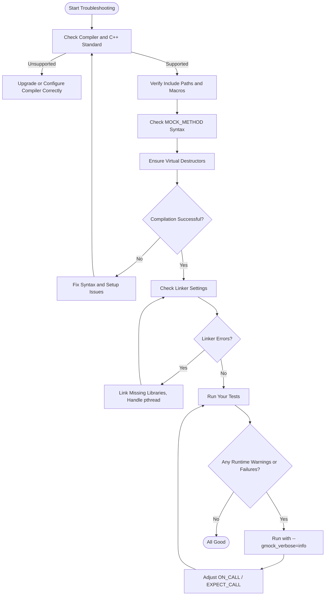

# Troubleshooting Common Issues

This page helps you quickly diagnose and fix typical problems encountered during GoogleTest and gMock installation or configuration. From compiler errors to linkage issues and missing dependencies, you will find actionable solutions and guidance to get your test environment working smoothly.

---

## 1. Compiler Errors During Build

Compiler errors often arise from environment or configuration inconsistencies. Follow these steps to pinpoint and resolve common issues:

### Step 1: Confirm Compiler and Language Standard
- Ensure you are using a supported compiler version:
  - GCC 5.0+ 
  - Clang 3.4+
  - MSVC 2015+
- Your project must be set to use **C++17** or above.

### Step 2: Check Include Paths and Macro Usage
- Verify you have correctly included the GoogleTest and GoogleMock headers:
  ```cpp
  #include <gmock/gmock.h>
  ```
- For mocking, include only `<gmock/gmock.h>`; no separate inclusion of `<gtest/gtest.h>` is required.
- If you encounter strange macro expansion issues, especially with Windows API (e.g., `Method` defined as a macro), isolate and #undef or adjust macro usage.

### Step 3: Address Parameter Parsing Problems in MOCK_METHOD
- If `MOCK_METHOD` yields parsing errors due to commas in types (like `std::pair<bool, int>`):
  - Wrap the type in extra parentheses, e.g.,
    ```cpp
    MOCK_METHOD((std::pair<bool, int>), GetPair, ());
    ```
  - Or use `using` aliases to simplify types:
    ```cpp
    using BoolIntPair = std::pair<bool, int>;
    MOCK_METHOD(BoolIntPair, GetPair, ());
    ```

### Step 4: Verify Virtual Destructors
- Classes intended for mocking **must have a virtual destructor**.
- Non-virtual destructors can cause heap errors and unpredictable behavior.

<Tip>
If your compiler issues warnings like MSVC warning C4301 or C4373 for const parameters in mocks, consider removing the `const` qualifier from parameter declarations, as it is ignored in function parameters and may cause spurious warnings.
</Tip>

---

## 2. Linker Errors After Compilation

Linker problems usually stem from missing libraries or conflicting symbols.

### Step 1: Link GoogleTest and GoogleMock Libraries
- Link against both `gtest` and `gmock` libraries as needed.
- When using CMake, link with targets `gtest`, `gmock`, or `gmock_main`.

Example CMake snippet:
```cmake
find_package(GTest REQUIRED)

target_link_libraries(your_test_target PRIVATE GTest::gmock_main)
```

### Step 2: Resolve pthread and Threading Dependencies
- On Linux and macOS, ensure pthreads are linked (`-lpthread`).
- Check your build system's threading flags; CMake handles this via `Threads::Threads` target.

### Step 3: Avoid Duplicate Symbols
- If you encounter multiple definition errors, ensure no source files or libraries are linked twice.
- For Bazel, verify that only one test entry point using `gmock_main` is linked to your test.

<Tip>
Use `-Wl,--verbose` or equivalent linker diagnostics to trace symbol resolution.
</Tip>

---

## 3. Runtime Issues: Unexpected or Uninteresting Call Warnings

At runtime, GoogleMock can generate warnings or errors about mock method calls. Understanding these will help reduce noise and failures.

### Why Am I Seeing "Uninteresting Mock Function Call" Warnings?
- This occurs when a mock method is called but no expectation (`EXPECT_CALL`) is set for it.
- By default, gMock prints warnings to alert you to unintended calls.

### Solutions
- If these calls are expected and harmless, use `NiceMock<T>` to suppress warnings:
  ```cpp
  using ::testing::NiceMock;
  NiceMock<MockFoo> mock;
  ```
- Alternatively, explicitly allow calls with:
  ```cpp
  EXPECT_CALL(mock, MethodName(_)).Times(AnyNumber());
  ```

### What Are Unexpected Calls?
- Unexpected calls match some expectations but argument values or call order do not match.
- These cause failures and should be fixed by adjusting your expectations or your code behavior.

### Handling Sticky Expectations
- By default, expectations remain active even after the expected number of calls.
- Use `.RetiresOnSaturation()` on `EXPECT_CALL` to retire expectations once saturated and avoid upper-bound failures.

Example:
```cpp
EXPECT_CALL(mock, MethodName())
    .Times(3)
    .RetiresOnSaturation();
```

---

## 4. Best Practices for Writing and Debugging Mocks

### Use ON_CALL vs EXPECT_CALL Judiciously
- `ON_CALL` sets default behavior without expecting calls.
- Use `EXPECT_CALL` only when you want to verify a call.
- Overusing `EXPECT_CALL` can make tests brittle.

### Debugging Failed Expectations
- Run your tests with:
  ```bash
  --gmock_verbose=info
  ```
- This prints detailed call and expectation traces.
- Combine with `--gtest_stack_trace_depth=0` if you want to suppress stack traces.

### Avoid Setting Expectations After Mock Usage
- All expectations should be set **before** exercising code under test.
- Setting expectations afterward results in undefined test behavior.

### Managing Compilation Overhead
- If your mock classes become large and slow to compile:
  - Define mock class constructors and destructors in `.cc` files instead of inline.
- This reduces redundant code generation and improves build times.

---

## 5. Additional Troubleshooting Resources

- **Mocking Reference**: In-depth details about mocking macros and usage.
  - [Mocking Reference](https://google.github.io/googletest/reference/mocking.html)

- **gMock Cookbook**: Recipes for testing techniques and mocking patterns.
  - [gMock Cookbook](https://google.github.io/googletest/gmock_cook_book.html)

- **Legacy gMock FAQ**: Answers to common advanced and legacy issues.
  - [Legacy gMock FAQ](https://google.github.io/googletest/gmock_faq.html)

- **gMock Cheat Sheet**: Quick syntax and usage reference.
  - [gMock Cheat Sheet](https://google.github.io/googletest/gmock_cheat_sheet.html)

- **User Forums and Issue Trackers**: If you're stuck, consider searching or posting on appropriate discussion channels or issue trackers in `googletest` github repository.

---

## Summary
Regularly validate your test environment by creating small tests to verify your mocks behave as expected. Use the verbose modes to diagnose runtime warnings and failures. Apply best practices in mock class construction and expect call syntax to avoid common pitfalls like sticky expectations and unexpected calls. For integration issues, ensure all libraries and threading dependencies are properly linked.

---

## Troubleshooting Flow Diagram



<Tip>
This flow helps systematically troubleshoot common setup and runtime issues with GoogleTest and gMock.
</Tip>
