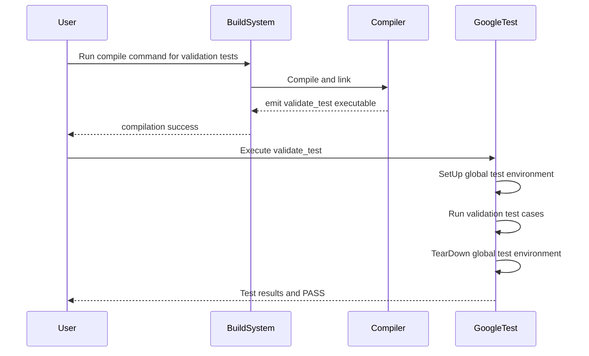

# Validate Your Setup

Confirm your GoogleTest installation is correct by running diagnostic tests and recommended sample cases. This guide walks you through verifying that compilation, linking, and test execution all succeed on your platform — ensuring your environment is ready for productive testing.

---

## 1. Purpose and Outcome

After completing the steps in this guide, you will:

- Successfully compile sample GoogleTest source files.
- Run built-in tests that exercise key GoogleTest features such as test environments, test fixtures, assertions, and setup/teardown mechanisms.
- Verify that your installation behaves correctly by observing expected pass/fail patterns.
- Confirm that global test environments, test suite setups, and teardown are functioning as intended.

## 2. Prerequisites & Preparation

Before you run the validation tests:

- Ensure you have installed GoogleTest and its dependencies according to your platform’s installation instructions (e.g., using CMake or Bazel). See the [System Requirements](https://github.com/google/googletest/blob/main/getting-started/prerequisites-installation/system-requirements.md) for environment compatibility details.
- Confirm your build environment supports C++17 or newer, as required by GoogleTest.
- Have your compiler and linker configured so they can find GoogleTest include directories and libraries.

<Tip>
If you compiled GoogleTest from source, use the provided sample test sources (usually found in the `googletest/test/` directory) to validate your setup.
</Tip>

## 3. Compile the Test Executable

GoogleTest includes several self-check tests designed to exercise internal functionality. The primary source file for validating setup is `gtest_environment_test.cc` within `googletest/test/`.

### Step-by-Step Compilation Example

1. Navigate to the directory containing GoogleTest tests:

```bash
cd googletest/test
```

2. Compile the validation test using your supported compiler. For example, using `g++`:

```bash
g++ -std=c++17 -isystem ../include -pthread gtest_environment_test.cc -L/path/to/gtest/libs -lgtest -lgtest_main -o validate_test
```

> Replace `/path/to/gtest/libs` with the path where GoogleTest libraries are installed.

3. Confirm the executable was created:

```bash
ls -l validate_test
```

### Verifying Compilation Success

- The `validate_test` executable should be created without errors.
- If you encounter errors related to include paths or linking, verify your build flags and library paths.

<Warning>
Common issues include missing `-pthread` or incorrect library linking flags. Check the compiler and linker commands carefully.
</Warning>

## 4. Run the Validation Tests

Run the test executable to execute GoogleTest internal tests that validate your installation.

```bash
./validate_test
```

### Expected Output

- The test run will print a series of PASS/FAIL messages.
- You should see a final line indicating `PASS`.

Example snippet of expected output:

```plain
[==========] Running 4 tests from 2 test suites.
[----------] Global test environment set-up.
... (test results) ...
PASS
```

### What the Tests Cover

- The global test environment setup and tear-down are executed and any failures reported.
- Several internal flags and environment registration mechanisms are exercised.
- Tests verify that fatal and non-fatal failures in test environments behave as expected.

<Tip>
If any tests fail unexpectedly, review the detailed failure messages for clues. It often indicates an environment or build configuration issue.
</Tip>

## 5. Understanding the Validation Code (Optional Deep Dive)

The main `gtest_environment_test.cc` file defines a custom environment class `MyEnvironment` that deliberately exercises failure conditions during setup and teardown phases.

- It tracks whether `SetUp()`, `TearDown()`, and the contained test were run.
- Tests simulate non-fatal and fatal failures within `SetUp()` to confirm GoogleTest handles them as intended.
- Various `RUN_ALL_TESTS()` outcomes are checked via embedded assertions.

These tests ensure that the core GoogleTest framework’s lifecycle management is operable.

## 6. Additional Validation Tests

You may also build and run other sample test sources like `googletest-setuptestsuite-test_.cc` which check suite-level setup/teardown errors, demonstrating GoogleTest’s error detection.

To run this suite:

```bash
g++ -std=c++17 -isystem ../include -pthread googletest-setuptestsuite-test_.cc -L/path/to/gtest/libs -lgtest -lgtest_main -o suite_test
./suite_test
```

## 7. Troubleshooting Validation Failures

If validation tests fail or do not behave as expected:

- Check your compiler version and flags; GoogleTest requires C++17 or newer.
- Confirm that linked GoogleTest libraries correspond to the include headers.
- Verify that multithreading (`-pthread`) support is enabled.
- Ensure no conflicting libraries or tools interfere with runtime.
- Review the output for clues about missing files, permissions, or runtime path issues.

<Tip>
Consult the [Troubleshooting Common Issues](../troubleshooting-validation/common-issues.md) for detailed resolution steps.
</Tip>

## 8. Next Steps

Having successfully validated your installation:

- Proceed to write and compile your own tests. See [Write and Run Your First Test](../basic-setup-first-test/write-first-test.md).
- Configure your project builds against GoogleTest. See [Configure Your Project](../basic-setup-first-test/configure-project.md).
- Explore advanced features such as fixtures, parameterized and typed tests.

---

## References and Further Reading

- [GoogleTest Primer](../primer.md): Learn the basics of writing tests.
- [Assertions Reference](../reference/assertions.md): Understand assertion macros.
- [Advanced Topics](../advanced.md): Explore lifecycle hooks and test fixtures in depth.
- Official GoogleTest GitHub: [https://github.com/google/googletest](https://github.com/google/googletest)

---

## Summary Diagram: GoogleTest Validation Workflow



---

<Check>
You have confirmed your GoogleTest installation by successfully compiling and running validation tests that exercise core framework features.
</Check>

---

<Source url="https://github.com/google/googletest" paths={[{"path": "googletest/test/gtest_environment_test.cc", "range": "1-118"}]} branch="main" />
<Source url="https://github.com/google/googletest" paths={[{"path": "googletest/test/googletest-setuptestsuite-test_.cc", "range": "1-41"}]} branch="main" />

