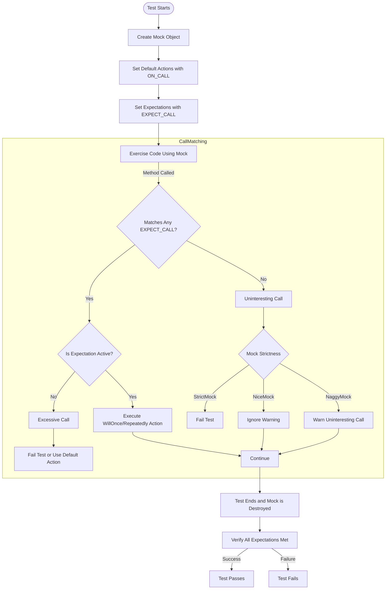

# Mastering GoogleMock: Patterns and Pitfalls

## Overview

This guide explores advanced usage patterns and common pitfalls when working with GoogleMock to help you build scalable, robust, and readable mock setups. You'll learn how to create custom actions, effectively use argument matchers, control call sequences, and set cardinality constraints tuned to your test needs. Along the way, best practices and tips will ensure you avoid common mistakes and write maintainable test code.

---

## Prerequisites

Before diving into these advanced topics, ensure you are comfortable with:

- Basic mocking concepts introduced in the GoogleMock framework.
- Defining mock classes using `MOCK_METHOD`.
- Setting simple expectations with `EXPECT_CALL` and behavior specifications with `ON_CALL`.

If you're new to GoogleMock basics, start with [gMock for Dummies](https://google.github.io/googletest/gmock_for_dummies.html) and [Mocking Basics](https://google.github.io/googletest/googletest-guides/core-workflows/mocking-basics.html).

---

## Expected Outcome

By following this guide, you will be able to:

- Implement complex mocking behavior using custom actions and parameterized matchers.
- Utilize sequences and cardinalities to impose ordering and invocation count constraints.
- Select appropriate mock strictness levels (`NiceMock`, `NaggyMock`, `StrictMock`) based on test resilience and verbosity needs.
- Compose maintainable, readable mocks that scale to large test suites.
- Recognize and avoid common pitfalls that degrade test reliability.

---

## Time Estimate

Intermediate to advanced GoogleMock users can typically master these patterns in 1–2 hours, including studying examples and experimenting with code.

---

# Advanced GoogleMock Patterns and Pitfalls

## 1. Custom Actions: Extending Mock Behavior

GoogleMock allows you to customize what happens when mock methods are called beyond simple return values.

### Using Lambdas, Functors, and Functions as Actions

You can use any callable type compatible with the mock method signature as an action. This offers flexibility for complex side effects or computed return values.

```cpp
using ::testing::Invoke;

class MockFoo {
 public:
  MOCK_METHOD(int, Compute, (int x), (override));
};

int DoubleValue(int x) { return x * 2; }

// Usage
MockFoo mock;
EXPECT_CALL(mock, Compute(_))
    .WillOnce(Invoke(DoubleValue));

EXPECT_EQ(mock.Compute(5), 10);
```

### Creating Parameterized Actions

You can define parameterized actions with the `ACTION_P` macro which produces reusable customized behavior:

```cpp
ACTION_P(Add, n) {
  return arg0 + n;
}

EXPECT_CALL(mock, Compute(_))
    .WillOnce(Add(3));  // Adds 3 to argument
```

### Combining Multiple Actions with `DoAll()`

Execute multiple effects in order; the last action's return value is used:

```cpp
EXPECT_CALL(mock, Mutate(_))
    .WillOnce(DoAll(SetArgPointee<0>(42), Return(true)));
```

### Delegation to Real or Fake Objects

For complex behavior, delegate calls to a real or fake implementation inside default or expectation actions.

```cpp
class MockFoo : public Foo {
 public:
  MOCK_METHOD(int, Compute, (int x), (override));

  MockFoo() {
    ON_CALL(*this, Compute(_))
        .WillByDefault([this](int x) { return real_.Compute(x); });
  }

 private:
  Foo real_;  // Real object for delegation
};
```

---

## 2. Argument Matchers: Fine-Tuning Expectations

Matchers specify what arguments an expected call should receive. Matchers can be literals, simple wildcards, or complex predicates.

### Basic Matchers

- `_` matches any argument.
- Equality matches like `Eq(value)` or literals work directly.
- Comparators like `Ge(5)` (greater or equal), `Lt(10)` (less than).

```cpp
EXPECT_CALL(mock, Process(Ge(5), _));
```

### Matching Multiple Arguments Together With `.With()`

Check combined argument conditions:

```cpp
EXPECT_CALL(mock, SetRange(Ne(0), _))
    .With(Lt());  // first argument < second argument
```

### Custom Matchers

Define polymorphic or parameterized matchers for complex validation.

```cpp
MATCHER_P(IsMultipleOf, n, "") { return (arg % n) == 0; }
EXPECT_CALL(mock, Func(IsMultipleOf(7)));
```

### Matching Members or Properties

Use `Field()` or `Property()` to match specific members or methods of argument objects:

```cpp
EXPECT_CALL(mock, Process(Field(&MyClass::member, Eq(10))));
```

### Matching Pointer Contents

Use `Pointee(matcher)` to match the dereferenced value of pointers.

---

## 3. Controlling Call Sequences and Order

By default, expectations can match calls in any order. Enforce ordering when necessary.

### Using `InSequence` for Strict Order

Wrap expectations in an `InSequence` scope to require calls to occur sequentially:

```cpp
using ::testing::InSequence;

{
  InSequence seq;
  EXPECT_CALL(mock, Step1());
  EXPECT_CALL(mock, Step2());
  EXPECT_CALL(mock, Step3());
}
```

### Using `Sequence` Objects for Partial Orders

Define sequences manually to express complex partial order constraints:

```cpp
Sequence s1, s2;
EXPECT_CALL(mock, A()).InSequence(s1, s2);
EXPECT_CALL(mock, B()).InSequence(s1);
EXPECT_CALL(mock, C()).InSequence(s2);
```

This means A should be called before B and C, but relative order between B and C is unrestricted.

### Using `.After()` Clouse for DAGs

Specify expectations that must occur after other expectations.

```cpp
Expectation e1 = EXPECT_CALL(mock, Init());
EXPECT_CALL(mock, Use()).After(e1);
```

---

## 4. Cardinality: Specifying Invocation Counts

Control how many times a mock method is expected to be called.

### Common Cardinalities

| Cardinality      | Description                                      |
|------------------|--------------------------------------------------|
| `Times(1)`       | Exactly once (default)                            |
| `Times(0)`       | Never called                                     |
| `AtLeast(n)`     | Called at least n times                           |
| `AtMost(n)`      | Called at most n times                            |
| `Between(m, n)`  | Called between m and n times inclusive           |
| `AnyNumber()`    | Called any number of times                        |

### Implicit Cardinality Inference

- No explicit `Times()` and no `WillOnce()/WillRepeatedly()`: assumed `Times(1)`.
- If `WillOnce()` used `n` times without `WillRepeatedly()`: treated as `Times(n)`.
- If `WillOnce()` with `WillRepeatedly()`: treated as `Times(AtLeast(n))`.

### Retiring Saturated Expectations

Use `.RetiresOnSaturation()` to deactivate an expectation after hitting its max call count, allowing other expectations to match subsequent calls.

```cpp
EXPECT_CALL(mock, Foo(7))
    .Times(2)
    .RetiresOnSaturation();
EXPECT_CALL(mock, Foo(_))
    .Times(AnyNumber());  // Catch-all
```

---

## 5. Mock Strictness Levels: Nice, Naggy, and Strict

GoogleMock offers three modes that control how it reacts to uninteresting calls (calls to methods that have no specific expectations).

| Type        | Behavior on Uninteresting Calls                                                             |
|-------------|---------------------------------------------------------------------------------------------|
| `NaggyMock` | Default behavior; prints warning messages but test continues.                               |
| `NiceMock`  | Suppresses warnings on uninteresting calls for cleaner test output.                        |
| `StrictMock`| Treats uninteresting calls as test failures, enforcing strict interaction verification.    |

### Usage

```cpp
using ::testing::NiceMock;
using ::testing::NaggyMock;
using ::testing::StrictMock;

NiceMock<MockClass> nice_mock;
NaggyMock<MockClass> naggy_mock;
StrictMock<MockClass> strict_mock;
```

`NiceMock` and `StrictMock` automatically inherit constructors from the underlying mock class, so they support all constructor signatures.

### Important Caveats

- Strictness modifiers only affect methods defined via `MOCK_METHOD` in that mock class directly.
- Nesting multiple strictness wrappers (e.g., `NiceMock<StrictMock<MockFoo>>`) is not supported.
- Non-virtual destructors in mock classes may cause strictness modifiers to behave incorrectly.

---

## 6. Best Practices and Common Pitfalls

### Use `ON_CALL` for Default Behavior, `EXPECT_CALL` for Expectations

Default behavior should be set with `ON_CALL` to reduce brittle tests. Use `EXPECT_CALL` sparingly to verify specific interactions.

### Avoid Over-Specifying Expectations

Too strict expectations make tests brittle and increase maintenance burden. Specify only what your test really needs.

### Beware of Sticky Expectations

Expectations remain active by default even after their expected call count is met. Use `.RetiresOnSaturation()` or sequences when saturation semantics are needed.

### Order Matters in Multiple Expectations

More specific expectations should come *after* general ones to avoid being shadowed.

### Mock Only Interfaces You Own

Avoid mocking classes owned by external teams. Instead, wrap them with adapter interfaces to maintain a single source of truth for mocks.

### Prefer `NiceMock` to Reduce Noise

Using `NiceMock` cleans your test logs by suppressing warnings on uninteresting calls, leading to more maintainable test suites.

### Properly Virtualize Destructors

Always ensure interfaces have virtual destructors to prevent leaks and undefined behavior with mocks.

### Prevent Duplicate `Times()` or `WillRepeatedly()` Clauses

The GoogleMock macros enforce clause order and frequency. Violations generate errors.

---

## 7. Troubleshooting Tips

- If mocks behave unexpectedly, run tests with `--gmock_verbose=info` to trace expectations and mock calls.
- Check for unintentional uninteresting calls, which produce warnings or errors depending on strictness.
- If mocking overloaded or const methods, use `Const()` wrapper and specify qualifiers correctly.
- Avoid returning references with `Return()`. Use `ReturnRef()` for reference types.
- Use `.RetiresOnSaturation()` to resolve repeated-call failures.
- When using move-only types in mocks (e.g., `std::unique_ptr`), use lambdas or custom actions rather than `Return()`.

---

## 8. Next Steps & Related Guides

- [gMock for Dummies](https://google.github.io/googletest/gmock_for_dummies.html) — A beginner-friendly introduction.
- [GoogleMock Cookbook](https://google.github.io/googletest/gmock_cook_book.html) — Additional recipes and patterns.
- [Mocking Basics](https://google.github.io/googletest/googletest-guides/core-workflows/mocking-basics.html) — Core workflow for mocking.
- [Matchers Reference](https://google.github.io/googletest/reference/matchers.html) — Comprehensive list of matchers.
- [Actions Reference](https://google.github.io/googletest/reference/actions.html) — Built-in actions and how to create custom ones.

---

## Additional Resources

- The [Mocking Reference](https://google.github.io/googletest/docs/reference/mocking.html) provides detailed descriptions of macros and classes.
- Review the [`NiceMock`, `NaggyMock`, and `StrictMock` source](https://github.com/google/googletest/blob/main/googlemock/include/gmock/gmock-nice-strict.h) for implementation insights.

---

### Summary Diagram: Expectation Lifecycle and Interaction



---

# Practical Tips

- Always define expectations *before* exercising the mock.
- Use `RetiresOnSaturation()` when you want an expectation to be disabled after it matches the allowed number of calls.
- Employ `Sequence` or `InSequence` to enforce order only when order is important.
- Use `NiceMock` during development to reduce warning noise; switch to `StrictMock` for rigorous testing phases.
- Create custom matchers and actions to encapsulate complex argument validation or behavior, promoting reusability and readability.
- Use `ON_CALL` smartly to set flexible default behavior shared across tests.


---

# Full Example: Setting Up a Strict Mock with Sequences and Custom Action

```cpp
using ::testing::StrictMock;
using ::testing::InSequence;
using ::testing::Return;

class MockDatabase {
 public:
  MOCK_METHOD(bool, Connect, (), (override));
  MOCK_METHOD(int, Query, (const std::string& sql), (override));
};

// Custom action to simulate connection latency.
ACTION(SimulateLatency) {
  std::this_thread::sleep_for(std::chrono::milliseconds(50));
  return true;
}

TEST(DatabaseTest, QueryInOrder) {
  StrictMock<MockDatabase> mock_db;

  {
    InSequence s;
    EXPECT_CALL(mock_db, Connect())
        .WillOnce(SimulateLatency());
    EXPECT_CALL(mock_db, Query("SELECT * FROM users"))
        .WillOnce(Return(42));
  }

  // Code under test
  ASSERT_TRUE(mock_db.Connect());
  int result = mock_db.Query("SELECT * FROM users");
  ASSERT_EQ(result, 42);
}
```

This example shows how to use a `StrictMock` to enforce strict call verification, `InSequence` to ensure the order of calls, and a custom action to simulate latency.

---

## Troubleshooting Tips

- **Unexpected call errors**: Verify your `EXPECT_CALL`s cover all expected call variants; use catch-all matchers with `AnyNumber()` to avoid unexpected calls.
- **Too many calls/upper bound exceeded**: Use `.RetiresOnSaturation()` or adjust `Times()` cardinality.
- **Uninteresting call warnings**: Either suppress using `NiceMock` or add explicit catches if behavior is intended.
- **Overloaded method ambiguity**: Use `Const()` wrapper or explicit matcher typing to resolve overloads.

---

> Remember: writing maintainable and clear mock expectations helps ensure tests continue to serve as reliable safety nets as your codebase grows.

---

*Happy mocking with GoogleMock!*
