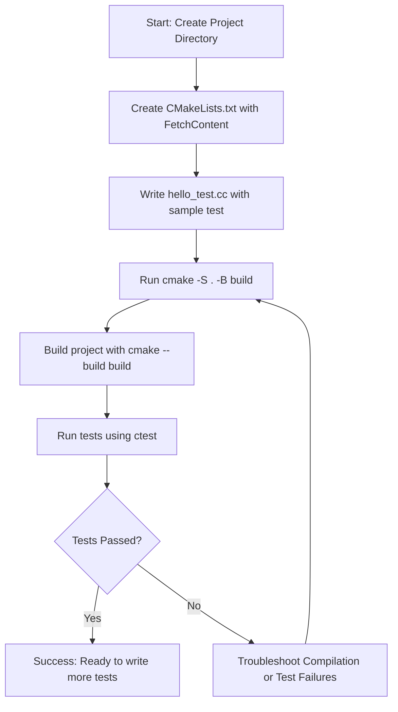

# Quickstart with CMake

Learn how to add GoogleTest and GoogleMock to your CMake project, write and build your first unit test, and interpret test results. This guide walks you through project setup tailored for newcomers and cross-platform C++ developers.

---

## 1. Overview

### What You'll Achieve
This guide enables you to configure your CMake project to integrate GoogleTest and GoogleMock, write a simple unit test, build it, run it, and understand the output.

### Prerequisites
- Compatible OS: Linux, macOS, or Windows
- A C++17-compliant compiler (e.g., GCC 7+, Clang 5+, MSVC 2017+)
- CMake version 3.14 or newer
- Familiarity with basic command line and CMake concepts

### Expected Outcome
By the end, you will have a working project set up with GoogleTest/GoogleMock, a sample test built and executed successfully with test results displayed.

### Time Estimate
Approximately 15–30 minutes depending on your familiarity with CMake and C++ build tools.

### Difficulty Level
Beginner: Suitable for developers new to GoogleTest or those needing clear, actionable setup steps.

---

## 2. Step-by-Step Instructions

### Step 1: Create Your Project Directory
Open your terminal or command prompt and run:

```bash
mkdir my_project && cd my_project
```

This directory will hold your source files and build configuration.

### Step 2: Create `CMakeLists.txt`
Inside `my_project`, create a file named `CMakeLists.txt` with the following content:

```cmake
cmake_minimum_required(VERSION 3.14)
project(my_project)

# Set C++ standard to C++17
set(CMAKE_CXX_STANDARD 17)
set(CMAKE_CXX_STANDARD_REQUIRED ON)

# Include FetchContent to download GoogleTest
include(FetchContent)

FetchContent_Declare(
  googletest
  URL https://github.com/google/googletest/archive/03597a01ee50ed33e9dfd640b249b4be3799d395.zip
)

# For Windows, ensure consistent runtime linkage
set(gtest_force_shared_crt ON CACHE BOOL "" FORCE)

# Download and make GoogleTest available
FetchContent_MakeAvailable(googletest)

# Enable testing features for CTest
enable_testing()

# Declare your test executable
add_executable(
  hello_test
  hello_test.cc
)

# Link the test executable against GoogleTest's main library
# which provides the main() entry point
target_link_libraries(
  hello_test
  GTest::gtest_main
)

# Lets CMake discover test cases automatically
include(GoogleTest)
gtest_discover_tests(hello_test)
```

> **Tip:** This setup uses `FetchContent` to automatically download the specified GoogleTest release during configuration. The commit hash refers to a stable version; update it regularly to get new features and fixes.


### Step 3: Write Your First Test
Create a file in your `my_project` directory named `hello_test.cc` with the following content:

```cpp
#include <gtest/gtest.h>

// Basic test case example
TEST(HelloTest, BasicAssertions) {
  // Check two strings are not equal
  EXPECT_STRNE("hello", "world");
  // Check arithmetic equality
  EXPECT_EQ(7 * 6, 42);
}
```

This test demonstrates simple GoogleTest assertions.

### Step 4: Build the Project
From your project root, create a build directory, configure, and build your test:

```bash
cmake -S . -B build
cmake --build build
```

This generates native build files and compiles the test executable.

### Step 5: Run the Tests
Run the tests using CTest:

```bash
cd build
ctest
```

You should see output similar to:

```
Test project /path/to/my_project/build
    Start 1: HelloTest.BasicAssertions
1/1 Test #1: HelloTest.BasicAssertions ........   Passed    0.00 sec

100% tests passed, 0 tests failed out of 1

Total Test time (real) =   0.01 sec
```

This confirms the test ran successfully.

### Decision Point: Using GoogleMock Features
- The above example uses `GTest::gtest_main` only, which provides the test runner and is sufficient for basic unit tests.
- If you require mocking capabilities with GoogleMock, link with `GTest::gmock_main` instead.

To switch, modify `target_link_libraries` in `CMakeLists.txt` like so:

```cmake
target_link_libraries(
  hello_test
  GTest::gmock_main
)
```

Then adjust your test files to include GoogleMock headers or mocks as needed.

### Verification
Confirm the build succeeds without errors and the test output shows all tests passing. Review any test failures easily by inspecting assertion messages. If the build fails due to missing C++17 support or CMake version, update your toolchain accordingly.

---

## 3. Examples & Configuration Details

### Full Minimal `CMakeLists.txt` Example

```cmake
cmake_minimum_required(VERSION 3.14)
project(my_project)

set(CMAKE_CXX_STANDARD 17)
set(CMAKE_CXX_STANDARD_REQUIRED ON)

include(FetchContent)

FetchContent_Declare(
  googletest
  URL https://github.com/google/googletest/archive/03597a01ee50ed33e9dfd640b249b4be3799d395.zip
)

set(gtest_force_shared_crt ON CACHE BOOL "" FORCE)
FetchContent_MakeAvailable(googletest)

enable_testing()

add_executable(hello_test hello_test.cc)
target_link_libraries(hello_test GTest::gtest_main)

include(GoogleTest)
gtest_discover_tests(hello_test)
```


### Example Test File (`hello_test.cc`)

```cpp
#include <gtest/gtest.h>

TEST(HelloTest, BasicAssertions) {
  EXPECT_STRNE("hello", "world");
  EXPECT_EQ(7 * 6, 42);
}
```

---

## 4. Troubleshooting & Best Practices

### Common Issues

- **C++17 Not Supported:** Build fails with errors related to language features. 
  - **Fix:** Confirm your compiler supports C++17 and set `CMAKE_CXX_STANDARD` correctly.

- **CMake Version Too Low:** `FetchContent` is unavailable or errors during configuration.
  - **Fix:** Upgrade to CMake 3.14 or later.

- **Linking Errors (especially on Windows):** Runtime library mismatches or missing symbols.
  - **Fix:** Use `set(gtest_force_shared_crt ON CACHE BOOL "" FORCE)` in your `CMakeLists.txt` to ensure consistent runtime linkage.

- **Tests Not Discovered:** Running `ctest` shows zero tests or none running.
  - **Fix:** Ensure `include(GoogleTest)` and `gtest_discover_tests()` are called after `add_executable` and linking.

### Best Practices

- Always use the same compiler and build settings for both your project and GoogleTest to avoid ABI and linking issues.
- Prefer linking against `GTest::gtest_main` or `GTest::gmock_main` for simplified main function handling.
- Keep the GoogleTest dependency updated by refreshing the commit hash used in `FetchContent_Declare` periodically.
- Enable testing in CMake with `enable_testing()` to integrate smoothly with `ctest`.

### Performance and Build Tips

- For large projects, consider adding GoogleTest as a submodule or embedding it directly instead of `FetchContent`.
- When working on Windows with Visual Studio, double-check runtime settings to avoid conflicting runtimes.

---

## 5. Next Steps & Related Content

- Start exploring basic test writing with the [GoogleTest Primer guide](/googletest-guides/getting-started/primer).
- Learn how to write mocking tests using the [Mocking Basics guide](/googletest-guides/advanced-mocking/mocking-basics).
- For advanced build integration, see [Installation Methods](/getting-started/setup-installation/installation-methods) and [Configuration & Integration](/getting-started/setup-installation/configuration-integration).
- If you encounter issues, consult [Troubleshooting Common Issues](/getting-started/first-test-execution/troubleshooting-common-issues) for expert solutions.

---

## Summary Diagram



---

<Check>
Confirm you have CMake 3.14 or later and a C++17-capable compiler before starting.
</Check>

<Info>
Visit the [GoogleTest official repository](https://github.com/google/googletest) for full source and updates.
</Info>

<Note>
For Windows users, `gtest_force_shared_crt` is essential to avoid runtime conflicts.
</Note>
