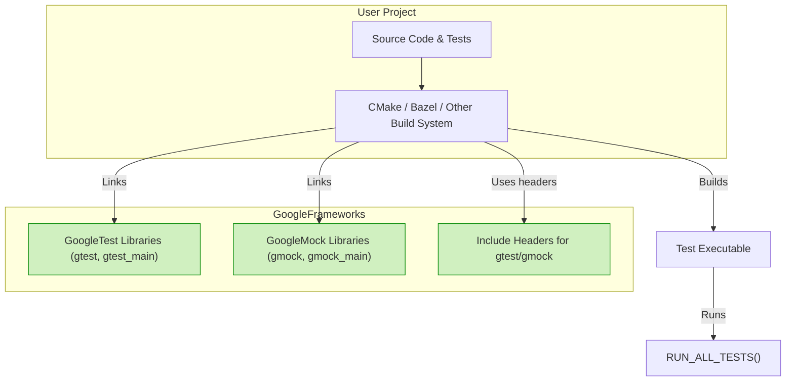

# Integrating with Build Systems (CMake, Bazel, Others)

## Overview

This guide helps you seamlessly incorporate GoogleTest and GoogleMock into your project's build workflow using popular build systems like CMake and Bazel. It details best practices for organizing your test code, managing dependencies, and running tests as part of your build process, allowing you to maintain clean, reliable, and automated C++ testing environments.

### Prerequisites

- A working C++17 development environment.
- Basic familiarity with your chosen build system (CMake, Bazel, or others).
- GoogleTest and GoogleMock sources downloaded or added as submodules.

### Expected Outcome

You will integrate GoogleTest and GoogleMock into your project so tests can be built and executed automatically as part of your build lifecycle, with correctly managed dependencies and headers.

### Time Estimate

10-30 minutes, depending on your familiarity and project complexity.

### Difficulty Level

Intermediate: requires some knowledge of build systems and C++ testing concepts.

---

## 1. Integrating GoogleTest and GoogleMock with CMake

### 1.1. Building GoogleTest and GoogleMock Standalone or Embedding

You have two main approaches to include the frameworks:

- **Standalone Build:** Build GoogleTest/GoogleMock separately, install, and link against installed libraries.
- **Embedded Build:** Build them as part of your project using `add_subdirectory()`.

### 1.2. Standalone Build (Recommended for Independent Projects)

```bash
git clone https://github.com/google/googletest.git -b main
cd googletest
mkdir build
cd build
cmake ..
make
sudo make install
```

This installs GoogleTest and GoogleMock to system locations like `/usr/local/`, making them discoverable via `find_package()`.

To build GoogleTest-only, pass `-DBUILD_GMOCK=OFF` to `cmake`.

### 1.3. Embedding GoogleTest/GoogleMock in Your Project

Modify your `CMakeLists.txt`:

```cmake
include(FetchContent)
FetchContent_Declare(
  googletest
  URL https://github.com/google/googletest/archive/main.zip
)
set(gtest_force_shared_crt ON CACHE BOOL "" FORCE)  # On Windows, to match runtime
FetchContent_MakeAvailable(googletest)

add_executable(my_tests test_main.cpp other_tests.cpp)
target_link_libraries(my_tests gtest_main gmock_main)
add_test(NAME my_tests COMMAND my_tests)
```

- This ensures GoogleTest and GoogleMock are built with your project, using the same compiler settings.

### 1.4. Linking Your Tests

Link with either `gmock_main` (which provides main()) or `gmock` (without main).

```cmake
target_link_libraries(my_tests gmock_main)
```

Use `gmock_main` if you want the standard GoogleTest main; otherwise, provide your own.

### 1.5. Include Directories

Ensure your target has appropriate include paths set automatically by linking to the libraries (`gmock` and `gtest`). If not, manually include:

```cmake
include_directories(${GMOCK_SOURCE_DIR}/include ${GTEST_SOURCE_DIR}/include)
```

### 1.6. Common CMake Options

- `BUILD_SHARED_LIBS`: Build shared (DLL) libraries instead of static.
- `gmock_build_tests`: Build GoogleMock's own tests.
- `gtest_force_shared_crt`: Make runtimes consistent on Windows.

<Note>
When combining your tests with GoogleTest and GoogleMock, ensure all dependencies and compiler options align to avoid runtime conflicts.
</Note>

---

## 2. Integrating with Bazel

### 2.1. Setup

Add GoogleTest and GoogleMock dependencies in your Bazel workspace using `MODULE.bazel` or `WORKSPACE`.

Example snippet in a Bazel `BUILD` file:

```bazel
cc_test(
    name = "my_test",
    srcs = ["my_test.cpp"],
    deps = ["@com_google_googletest//:gmock_main"],
)
```

- `@com_google_googletest//:gmock_main` provides GoogleMock with main.

### 2.2. Running Tests

Use Bazel's test command:

```bash
bazel test //path/to:my_test
```

### 2.3. Differences from CMake

- Bazel uses strict build rules and dependency declarations.
- GoogleMock and GoogleTest source management is preconfigured in Bazel packages.

<Info>
Refer to the official Bazel installation guide for GoogleTest and GoogleMock for comprehensive setup instructions specific to Bazel.
</Info>

---

## 3. Integration with Other Build Systems

Regardless of build system, the key points are:

- Add GoogleTest and GoogleMock source files or libraries to your build inputs.
- Add their include paths to the compiler's search path.
- Link your test executables with `gmock` and/or `gmock_main` to provide mocking and test framework functionality.
- Initialize GoogleMock (which also initializes GoogleTest) by calling `testing::InitGoogleMock(&argc, argv);` in your test's `main()`.

### 3.1. Example Test Main in Custom Build Systems

```cpp
#include <gmock/gmock.h>
int main(int argc, char** argv) {
  testing::InitGoogleMock(&argc, argv);
  return RUN_ALL_TESTS();
}
```

---

## 4. Best Practices for Test Code Organization

- Place your tests in a dedicated directory like `tests/` or `unittest/`.
- Keep mocks, fixtures, and test helpers in logical subfolders.
- Name test files consistently (e.g., `foo_test.cpp`).
- Use `EXPECT_CALL` and `ON_CALL` inside test suites to define expectations and default behaviors.

<Tip>
Link tests against `gmock_main` when you want to avoid writing your own `main()`. Use `gmock` if you supply your own test runner.
</Tip>

---

## 5. Running Tests as Part of Your Build Workflow

- Configure your build system to build test targets alongside your main build.
- Use test runners built into the system (`ctest` for CMake, `bazel test` for Bazel).
- Integrate test runs into CI systems by invoking these commands.

---

## 6. Troubleshooting Common Integration Issues

| Symptom                                           | Cause                                        | Solution                                |
|---------------------------------------------------|----------------------------------------------|----------------------------------------|
| Missing GoogleTest headers                         | Include paths not set or wrong                | Verify include dirs or link to `gmock` target |
| Linker errors about undefined symbols             | Libraries not linked                           | Link with `gmock_main` or `gmock` and `gtest`|
| Runtime errors related to multiple `main()`       | Linking `gmock_main` twice or defining own main along | Link only once; choose `gmock` or `gmock_main`|
| Version mismatch or compilation failures with C++17 | Environment or compiler incompatibility      | Ensure C++17 support as per system requirements |

<Warning>
Always build GoogleTest and GoogleMock with the same compiler and standard library settings as your project to prevent ABI incompatibilities.
</Warning>

---

## 7. Summary

Integrating GoogleTest and GoogleMock into your build system enables automated and robust testing with powerful mocking capabilities. Whether you use CMake, Bazel, or other tools, following the outlined steps ensures clean dependency management, smooth test execution, and maintainable test code organization.

---

## Additional Resources

- [GoogleTest CMake Build Instructions](https://github.com/google/googletest/blob/main/README.md)
- [GoogleMock Bazel Integration Guide](https://github.com/google/googletest/tree/main/googlemock)
- [GoogleMock API Reference – MOCK_METHOD, EXPECT_CALL](../api_reference/mocking_core/mock_method_macros.md)
- [Getting Started: Writing and Running Your First Test](../getting-started/configuration-first-run-validation/first-test.md)
- [Troubleshooting Setup Errors](../getting-started/troubleshooting-common-issues/troubleshooting-setup-errors.md)


---

## Diagram: Typical Build and Test Integration Workflow



---