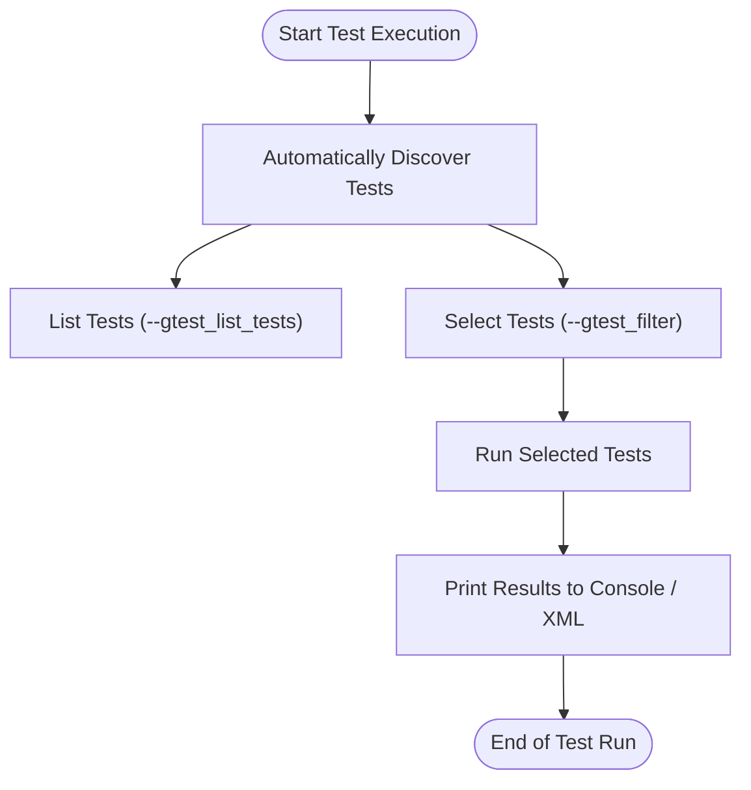

# Test Discovery, Selection, and Reporting

## Overview

This guide provides practical strategies to help you organize, discover, select, and report on tests effectively using GoogleTest and GoogleMock. Whether you are running tests locally or on a continuous integration (CI) system, knowing how to quickly find and run relevant tests, interpret results, and integrate with external test runners is crucial to maintaining a fast and reliable development workflow.

The guide covers:

- How GoogleTest discovers tests automatically and the implications for organizing your code
- Techniques to filter and selectively execute tests to save time
- Best practices for reading and understanding test results and outputs
- Approaches for integrating GoogleTest with external test runners and reporting tools

## 1. Understanding Test Discovery

GoogleTest automatically discovers all tests compiled into your test binary at runtime, without requiring you to manually list or register tests.

### Key Points:

- Every test defined using the `TEST()` or `TEST_F()` macros is automatically registered.
- Tests are grouped into *test suites* (previously called test cases) based on the first argument to these macros.
- GoogleTest supports *parameterized* and *typed* tests, all discovered dynamically.

### Organizing Tests for Efficient Discovery

To optimize test discovery and future maintenance:

- Organize test code into logical suites that mirror the structure of your production code.
- Name test suites and tests using clear, concise, and consistent naming conventions.
- Avoid test suite name collisions to prevent confusion in test reports.

```cpp
TEST(FooTest, DoesSomething) {
  ...
}

TEST(BarTest, DoesSomethingElse) {
  ...
}
```

This structure improves discoverability both for tools and human readers.

### Running Tests Programmatically

Typically, tests are run by invoking `RUN_ALL_TESTS()` in your `main()` function, which runs all registered tests and returns an exit code reflecting overall success or failure.

## 2. Selecting and Filtering Tests

Running the entire test suite can be expensive, especially in larger projects. GoogleTest offers flexible filtering mechanisms to select subsets of tests quickly.

### Using Command-Line Flags

The primary flag for controlling test execution is `--gtest_filter`.

- **Syntax:** `--gtest_filter=<pattern>`
- **Pattern format:** `[positive_patterns][-negative_patterns]`

Example:

```bash
./my_tests --gtest_filter=FooTest.*
# Runs all tests in the FooTest suite

./my_tests --gtest_filter=FooTest.DoesSomething
# Runs one specific test

./my_tests --gtest_filter=* -FooTest.Bar*
# Runs all tests except those matching FooTest.Bar*
```

### Best Practices for Filtering

- Use package or module names as prefixes in test suite names to simplify filtering.
- Combine filters to run critical or recently failed tests.
- Use negative patterns to exclude flaky or slow tests selectively.

### Advanced Filtering Options

- Filter test execution by setting environment variables, e.g., `GTEST_FILTER`.
- Use regex matching within filter patterns to define complex selections.
- Combine filtering with other GoogleTest flags such as `--gtest_repeat` for repeated runs.

### Running Single Tests from the IDE

Many IDEs and build systems detect GoogleTest tests and allow running individual tests or suites via a graphical interface, enhancing developer productivity.

## 3. Understanding and Interpreting Test Output

GoogleTest produces human-readable output by default but also supports formats suited for automated parsing.

### Default Console Output

- Lists each test run with a PASS or FAIL status.
- Shows summary of total tests, failures, and elapsed time.
- Prints detailed failure messages, including file name, line number, and stack traces.

Example:

```shell
[ RUN      ] FooTest.DoesSomething
[       OK ] FooTest.DoesSomething (0 ms)
[ RUN      ] FooTest.DoesAnotherThing
path/to/foo_test.cc:42: Failure
Expected: ...
[  FAILED  ] FooTest.DoesAnotherThing (1 ms)

[==========] 2 tests from 1 test case ran. (1 ms total)
[  PASSED  ] 1 test.
[  FAILED  ] 1 test, listed below:
[  FAILED  ] FooTest.DoesAnotherThing
```

### Output in XML or Other Formats

- Use `--gtest_output=xml:<file_path>` to generate XML reports for CI systems.
- The XML report includes test hierarchy, results, durations, and failure details.
- You can extend or customize output formats via third-party tools.

```bash
./my_tests --gtest_output=xml=report.xml
```

### Debugging Failed Tests

- Examine failure messages and stack traces printed above.
- Use debugging flags to increase verbosity, e.g., `--gtest_verbose=info`.

### Tips for Readable Output

- Give tests descriptive names to make outputs easier to understand.
- Limit the number of assertions per test to isolate failures clearly.
- Use fixtures to create clean environments, resulting in more predictable outputs.

## 4. Integrating with External Test Runners and Reporting Tools

GoogleTest integrates well with popular continuous integration servers and IDE test runners.

### Common Integration Scenarios

- **CI systems (e.g., Jenkins, GitHub Actions):** Use GoogleTest XML reports for test results visualization.
- **IDEs (e.g., Visual Studio, CLion, VS Code):** Detect GoogleTest tests automatically and allow click-to-run.
- **Third-party test runners:** Tools like TAP listeners or custom parsers can consume *.xml reports or parse console outputs.

### Tips for Smooth Integration

- Generate XML test results on CI to enable detailed test reporting.
- Use GoogleTest command-line options to configure test retries or timeouts.
- Tailor test filtering to run fast subsets in CI pre-submit checks and full suites periodically.

### Best Practices

- Keep test outputs clean and concise to avoid clutter in CI logs.
- Avoid excessive logging inside tests unless debugging.
- Use GoogleTest hooks or environment variables to tune test behavior in different environments.

## 5. Troubleshooting Common Test Selection and Reporting Issues

### Tests Not Discovered

- Ensure your test binaries include all compiled test files.
- Confirm tests are correctly defined with `TEST()` or `TEST_F()` macros.
- Verify `RUN_ALL_TESTS()` is called in your `main()`.

### Filters Not Working as Expected

- Review filter syntax and escape special characters if needed.
- Remember that filters apply to `TestSuiteName.TestName`.
- Use `--gtest_list_tests` to check the registered test names.

### Test Output Is Hard to Parse

- For machine parsing, prefer XML output.
- Adjust `--gtest_color` and verbosity flags to control output detail.

### Test Execution Time Too Long

- Use filters to run only relevant tests during development.
- Mark long-running or flaky tests with custom tags and exclude them in CI runs.

## 6. Summary

Properly organizing your test code, using GoogleTest's discovery and filtering features, and configuring output formatting and integrations empower you to maintain fast, efficient, and reliable test automation.

These tools help you:

- Run exactly the tests you need, when you need them
- Understand test successes and failures quickly
- Integrate with your development environment and CI pipeline seamlessly

## References and Further Reading

- [GoogleTest Primer](primer.md) – Introduction to writing tests with GoogleTest
- [Running and Filtering Tests](https://github.com/google/googletest/blob/main/docs/Primer.md#running-a-subset-of-the-tests) (section in Primer)
- [Continuous Integration and Reporting](overview/workflow-integration/ecosystem-integration.md)
- [gMock Cookbook](gmock_cook_book.md) – For mocking tests alongside test discovery
- [GoogleTest FAQ](faq/getting-started-faq/first-tests-faq.md) – Troubleshooting common test execution issues

---

## Example: Filtering and Running Specific Tests

Imagine you have three test suites: `MathTest`, `StringUtilTest`, and `FileIOTest`. You want to run all tests in `MathTest` and only the `ReadFile` test in `FileIOTest`:

```bash
./my_tests --gtest_filter=MathTest.*:FileIOTest.ReadFile
```

If you want to ensure no other `FileIOTest` tests run, but you want to exclude a known flaky test called `FileIOTest.WriteFileFlaky`:

```bash
./my_tests --gtest_filter=FileIOTest.*-FileIOTest.WriteFileFlaky
```

## Example: Inspecting Available Tests

To list all discovered tests without running them:

```bash
./my_tests --gtest_list_tests
```

Sample output:

```
MathTest.
  Addition
  Subtraction
StringUtilTest.
  ToUpper
  Trim
FileIOTest.
  ReadFile
  WriteFile
```

This output helps you build precise filter expressions.

## Diagram: Test Execution Flow



This flow represents the typical life cycle of a test run using GoogleTest.

<Tip>
For large test suites, always leverage `--gtest_filter` to speed up local development and debugging.
</Tip>

<Note>
Use `--gtest_output=xml:<file>` in CI to generate detailed reports for test dashboards.
</Note>

<Warning>
Avoid setting expectations (`EXPECT_CALL`) after the tests begin running, as test discovery and registration happens at startup.
</Warning>

---

For detailed setup and usage, please refer to the following documentation pages:

- [GoogleTest Primer](primer.md)
- [GoogleMock Cookbook](gmock_cook_book.md)
- [Ecosystem and Tooling Integrations](overview/workflow-integration/ecosystem-integration.md)
- [Getting Started: Your First Test](googletest-guides/core-workflows/getting-started-tests.md)

---
