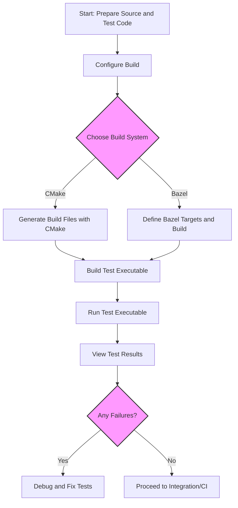

# Building and Running Tests

Explore practical steps for compiling and executing tests using CMake or Bazel. Includes troubleshooting tips for build errors and integration with your development workflow.

---

## 1. Overview

This guide helps you build and run GoogleTest and GoogleMock test binaries using supported build systems, primarily CMake and Bazel. Whether you are setting up a standalone testing environment or integrating tests into your project, you will find actionable instructions to compile and execute your tests reliably.

### Prerequisites
- A development environment with a C++ compiler supporting C++17.
- CMake (version 3.13 or higher) or Bazel installed.
- GoogleTest source code and/or GoogleMock if using mocks.

### Expected Outcome
- Successful compilation of test binaries.
- Ability to run tests and observe test results using standard test runners.

### Time Estimate
- ~10 to 30 minutes depending on environment and familiarity.

### Difficulty Level
- Beginner to Intermediate

---

## 2. Building Tests Using CMake

CMake is the recommended build system for GoogleTest with extensive support for both standalone and integrated builds.

### Step 1: Prepare the Build Directory

```bash
cd googletest                 # Root directory of cloned repo
mkdir build                   # Create build output directory
cd build
```

### Step 2: Generate Build Files

- To build **GoogleTest and GoogleMock** (default):

  ```bash
  cmake ..
  ```

- To build only **GoogleTest** (without GoogleMock):

  ```bash
  cmake .. -DBUILD_GMOCK=OFF
  ```

### Step 3: Build the Libraries

- On Unix-like systems, run:

  ```bash
  make
  ```

- On Windows, open the generated `.sln` file in Visual Studio and build the solution.

### Step 4: Build Your Test Executable

- If incorporating GoogleTest into your own CMake project, link against `gtest` or `gtest_main` libraries.

- Example CMake snippet inside your project:

  ```cmake
  find_package(GTest REQUIRED)
  
  add_executable(my_tests test_example.cpp)
  target_link_libraries(my_tests GTest::gtest_main)
  add_test(NAME my_tests COMMAND my_tests)
  ```

### Step 5: Run Your Tests

- Execute the compiled test binary:

  ```bash
  ./my_tests
  ```

- Tests will run and output results with detailed success/failure information.

### Best Practices
- Use `gtest_main` to avoid writing your own `main()` function unless custom behavior before or after tests is necessary.
- Specify C++17 standard explicitly in your CMake project for compatibility:

  ```cmake
  set(CMAKE_CXX_STANDARD 17)
  set(CMAKE_CXX_STANDARD_REQUIRED ON)
  ```

### Troubleshooting Tips
- If you encounter runtime errors related to missing symbols or libraries, ensure that your linker includes `pthread` on Unix-like systems.
- On Windows, be cautious of runtime library mismatches; enable `gtest_force_shared_crt` in CMake if dynamic CRT linking is preferred.
- Verify your compiler version meets minimum C++17 requirements.

---

## 3. Building Tests Using Bazel

If your development workflow is Bazel-based, GoogleTest can be integrated and built there as well.

### Step 1: Define Dependencies

- Include GoogleTest targets in your Bazel `BUILD` files.

- Example snippet:

  ```python
  cc_test(
      name = "my_tests",
      srcs = ["test_example.cc"],
      deps = ["//third_party/googletest:gtest_main"],
  )
  ```

### Step 2: Build the Test

- Run Bazel build:

  ```bash
  bazel build //path/to:my_tests
  ```

### Step 3: Run Tests

- Run the tests via Bazel:

  ```bash
  bazel test //path/to:my_tests
  ```

- Bazel will show test results in the output, handling failed and passed tests.

### Troubleshooting
- Ensure Bazel version and environment support C++17.
- If GoogleMock is used, confirm `gmock` targets are included properly.

---

## 4. Running Tests Directly

GoogleTest provides a straightforward way to run all tests or a subset by using command-line flags.

### Running All Tests

Simply execute your test binary:

```bash
./my_tests
```

### Selecting Specific Tests

Use the `--gtest_filter` flag to run selected tests:

```bash
./my_tests --gtest_filter=TestSuiteName.TestName
```

Wildcards are supported for filtering.

### Common Useful Flags

| Flag                       | Purpose                            |
|----------------------------|----------------------------------|
| `--gtest_repeat=N`         | Run tests N times                 |
| `--gtest_shuffle`          | Randomize test order              |
| `--gtest_break_on_failure` | Break into debugger on failure   |

For a complete list, run `./my_tests --help`.

---

## 5. Troubleshooting Common Build and Run Issues

### Build Errors

- **Missing Headers or Libraries**: Verify GoogleTest source paths and your include directories.
- **Compiler Not Supporting C++17**: Upgrade your compiler to a supported version (GCC 7.1+, Clang 5.0+, MSVC 2017+).
- **Linker Errors Related to pthread on Linux**: Add `-pthread` flag to compiler and linker.
- **Runtime Library Mismatch on Windows**: Use `-Dgtest_force_shared_crt=ON` in CMake.

### Runtime Problems

- **Tests Not Discovering All Cases**: Ensure all test files are compiled/linked into the executable.
- **Tests Crash or Fail Unexpectedly**: Run with `--gtest_break_on_failure` and debug failures.

---

## 6. Integration into Development Workflow

### Continuous Integration

- GoogleTest binaries can be run in CI pipelines, emitting exit codes reflecting test pass/fail results.
- Output formats such as XML can be generated using `--gtest_output=xml:report.xml`.

### IDE Integration

- Many IDEs support integration with GoogleTest, providing test explorers and results.
- Using the CMake generated projects simplifies IDE support.

### Automation

- Use CTest or other test runners to automate test execution.
- Parallel test running can be facilitated with tools in the GoogleTest ecosystem.

---

## 7. Summary Diagram of Test Build and Run Flow



---

## 8. Additional References and Next Steps

- **Setup and Installation**: [Prerequisites and System Requirements](/getting-started/setup-introduction/prerequisites-requirements), [Installation (CMake, Bazel, Manual)](/getting-started/setup-introduction/installation-options)
- **Writing Tests**: [Writing Your First Test](/gtest-guides/getting-started/write_first_test)
- **Troubleshooting**: [Troubleshooting Common Setup Issues](/getting-started/first-experience/common-setup-issues)
- **Integration**: [Integrating with CI/CD Pipelines](/gtest-guides/integration-scaling/ci_integration)

<Tip>
Always validate your build setup by compiling and running a simple test before scaling up your test suite. This catches environment issues early.
</Tip>

<Note>
Linking your test executable against `gtest_main` or `gmock_main` automatically provides the standard entry point, freeing you from writing your own `main()` function.
</Note>

<Warning>
Ignoring build errors or linker warnings can lead to confusing runtime failures. Address all issues promptly.
</Warning>

---

This guide empowers you to compile and execute your GoogleTest-based tests efficiently using CMake or Bazel, integrating them smoothly into your development and CI workflows.