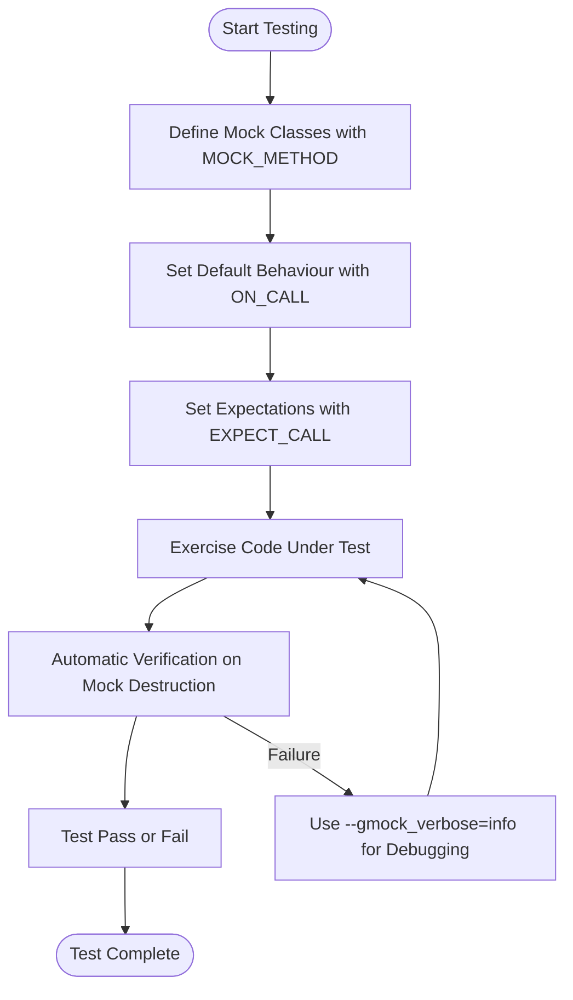

# Effective Mocking Patterns

Harness advanced GoogleMock features such as argument matchers, setting cardinalities, call sequence control, and custom actions. Learn practical patterns to write clear and resilient tests.

---

## 1. Overview

### What This Guide Covers
This guide shows you how to use GoogleMock’s powerful capabilities beyond basic mocking. You'll learn how to effectively use argument matchers, control how many times a mock method is called, enforce call sequences, and define custom actions to tailor mocks to your testing needs.

### Prerequisites
- Basic familiarity with GoogleMock: defining mock classes with `MOCK_METHOD`.
- Understanding of expectations (`EXPECT_CALL`) and default behaviors (`ON_CALL`).

### Outcome
After completing this guide, you will be able to:
- Write precise expectations with complex argument validations.
- Manage call cardinality to express how often mocks should be invoked.
- Control and verify call order using sequences and dependencies.
- Create custom actions for flexible mock behavior.

### Time Estimate
~30 minutes for familiar users to read and apply examples.

### Difficulty Level
Intermediate

---

## 2. Advanced Mocking Patterns

### Argument Matching Patterns
GoogleMock provides versatile matchers to specify what arguments are expected on mock calls.

- **Wildcard Matcher `_`**: Use `_` to accept any argument value when specifics aren’t important.

- **Combining Matchers:** Use matchers like `AllOf()`, `AnyOf()`, and `Not()` to build complex argument conditions.
  
```cpp
EXPECT_CALL(mock_obj, Foo(AllOf(Gt(0), Lt(10))));  // argument in (0,10)
```

- **With Clause:** Match multiple arguments as a group using `.With()` for cross-param constraints.

```cpp
// Expect SetPosition called with first arg less than second.
EXPECT_CALL(mock_obj, SetPosition(_, _))
    .With(Lt());
```

*Tip:* In unfamiliar scenarios, start with `_` and increment specificity to avoid brittleness.

### Setting Call Cardinality
Control how many times a mock method is allowed or expected to be called with `Times()`.

| Cardinality        | Meaning                                   |
| ------------------ | -----------------------------------------|
| `AnyNumber()`      | Any number of calls (including zero).     |
| `AtLeast(n)`       | At least *n* times.                        |
| `AtMost(n)`        | At most *n* times.                         |
| `Between(m, n)`    | Between *m* and *n* inclusive.            |
| `Exactly(n)` or `n`| Exactly *n* times (zero means never called).|

- **Implicit Cardinalities:** If omitted, GoogleMock infers cardinality based on presence of `WillOnce` and `WillRepeatedly`.

*Example:* 
```cpp
EXPECT_CALL(mock, Process()).Times(3);  // Expect exactly 3 calls
```

### Enforcing Call Sequence
By default, mock calls can occur in any order. Use sequences to specify call order constraints.

- **Using `InSequence`:** Enforces strict order for all expectations declared within the scope.

```cpp
{
  InSequence seq;
  EXPECT_CALL(mock, Init());
  EXPECT_CALL(mock, Run());
  EXPECT_CALL(mock, Cleanup());
}
```

- **Using `Sequence` objects:** Define complex partial orders across multiple sequences.

```cpp
Sequence seq1, seq2;
EXPECT_CALL(mock, Reset()).InSequence(seq1, seq2);
EXPECT_CALL(mock, GetSize()).InSequence(seq1);
EXPECT_CALL(mock, Describe()).InSequence(seq2);
```

- **Using `After()`:** Specify that a call should happen after one or more other calls.

```cpp
Expectation initA = EXPECT_CALL(mock, InitA());
Expectation initB = EXPECT_CALL(mock, InitB());
EXPECT_CALL(mock, Describe()).After(initA, initB);
```

### Custom Actions
You can specify what happens when a mock method is called using actions:

- **`WillOnce()`, `WillRepeatedly()`:** Define return values or side-effects.

- **Built-in Actions:** Use `Return()`, `ReturnRef()`, `Invoke()`, `SetArgPointee()`, `DoAll()`, etc.

- **Lambda or Callable:** Pass any callable compatible with the mock method signature.

```cpp
EXPECT_CALL(mock, Compute(5))
    .WillOnce([](int x) { return x * 2; });
```

- **Delegating to a Fake or Real Object:** Use `ON_CALL` with a lambda to forward calls.

```cpp
ON_CALL(mock, DoWork(_))
    .WillByDefault([&fake](int x) { return fake.DoWork(x); });
```

---

## 3. Step-by-Step Patterns

<Steps>
<Step title="Define Mock Methods with Mocked Signatures">
Make sure all virtual methods to be mocked are defined with `MOCK_METHOD`. For example:

```cpp
class MockFoo : public Foo {
 public:
  MOCK_METHOD(int, GetSize, (), (const, override));
  MOCK_METHOD(std::string, Describe, (const char*), (override));
};
```

*Note:* If method arguments or return types contain commas, wrap types in extra parentheses or use `using` aliases.
</Step>

<Step title="Set Default Behavior Using ON_CALL">
Set default behaviors for mock methods to avoid warnings on uninteresting calls. Example:

```cpp
ON_CALL(mock_foo, GetSize())
    .WillByDefault(Return(42));
```

This lets your tests run smoothly even if the method is called without an explicit expectation.
</Step>

<Step title="Specify Expectations with EXPECT_CALL">
Define the exact calls you expect, including argument matchers and cardinalities.

Example - expect `Describe` to be called exactly 3 times with argument "hello":

```cpp
EXPECT_CALL(mock_foo, Describe("hello"))
    .Times(3)
    .WillRepeatedly(Return("Greeting"));
```

You can omit arguments to accept any parameters in non-overloaded methods.
</Step>

<Step title="Control Call Order with Sequences or After">
Group related expectations inside an `InSequence` to enforce call order:

```cpp
{
  InSequence seq;
  EXPECT_CALL(mock, Open());
  EXPECT_CALL(mock, Read());
  EXPECT_CALL(mock, Close());
}
```

Or use `Sequence` objects and `.After()` when partial ordering is needed.
</Step>

<Step title="Chain Actions to Simulate Complex Behavior">
Use multiple `WillOnce()` clauses in sequence followed by `WillRepeatedly()`, or combine multiple actions with `DoAll()`.

Example:

```cpp
EXPECT_CALL(mock, GetValue())
    .WillOnce(Return(1))
    .WillOnce(Return(2))
    .WillRepeatedly(Return(3));
```

The mock returns 1, then 2, then 3 for all subsequent calls.
</Step>

<Step title="Utilize NiceMock, NaggyMock, or StrictMock to Adjust Strictness">
Wrap mock objects to control warnings and errors on unexpected or uninteresting calls.

```cpp
NiceMock<MockFoo> nice_mock;   // Suppresses warnings on uninteresting calls
NaggyMock<MockFoo> naggy_mock; // Issues warnings on uninteresting calls (default)
StrictMock<MockFoo> strict_mock; // Fails test on uninteresting calls
```

Choose based on your test sensitivity and maintenance preferences.
</Step>
</Steps>

---

## 4. Examples & Patterns

### Example 1: Using Argument Matchers & Cardinalities

```cpp
using ::testing::_, ::testing::Gt, ::testing::Return;

EXPECT_CALL(mock, Process(Gt(10)))  // Argument greater than 10
    .Times(AtLeast(2))              // Called at least twice
    .WillRepeatedly(Return(true));  // Returns true on each call
```

### Example 2: Enforcing Partial Call Order

```cpp
using ::testing::Sequence;
Sequence s1, s2;

EXPECT_CALL(mock, Init())
    .InSequence(s1, s2);
EXPECT_CALL(mock, LoadConfig())
    .InSequence(s1);
EXPECT_CALL(mock, Connect())
    .InSequence(s2);
```

This enforces that Init() must be called before both LoadConfig() and Connect(), but LoadConfig() and Connect() can be in any order relative to each other.

### Example 3: Custom Action Using Lambda

```cpp
EXPECT_CALL(mock, Compute(_))
    .WillOnce([](int x) { return x * x; })
    .WillRepeatedly(Return(0));
```

First call returns square of input, subsequent calls return 0.

### Example 4: Delegating to Real Object

```cpp
class MockWorker : public Worker {
 public:
  MockWorker() {
    ON_CALL(*this, DoWork(_)).WillByDefault([this](int x) {
      return real_.DoWork(x);
    });
  }

  MOCK_METHOD(int, DoWork, (int), (override));

 private:
  Worker real_;
};
```

### Example 5: Using NiceMock to Suppress Uninteresting Call Warnings

```cpp
NiceMock<MockFoo> nice_mock;
EXPECT_CALL(nice_mock, DoThis());
nice_mock.DoThis();
// Other calls to nice_mock are silently ignored if uninteresting
```

---

## 5. Troubleshooting & Best Practices

<AccordionGroup title="Common Issues and Tips">
<Accordion title="Uninteresting call warnings">
If you see warnings about uninteresting calls, consider:
- Adding default actions with ON_CALL.
- Using `NiceMock` to suppress warnings if you don’t care about certain calls.
- Adding catch-all EXPECT_CALLs with `.Times(AnyNumber())` explicitly to document allowed calls.
</Accordion>

<Accordion title="Unexpected call errors">
If a mock function is called with arguments that no expectation matches:
- Review argument matchers for correctness.
- Ensure all expected calls are set *before* exercising the mock.
- Use `--gmock_verbose=info` to trace mock call matches.
</Accordion>

<Accordion title="Failing due to call order">
If tests fail due to call order:
- Use `InSequence` or `Sequence` objects with `InSequence()` to explicitly set required order.
- Use the `After()` clause to specify prerequisite calls.
- Avoid overconstraining order if not necessary.
</Accordion>

<Accordion title="Over-specifying expectations">
Overly strict expectations lead to brittle tests.
- Specify only the arguments of interest using matchers or `_`.
- Avoid requiring precise call counts unless verification requires it.
- Use `Times(AnyNumber())` when appropriate.
</Accordion>

<Accordion title="Cannot compile MOCK_METHOD with comma in argument">
- Wrap the type containing commas with parentheses or define type aliases.
Example:
```cpp
using PairType = std::pair<int, int>;
MOCK_METHOD(bool, Foo, (PairType), (override));
```
</Accordion>
</AccordionGroup>

---

## 6. Additional Resources & Next Steps

- Read the [gMock Cookbook](https://google.github.io/googletest/gmock_cook_book.html) for detailed recipes.
- Review the [Matchers Reference](https://google.github.io/googletest/reference/matchers.md) for built-in matchers.
- Explore the [Actions Reference](https://google.github.io/googletest/reference/actions.md) for built-in actions and how to create custom ones.
- Learn about [Mock Object Strictness Modes](https://google.github.io/googletest/reference/strictness-modes.html) for adjusting test sensitivity.
- Consult the [gMock Cheat Sheet](https://google.github.io/googletest/gmock_cheat_sheet.html) for a handy summary.

Use this knowledge to write robust, maintainable, and expressive tests that utilize the full power of GoogleMock.

---

## 7. Diagram: High-Level Mocking Workflow



---

<Tip>
Effective mocking improves test precision and maintenance by specifying what matters: arguments, call frequency, and order. Use this guide to master advanced gMock features and write clearer, more reliable tests.
</Tip>

---