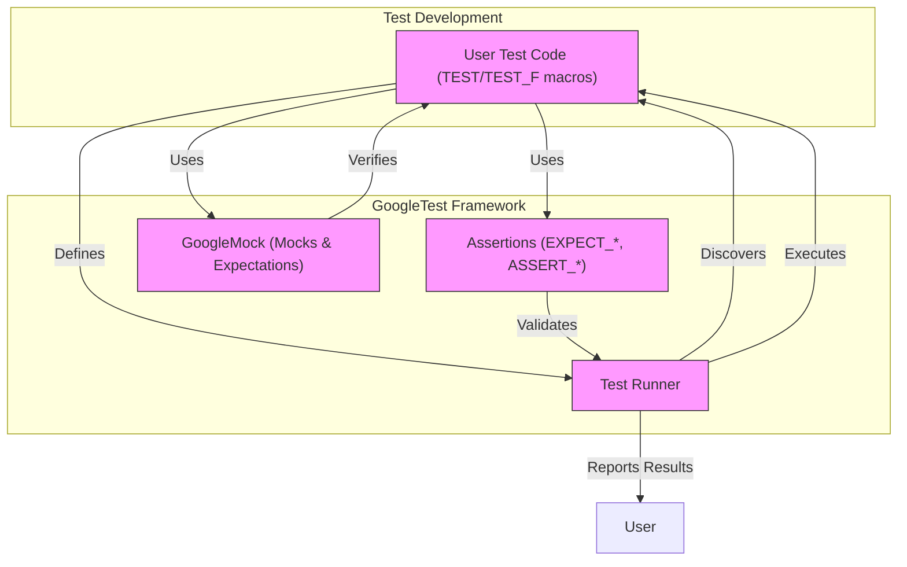

# System Architecture Overview

GoogleTest’s architecture centers on empowering C++ developers to write robust, maintainable tests through an intuitive interaction model with its core components. This page visually lays out the system architecture, focusing on how the main elements of GoogleTest—test runners, assertions, and mocks—interact with each other and your code to deliver a seamless testing workflow.

---

## Understanding GoogleTest’s Architecture

At its heart, GoogleTest is designed to discover and execute tests you write while providing detailed assertions and failure feedback. This system overview reveals what happens behind the scenes when running your tests and how mocks play a critical part in verifying interactions.

### What This Page Covers

This page:
- Illustrates the interaction between core GoogleTest components: **test runners**, **assertions**, and **mocks**.
- Shows how your **test code** is integrated into the execution flow.
- Explains the process of **discovering** and **executing** tests within the framework.

### Why It Matters

Familiarity with GoogleTest’s architecture allows you to anticipate how tests are processed and where your code fits. Understanding component interactions guides you in writing testable, effective test cases, especially when using mocks to simulate complex dependencies.

---

## Core Components and Their Interactions

GoogleTest consists of several key parts, each with distinct responsibilities that together enable efficient testing.

### Components at a Glance

- **Test Runners**: Drive the test execution lifecycle. They automatically detect your tests, invoke them one by one, and report results.
- **Assertions**: The core checks within your tests that validate conditions and report successes or failures.
- **Mocks (via GoogleMock)**: Allow you to simulate and verify interactions with dependent objects, providing control and observation over test behavior.

### Your Code in the Workflow

Your *user code*—the classes, functions, and tests you write—integrates tightly with these components. Tests are written as functions using GoogleTest’s macros (`TEST()`, `TEST_F()`), which the test runner automatically discovers and invokes.

### How It All Works Together

This diagram shows that the test runner orchestrates test discovery and execution, driving assertions that check correctness and mocks that verify interaction correctness.

---

## Detailed Workflow: Test Discovery to Completion

### 1. Test Discovery

- GoogleTest scans linked binaries for test cases defined via `TEST()` and `TEST_F()` macros.
- Each test case registers itself with the framework automatically.

### 2. Test Execution

- The test runner calls each test method in isolation.
- Any setup or teardown defined in fixtures (`SetUp()`, `TearDown()`) executes around test methods.

### 3. Assertions

- Inside tests, `EXPECT_*` and `ASSERT_*` macros check conditions.
- Failures are reported immediately (`ASSERT_*` aborts the current test), while `EXPECT_*` lets test continue.

### 4. Mock Interaction

- If the test involves dependencies, you create mock objects.
- Expectations on mocks specify expected calls, argument values, call order, and return values.
- GoogleMock intercepts mock calls during test execution and verifies expectations.

### 5. Reporting

- After all tests run, or upon failures, GoogleTest aggregates results.
- Detailed failure messages, including stack traces and mock call mismatches, are output.

---

## Practical Example: User Test Using GoogleMock

Imagine testing a component `Calculator` that depends on an interface `Logger`.

- You write a mock class `MockLogger` with mocked methods using `MOCK_METHOD`.
- In your test, you:
  - Set expectations on `MockLogger` for certain logs to be generated.
  - Invoke the `Calculator` methods.
  - GoogleMock verifies log method calls against expectations.

This architecture enables precise control and validation of component interactions without requiring actual logger implementations.

---

## Tips for Successful GoogleTest Usage

- **Write isolated tests:** Take advantage of GoogleTest’s isolated test fixture creation to prevent state leakage between tests.
- **Use mocks smartly:** Rely on mocks for interaction testing but avoid over-specification that reduces test flexibility.
- **Leverage sequences:** Enforce order constraints using `InSequence` where necessary for strict call order dependencies.
- **Set defaults with ON_CALL:** Use `ON_CALL` for default mock behaviors and `EXPECT_CALL` for explicit call expectations.
- **Manage verbosity:** Configure logging verbosity with `--gmock_verbose=info|warning|error` to balance detail and noise.

---

## Troubleshooting Common Issues

<AccordionGroup title="Common Issues When Using GoogleTest Architecture">
<Accordion title="Unexpected Call Failures">
If your test fails with unexpected call errors, verify that:

- All required expectations are set before exercising the mock.
- Call orders respect any specified sequences or dependencies.
- Your matchers correctly reflect argument expectations.
</Accordion>
<Accordion title="Uninteresting Calls Warning">
This warning appears when methods without explicit `EXPECT_CALL` are invoked.

**Solution:**

- Use `NiceMock` to suppress warnings for uninteresting calls.
- Add catch-all `EXPECT_CALL(mock, Method(_)).Times(AnyNumber());` if calls are allowed.
</Accordion>
<Accordion title="Test Discovery Failures">
If GoogleTest isn’t discovering your test cases:

- Ensure you’re using `TEST()` or `TEST_F()` macros correctly.
- Confirm your test files are linked into the test binary.
- Check for macro or namespace issues masking test case registration.
</Accordion>
</AccordionGroup>

---

## Next Steps

After internalizing this architecture overview, proceed to:

- [Core Concepts and Terminology](../core_concepts_terminology) to deepen understanding of GoogleTest basics.
- Explore [Effective Mocking Techniques](../../guides/core-workflows/mocking-techniques) to master GoogleMock usage.
- Start writing your own tests with [Writing Your First Test](../../getting-started/quickstart-usage/writing-first-test).

Learn how to harness the full power of GoogleTest, confident in how your test code flows within the system.

---

*This overview guides you from understanding architecture to writing effective, robust tests with GoogleTest and GoogleMock.*

---

## References

- [GoogleTest Primer](../primer.md) — Learns basics of writing and structuring tests.
- [gMock Cookbook](../gmock_cook_book.md) — Practical recipes for mocking with GoogleMock.
- [Mocking Reference](../reference/mocking.md) — Detailed syntax and semantics of mock components.
- [Test Runner Entry Points](../../api_reference/configuration_and_main_api/runner_entry_points) — For customizing test execution.

---

<Source url="https://github.com/google/googletest" paths={[{"path": "docs/primer.md", "range": "1-278"},{"path": "docs/gmock_cook_book.md", "range": "1-500"},{"path": "docs/gmock_cheat_sheet.md", "range": "1-140"},{"path": "docs/reference/mocking.md", "range": "1-700"}]} />