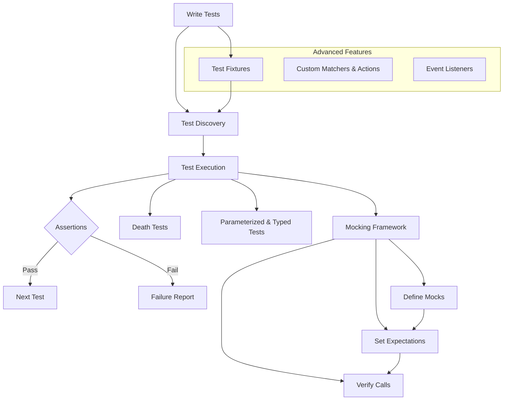

# Key Features at a Glance

Discover the essential capabilities of GoogleTest, laid out in a way that aligns directly with your testing workflows and goals. This page serves as a concise map to leverage GoogleTest’s powerful features—from test discovery and diverse assertions to advanced testing techniques like death tests and mocking—so you can write effective and maintainable C++ tests with confidence.

---

## Comprehensive Test Discovery

GoogleTest automatically detects and aggregates all tests across your codebase without requiring manual registration. Whether you organize tests as simple functions, or group them using fixtures and suites, GoogleTest ensures your entire test suite is accounted for and easily executed.

**What this means for you:**
- Write tests anywhere in your code without extra bookkeeping.
- Organize tests logically into suites reflecting your project structure.
- Run either the full suite or isolated tests effortlessly.


## Rich and Flexible Assertions

At the heart of GoogleTest are its assertion macros, designed to verify virtually any kind of condition:

- Equality and inequality
- Boolean checks
- String comparisons, including substrings and regex
- Floating-point comparisons with tolerance
- Custom predicates and user-defined assertions

Assertions come in two flavors:
- `ASSERT_` variants that abort the current test function on failure.
- `EXPECT_` variants that log failures but allow the test to continue.

**Example:**
```cpp
TEST(FactorialTest, HandlesZeroInput) {
  EXPECT_EQ(Factorial(0), 1);
}
```

Well-crafted assertions give you detailed diagnostics on failures—like file, line number, and detailed values—so you can debug faster and with less guesswork.


## Powerful Death Tests

GoogleTest supports death tests to verify that your program crashes or exits as expected under erroneous conditions. These tests run code in a subprocess, isolating potentially hazardous checks.

**User benefits:**
- Confidently verify error handling and assertion checks that should abort execution.
- Test patterns where program termination is the expected outcome.


## Parameterized and Typed Tests

Test your code against multiple scenarios efficiently:

- **Value-Parameterized Tests:** Run the same test logic repeatedly with different input values.
- **Typed Tests:** Test your templates or interfaces across different types without rewriting tests.

This leads to less code duplication and clearer test intent.

**Quick example:**
```cpp
TEST_P(MyTestSuite, WorksForVariousValues) {
  EXPECT_TRUE(IsValid(GetParam()));
}
INSTANTIATE_TEST_SUITE_P(MyGroup, MyTestSuite, testing::Values(1, 2, 3));
```


## Robust Mocking Framework Integration

GoogleTest includes GoogleMock, an advanced mocking framework enabling simulation of dependencies and behaviors:

- Define mocks with clear syntax using `MOCK_METHOD` macros.
- Set, verify, and order expectations on mock calls.
- Use matchers to specify arguments precisely and concisely.
- Delegate calls to real or fake implementations as needed.

**Why it matters:**
- Decouple tests from complex dependencies for isolated testing.
- Verify interaction patterns and contracts explicitly.


## Advanced Features to Accelerate Testing

- **Test Fixtures:** Share setup and teardown logic across tests to reduce boilerplate.
- **Custom Matchers and Actions:** Extend GoogleTest’s capabilities to suit complex domain logic.
- **Event Listeners:** Customize output and integrate test events with other tools.


## How These Features Help You

Imagine you’re integrating a new module in your project. With GoogleTest’s **automatic test discovery**, you write tests freely without registering each one. Using **rich assertions and fixtures**, you cover edge cases cleanly. To validate error conditions that cause your app to exit, **death tests** keep you safe. When testing classes with interdependent components, **GoogleMock’s** powerful mocking lets you simulate and verify behaviors precisely, keeping tests fast and focused.

Without GoogleTest, setting up these workflows would be tedious, error-prone, and potentially inconsistent—GoogleTest streamlines these challenges with built-in, battle-tested solutions.


---

## Getting Started

Start with writing simple tests using the `TEST()` macro, then explore ways to group them using test fixtures (`TEST_F()`). Next, expand to parameterized tests when you want to run variants. Incorporate mocks to isolate test units and verify interactions.

For detailed examples, check out the Getting Started guides and sample test cases included in the GoogleTest repository.


---

## Practical Tips & Best Practices

- **Use `EXPECT_` assertions when you want tests to continue after failure to find multiple issues at once.** Use `ASSERT_` when it doesn’t make sense to continue.
- **Group related tests using test fixtures to reuse setup code and keep tests consistent.**
- **Avoid over-asserting in mocks; use `ON_CALL` to specify default behaviors and `EXPECT_CALL` only when you want to verify a call occurs.**
- **Name test suites and tests clearly and avoid underscores (`_`) to prevent naming conflicts.**


---

## Troubleshooting Common Issues

- If your tests don’t run, ensure tests are compiled and linked correctly; GoogleTest discovers tests automatically.
- For flaky death tests, check thread usage and consider using the "threadsafe" style death tests.
- When mocking heavily, use `NiceMock` or `StrictMock` to control uninteresting call warnings.


---

## Related Documentation

- [System Architecture Overview](../architecture_core_concepts/architecture_overview.md) — Understand how test discovery and execution are orchestrated.
- [Core Concepts and Terminology](../architecture_core_concepts/core_concepts_terminology.md) — Learn foundational GoogleTest terms.
- [Writing Your First Test](../../guides/getting-started/writing-first-test.md) — Practical guide to writing tests.
- [Introduction to Mocking](../../guides/getting-started/introduction-to-mocking.md) — Start with GoogleMock basics.
- [Assertions Reference](../../api_reference/core_assertions_matchers/assertions_overview.md) — Comprehensive assertion details.


---

Ready to dive deeper? Head to the guides for step-by-step tutorials or to the API reference for fine-grained control over GoogleTest features.


---

### Summary Mermaid Diagram of Key Features Workflow



This diagram summarizes the flow from writing tests, through discovery and execution, supported by assertions, death tests, parameterization, and robust mocking.


---

# Unlock the full power of GoogleTest, one feature at a time.

