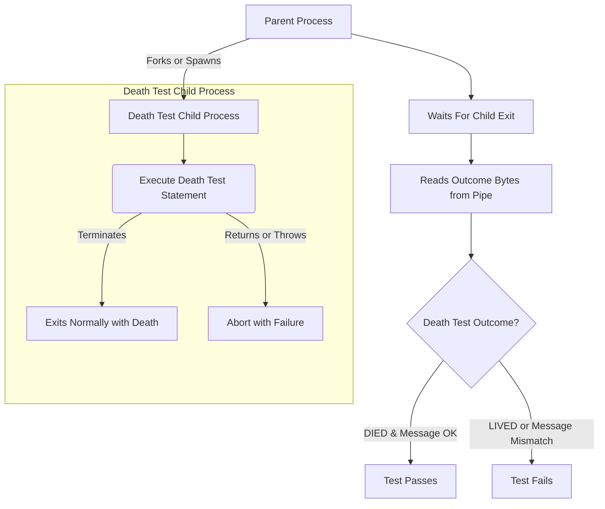

# Robust Error-Handling with Death Tests

GoogleTest's *death tests* let you assert that certain code paths terminate the program as expected. These tests verify that your application correctly aborts or exits under error conditions, ensuring your application's defensive safeguards are effective. This guide walks you through writing, running, and troubleshooting death tests safely across platforms and CI environments.

---

## Understanding Death Tests

### What is a Death Test?

A death test checks that a specified statement causes the program to terminate either by calling `exit()`, `_Exit()`, or aborting via a fatal error (such as an assertion failure). It confirms:

- The process aborts or exits correctly.
- The exit status matches an expected predicate.
- The program's error output matches a given pattern.

This is most useful to verify that your code asserts on invalid input or critical failures.

### Why Use Death Tests?

- To verify your program *fails fast* under unsafe conditions.
- To ensure your assertions and checks trigger correctly.
- To avoid silent failure modes that compromise program correctness.

### Important Death Test Terminology

- **Exit Status:** Integer exit information returned by the OS (e.g., from `wait(2)` on Unix).
- **Exit Code:** Integer code passed to `exit()` or returned from `main()`.
- **Death Test Style:** How the child process is launched: *fast* (fork and run immediately) or *threadsafe* (reexecutes the test binary).

---

## Key Death Test Macros

GoogleTest provides macros that behave similarly to other assertions but check for program termination.

| Macro                  | Behavior                                                                                             |
|------------------------|--------------------------------------------------------------------------------------------------|
| `ASSERT_DEATH(stmt, matcher)` | Fails the current test fatally if `stmt` does not cause termination with matching error output.    |
| `EXPECT_DEATH(stmt, matcher)` | Records a nonfatal failure on failure but continues.                                            |
| `ASSERT_EXIT(stmt, predicate, matcher)` | Asserts `stmt` causes termination with exit status satisfying `predicate`.                 |
| `EXPECT_EXIT(stmt, predicate, matcher)` | Like `ASSERT_EXIT` but nonfatal.                                                             |
| `EXPECT_DEBUG_DEATH(stmt, matcher)` | Asserts death in debug builds, runs normally in optimized builds (NDEBUG).                   |

> The `matcher` parameter accepts either a string (interpreted as a regex for matching `stderr` output) or a gMock matcher for strings.

---

## Writing Effective Death Tests

### Step 1: Name Your Test Suite Appropriately

Name your test suite with a `*DeathTest` suffix to help GoogleTest run death tests first, which avoids interference from multithreading or static initialization in other suites.

```cpp
class FooDeathTest : public ::testing::Test { ... };

TEST_F(FooDeathTest, DiesOnInvalidInput) {
  ASSERT_DEATH(Foo(-1), "Negative input not allowed");
}
```

### Step 2: Write the Death Test Statement

- Use any valid C++ statement, including compound statements.
- Avoid using assertions inside the death test statement that may return.
- Be mindful not to place multiple death checks on the same source line.

Example:

```cpp
ASSERT_DEATH({
  ValidateUser(nullptr);
  DoSomething();
}, "User must not be null");
```

### Step 3: Provide a Reliable Matcher

- The matcher should match any error output your code produces on `stderr`.
- Prefer concise but clear regular expressions or use prebuilt string matchers.

### Step 4: Choose the Death Test Style (Optional)

Select the `death_test_style` flag:

- `fast` (default): Forks and runs the test logic immediately.
- `threadsafe`: More robust in multi-threaded environments; re-executes the test binary in a child.

Set programmatically in `main()` for all tests:

```cpp
GTEST_FLAG_SET(death_test_style, "threadsafe");
```

Or per test, if needed.

---

## Advanced Usage

### Using Predicates with `ASSERT_EXIT`/`EXPECT_EXIT`

You can assert on the exit status using predicate functors:

```cpp
EXPECT_EXIT(EXIT_WITH_ERROR(), testing::ExitedWithCode(42), "Error occurred");

bool KilledBySIGTERM(int status) {
  return WIFSIGNALED(status) && WTERMSIG(status) == SIGTERM;
}

ASSERT_EXIT(DeleteTempFiles(), KilledBySIGTERM, "Terminated by SIGTERM");
```

GoogleTest provides `ExitedWithCode` and `KilledBySignal` predicates for common cases.

### Handling Exceptions in Death Tests

- Death tests treat exceptions as failures because the code does not terminate as expected.
- GoogleTest provides macros `EXPECT_DEATH` and `ASSERT_DEATH` which have built-in handling.

---

## Practical Tips and Best Practices

- **Thread Safety:** Death tests require a single-threaded environment. If you have background threads, use the `threadsafe` death test style to avoid hangs.
- **Single Evaluation:** The statement in death tests and the matcher expressions are evaluated exactly once.
- **Watch out for Return or Exceptions:** If the death test statement returns or throws an exception instead of terminating, the test will fail and report an illegal return or exception thrown.
- **Testing Within Loops:** Wrap each iteration in a separate death test to isolate failures.
- **Logging Behavior:** Logging inside death tests only appears when the test fails to avoid clutter.
- **Mock Objects and Death Tests:** If your death test uses mocks, consider allowing leaks via `Mock::AllowLeak` because the child process exit skips normal cleanup.
- **Changing Working Directory:** Death tests handle changed directories correctly if your test binary can be launched via a path with at least one separator.

### Avoid Common Pitfalls

- Do **not** mix death tests and non-death tests in a suite without suffixing the suite name with `DeathTest`.
- Do **not** place multiple death tests on the same line.
- Do **not** rely on side-effects within death tests, as they run in child processes.

---

## Debugging Common Death Test Issues

### Problem: Death Test Hangs

**Solutions:**

- Check for multiple threads in your test binary before the death test.
- Switch to the `threadsafe` style:

  ```cpp
  GTEST_FLAG_SET(death_test_style, "threadsafe");
  ```

- Avoid creating threads outside the death test statements.
- Simplify death test code to isolate the hang.

### Problem: Death Test Fails Because Message Does Not Match

- Make sure your regex matches the `stderr` output.
- Use simple regex features supported by GoogleTest.
- For multi-line output, consider matching key substrings instead of entire text.

### Problem: Death Test Passes Without Terminating

- Ensure your death test statement contains code that actually terminates.
- Beware of statements that throw exceptions or return instead.
- Use the `EXPECT_DEATH` and `ASSERT_DEATH` macros properly.

---

## Death Test Implementation Overview

GoogleTest internally uses different strategies based on OS and style:

- **Fast style:** fork and run the death code immediately.
- **Threadsafe:** fork and re-exec test binary to isolate the test.

On Windows and Fuchsia, death tests always use the threadsafe approach.

### Communication Mechanism

Parent and child processes communicate results through pipes to:

- Detect if the child died as expected.
- Convey error messages back.

### Summary Diagram of Death Test Flow (Generalized)



---

## Example of a Death Test

```cpp
TEST(FooDeathTest, DiesOnNullPointer) {
  ASSERT_DEATH(Foo(nullptr), "Null pointer error");
}

TEST(FooDeathTest, FatalExitWithCodeZero) {
  EXPECT_EXIT(ExitZero(), ::testing::ExitedWithCode(0), "Success message");
}
```

---

## Troubleshooting in CI Environments

- Ensure the test binary path is correct; the `threadsafe` mode requires running the binary via `argv[0]` with at least one directory separator.
- Avoid flaky shared state; keep death test side effects isolated.
- Use `--gtest_death_test_style=threadsafe` for better stability.
- If tests produce unexpected pipe or communication errors, verify RAII and resource lifetimes.

---

## Related Documentation

- [Death Assertions in the Assertions Reference](../reference/assertions.md#death)
- [Advanced Topics on Death Tests](../advanced.md#death-tests)
- [Using Mocks with Death Tests](../guides/core-testing-workflows/using-mocks) for handling mock leak concerns
- [Test Naming Conventions](../docs/faq.md#why-should-test-suite-names-and-test-names-not-contain-underscore)

---

## Summary

Death tests are essential for validating code paths that terminate the program on critical errors. Use GoogleTest's `ASSERT_DEATH` and related macros to write these tests safely and idiomatically. Choose the appropriate death test style based on threading considerations, and provide clear matchers for stderr output. Follow best practices on test naming, single-line assertions, and careful statement writing to avoid common pitfalls. Utilize the built-in facilities to diagnose failures and anomalies efficiently.

---

For more details and advanced usage, consult the [Death Tests API Reference](/api-reference/core-testing-api/death-tests) and related guides.

---

# Appendices

### Basic Death Test Macro Usage

```cpp
ASSERT_DEATH(SomeFunction(), "expected error message");
EXPECT_DEATH(SomeFunction(), ContainsRegex("SomeFunc.*error"));
EXPECT_EXIT(ExitFunction(), ::testing::ExitedWithCode(1), "Exit message");
EXPECT_DEBUG_DEATH(DebugCheck(), "death");
```

### Setting Death Test Style Flag

```cpp
int main(int argc, char** argv) {
  ::testing::InitGoogleTest(&argc, argv);
  GTEST_FLAG_SET(death_test_style, "threadsafe");
  return RUN_ALL_TESTS();
}
```

### Death Test in a Loop

Always wrap each death test iteration separately to isolate failures:

```cpp
for (int i = 0; i < 3; ++i) {
  EXPECT_DEATH(Foo(i), "error code");
}
```

### Avoid Multiple Death Tests on One Line

```cpp
// Correct - separate lines
EXPECT_DEATH(Foo(1), "error1");
EXPECT_DEATH(Foo(2), "error2");

// Incorrect - causes compilation error
EXPECT_DEATH(Foo(1), "error1"); EXPECT_DEATH(Foo(2), "error2");
```

---

# Frequently Asked Questions

<AccordionGroup title="FAQ">
<Accordion title="Why name test suites with DeathTest suffix?">
Naming with `*DeathTest` ensures GoogleTest runs death tests first, avoiding interference from multi-threading or static initialization issues in other tests.
</Accordion>
<Accordion title="What if my death test hangs?">
Use the `threadsafe` style to avoid hangs caused by multithreading issues. Also, minimize threads outside death test code.
</Accordion>
<Accordion title="Can death tests modify global state?">
No. Death tests run in subprocesses; modifications do not propagate back to the parent. Avoid relying on side effects in death tests.
</Accordion>
</AccordionGroup>

---

# See Also

- [GoogleTest Primer](primer.md)
- [Assertions Reference](reference/assertions.md#death)
- [Writing and Running Your First Test](guides/getting-started/writing-first-test)
- [Death Tests API Reference](/api-reference/core-testing-api/death-tests)
- [Exception Assertions](reference/assertions.md#exceptions)

---

Visit the [GoogleTest Ecosystem Overview](overview/integrations/related-tools-ecosystem) for tools that complement death testing workflows.

---

*This documentation leverages implementation practices found in `googletest/src/gtest-death-test.cc` and related test suites.*