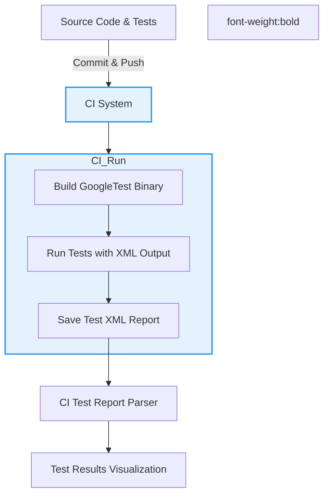

# Integrating GoogleTest in Continuous Integration Pipelines

## Workflow Overview

### Task Description
This guide provides a practical, end-to-end walkthrough to help you integrate GoogleTest seamlessly into common Continuous Integration (CI) pipelines. You'll learn how to export test results, customize test output, and connect GoogleTest with popular CI tools for rich visualization and reporting.

### Prerequisites
- GoogleTest is installed and integrated within your build system (e.g., CMake or Bazel).
- You have a working test suite that builds and runs locally.
- Basic familiarity with your CI environment (Jenkins, GitHub Actions, GitLab CI, etc.).

### Expected Outcome
By following this guide, you will have GoogleTest running with your CI system, producing machine-readable test reports that your CI can consume and visualize. The setup allows you to:
- Export GoogleTest results in XML format compatible with CI tools.
- Customize output verbosity for debugging or summary needs.
- Implement steps in your CI script to run tests automatically on commits.

### Time Estimate
About 30-60 minutes to configure and verify the integration depending on your CI experience.

### Difficulty Level
Intermediate

---

## Step-by-Step Instructions

<Steps>
<Step title="1. Enable GoogleTest XML Output">
To integrate with CI tools, export your test results in the XML format GoogleTest supports. This is done by passing the `--gtest_output=xml[:path]` flag to your test binary.

**Action:** Add this flag when invoking your test executable. For example:

```bash
./my_test_binary --gtest_output=xml:report.xml
```

If you omit the `path`, the default `test_detail.xml` is created in the working directory.

**Expected Result:** After running, you will have an XML file containing detailed results consumable by CI systems.

**Tip:** Place the XML report in a directory your CI can archive or process.
</Step>
<Step title="2. Customize Test Output Verbosity">
You can control how much detail GoogleTest prints to the console, which often helps debugging in CI.

**Actions:**
- Use `--gtest_print_time=[yes|no]` to enable or disable test timing display.
- Use `--gtest_color=[yes|no]` to control colored output if your CI supports it.
- Use `--gtest_brief=1` to shorten output for large test suites.

Example:

```bash
./my_test_binary --gtest_output=xml:report.xml --gtest_print_time=yes --gtest_color=yes
```

**Expected Result:** Console output will be formatted as per your flags, aiding logs readability.
</Step>
<Step title="3. Integrate Test Execution into Your CI Workflow">
In your CI configuration file (Jenkinsfile, `.github/workflows/*.yml`, `.gitlab-ci.yml`, etc.), add a step to build your test binary and run it with the XML output flag.

**Example for GitHub Actions:**
```yaml
steps:
  - uses: actions/checkout@v3
  - name: Build
    run: cmake --build build
  - name: Run Tests
    run: ./build/my_test_binary --gtest_output=xml:reports/gtest-report.xml
  - name: Upload Test Report
    uses: actions/upload-artifact@v3
    with:
      name: test-report
      path: reports/gtest-report.xml
```

**Expected Result:** Every CI run automatically executes your tests and saves results.

**Tip:** Adjust build commands as per your environment.
</Step>
<Step title="4. Configure Your CI Tool to Consume GoogleTest XML Reports">
Most CI systems have native or plugin support for parsing GoogleTest-style XML reports.

**Actions:**
- In Jenkins, use the "Google Test Plugin" and configure the path to your XML reports.
- In GitLab CI, use the `artifacts:reports:junit` keyword to point to the XML report.
- In GitHub Actions, use third-party actions or upload the reports for analysis.

Example (GitLab CI snippet):
```yaml
test_job:
  script:
    - ./build/my_test_binary --gtest_output=xml:report.xml
  artifacts:
    reports:
      junit: report.xml
    expire_in: 1 week
```

**Expected Result:** Test results appear in your CI web interface with pass/fail annotations.
</Step>
<Step title="5. Handling Failures and Retries in CI">
Set your CI job to fail if tests fail. GoogleTest binary will return `1` on any test failure.

If flaky tests occur, consider:
- Using GoogleTest's `--gtest_repeat` flag to rerun tests multiple times.
- Filtering tests via `--gtest_filter` to isolate problematic tests.

Example:
```bash
./my_test_binary --gtest_output=xml:report.xml --gtest_filter=-FlakyTest* --gtest_repeat=3
```

**Expected Result:** CI marks failures correctly, and retries help minimize transient errors.
</Step>
<Step title="6. Enhancing Reporting with Test Properties">
Use `RecordProperty(key, value)` API in your tests to add metadata (e.g., test coverage data, bug IDs) that appears in XML and CI reports.

Example inside tests:
```cpp
TEST(MySuite, MyTest) {
  testing::Test::RecordProperty("Bug", "12345");
  EXPECT_TRUE(someCondition);
}
```

**Expected Result:** Additional info appears in detailed reports, improving traceability.
</Step>
</Steps>

---

## Examples & Configuration Snippets

### Sample Command to Run Tests and Export XML

```bash
./my_test_binary --gtest_output=xml:artifacts/gtest_report.xml --gtest_print_time=yes
```

### GitHub Actions Workflow Example

```yaml
name: C++ GoogleTest CI

on: [push, pull_request]

jobs:
  build_and_test:
    runs-on: ubuntu-latest

    steps:
    - uses: actions/checkout@v3
    - name: Configure
      run: cmake -S . -B build
    - name: Build
      run: cmake --build build --config Release
    - name: Run Tests
      run: ./build/my_test_binary --gtest_output=xml:reports/gtest-results.xml
    - name: Upload Test Results
      uses: actions/upload-artifact@v3
      with:
        name: google-test-results
        path: reports/gtest-results.xml
```

### Jenkins Pipeline Snippet

```groovy
pipeline {
  agent any

  stages {
    stage('Build') {
      steps {
        sh 'cmake --build build'
      }
    }

    stage('Test') {
      steps {
        sh './build/my_test_binary --gtest_output=xml:report.xml'
      }
      post {
        always {
          junit 'report.xml'
        }
      }
    }
  }
}
```

---

## Troubleshooting & Tips

<AccordionGroup title="Common Issues in CI Integration">
<Accordion title="Test Results XML Not Found or Empty">
- Verify test executable completes and creates the XML file.
- Confirm working directory in CI matches where test binary runs.
- Use absolute paths in `--gtest_output=xml:<path>` if needed.
</Accordion>
<Accordion title="CI Does Not Recognize Test Results">
- Check your CI tool configuration for correct report path.
- Ensure XML is in GoogleTest XML format; avoid custom modifications.
- Use latest CI plugins or tools for better compatibility.
</Accordion>
<Accordion title="Tests Not Running or Found in CI">
- Ensure your tests are linked and discovered correctly locally.
- Validate test binary runs successfully without filters.
- Add `--gtest_list_tests` locally to see tests GoogleTest detects.
</Accordion>
<Accordion title="Test Binary Fails with Exit Code 0 Despite Failures">
- Confirm that you use `RUN_ALL_TESTS()` correctly; it returns 1 if any test fails.
- Check if your `main()` function returns the result of `RUN_ALL_TESTS()`.
</Accordion>
</AccordionGroup>

<Tip>
Consider archiving both console logs and XML reports in your CI artifacts for comprehensive test analysis and debugging.
</Tip>

<Note>
You can combine GoogleTest output customization with CI-specific features like test sharding, parallel execution, and selective test reruns described in the Scaling and Performance guide.
</Note>

---

## Next Steps & Related Content

- Explore the [Scaling Test Suites and Optimizing Performance guide](../advanced-and-best-practices/scaling-and-performance) to accelerate test runs in CI.
- Review [Installation and Build Integration](getting-started/setup-overview/installation-guide) for expert tips on building test binaries suited for CI.
- Consult [Writing and Running Your First Test](guides/getting-started/writing-first-test) to ensure your tests are correctly written for CI execution.
- For mocking dependencies in tests that run in CI, see the [Using Mocks with GoogleMock](guides/core-testing-workflows/using-mocks).

---

## References

- [GoogleTest Primer](primer.md)
- [Running Tests in a Build System](overview/integrations/integration-with-build-systems)
- [GoogleTest XML Output Format and Flags](reference/testing.md#RUN_ALL_TESTS)
- [Jenkins Google Test Plugin](https://plugins.jenkins.io/google-test/)
- [GitHub Actions Documentation](https://docs.github.com/en/actions)
- [GitLab CI JUnit Reports](https://docs.gitlab.com/ee/ci/unit_test_reports.html)

---

## Summary Diagram: GoogleTest in CI Pipeline


