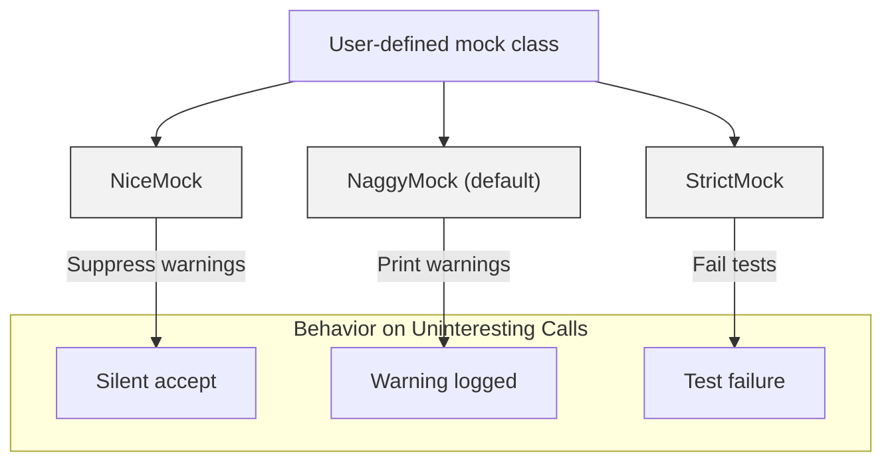

# Mock Object Strictness Modes

Manage the behavior of your GoogleMock mock objects through three distinct strictness modes: **NiceMock**, **NaggyMock**, and **StrictMock**. Each mode controls how uninteresting calls (calls to mock methods without explicit expectations) are handled, balancing test readability, maintenance, and strictness of verification.

---

## Overview

GoogleMock provides flexible modes to configure how your mocks respond to unexpected or uninteresting method calls. These modes help you tailor test verbosity and strictness based on your testing needs, making your tests easier to maintain, less noisy, or more precise.

### Strictness Modes

| Mode        | Behavior on Uninteresting Calls                  | Use Case                                      |
| ----------- | -------------------------------------------------|----------------------------------------------|
| **NiceMock**  | Ignores uninteresting calls silently            | For cleaner test logs; less noisy and tolerant |
| **NaggyMock** | Prints warnings on uninteresting calls (default) | Helpful during test development and debugging |
| **StrictMock**| Treats uninteresting calls as test failures     | Enforces strict verification; catches all surprises |

Uninteresting calls are those mock method calls for which there are no matching `EXPECT_CALL` expectations.

---

## When to Use Each Mode

- **NiceMock**: Use when you want to suppress noise from mock calls you don't care about. This is recommended for stable tests where extraneous calls are not important.
- **NaggyMock**: Useful during test development phases to get warnings of unexpected calls, helping identify missing expectations or overlooked interactions.
- **StrictMock**: Apply in scenarios demanding rigorous interaction verification, where any unplanned call constitutes a failure.

---

## Using Strictness Modes

Each strictness mode is a class template that inherits from your mock class, altering its behavior regarding uninteresting calls.

```cpp
#include <gmock/gmock.h>

using ::testing::NiceMock;
using ::testing::NaggyMock;
using ::testing::StrictMock;

class MockFoo {
 public:
  MOCK_METHOD(void, DoThis, (), ());
};

// Default naggy mock
MockFoo naggy_mock;

// Nice mock suppresses warnings for uninteresting calls
NiceMock<MockFoo> nice_mock;

// Strict mock treats uninteresting calls as errors
StrictMock<MockFoo> strict_mock;
```

You can instantiate these with any arguments the underlying mock class accepts.

---

## Behavior Details

- **NiceMock**:
  - Any call to a method with no matching expectation is silently allowed.
  - Does not generate warnings, keeping test output clean.
  - Useful to avoid clutter from irrelevant calls.

- **NaggyMock** (default):
  - Prints warnings on uninteresting calls.
  - Warns test developers about unexpected interactions without failing the test.
  - Helpful for iterative test improvement.

- **StrictMock**:
  - Treats any uninteresting call as a failure.
  - Immediately flags unexpected use of mocks.
  - Encourages comprehensive expectation specification.

---

## Practical Examples

### Suppressing Warnings with NiceMock

```cpp
using ::testing::NiceMock;

class MockPrinter {
 public:
  MOCK_METHOD(void, Print, (const std::string& text), ());
};

TEST(PrintTest, SuppressesUninterestingCalls) {
  NiceMock<MockPrinter> printer;
  // No expectation set for Print(), but no warning will be shown.
  printer.Print("Hello");
}
```

### Strict Mock to Catch Unexpected Calls

```cpp
using ::testing::StrictMock;

class MockDatabase {
 public:
  MOCK_METHOD(bool, Connect, (const std::string& uri), ());
};

TEST(DatabaseTest, FailsOnUnexpectedCalls) {
  StrictMock<MockDatabase> db;

  EXPECT_CALL(db, Connect("db://example"));

  // This call is allowed.
  db.Connect("db://example");

  // This call is unexpected, will fail the test.
  db.Connect("db://unexpected");
}
```

---

## Important Considerations

- `NiceMock`, `NaggyMock`, and `StrictMock` only affect mock methods defined *directly* in the mock class with the `MOCK_METHOD` macro. Methods inherited from base classes may not be affected depending on your compiler.

- These modifiers can *not* be nested, e.g., `NiceMock<StrictMock<MockFoo>>` is not supported.

- The destructor of the mock class should be virtual for these modifiers to work reliably.

---

## Internals & Implementation Notes

Strictness modes introduce lightweight base classes that register their reaction to uninteresting calls:

- `NiceMock` registers to allow uninteresting calls silently.
- `NaggyMock` registers to emit warnings.
- `StrictMock` registers to treat them as failures.

The mode is set per-mock-object ensuring that individual mocks can be controlled independently.

---

## Summary

Strictness modes in GoogleMock let you control how mock objects handle uninteresting calls, balancing between quietness, helpful warnings, and strict error enforcement. Selecting the appropriate mode streamlines test feedback and maintenance.

---

## Additional Resources

- [gMock Cookbook](https://google.github.io/googletest/gmock_cook_book.html#NiceStrictNaggy) – In-depth recipes including NiceMock and StrictMock usage.
- [GoogleMock Cheat Sheet](https://google.github.io/googletest/gmock_cheat_sheet.html#Mocking-a-Normal-Class) – Quick syntax for using NiceMock, NaggyMock, and StrictMock.
- [gMock for Dummies](https://google.github.io/googletest/gmock_for_dummies.html#setting-expectations) – Introduction to mocking concepts and best practices.

---

## See Also

- [Mocking Reference: NiceMock, NaggyMock, StrictMock](https://google.github.io/googletest/reference/mocking.html#NiceMock)
- [Mocking Techniques and Patterns](https://google.github.io/googletest/guides/core-testing-workflows/mocking-techniques.html)
- [Expectations and Cardinalities](https://google.github.io/googletest/api-reference/core-apis/cardinality-expectations.html)

---

## Troubleshooting

<AccordionGroup title="Troubleshooting Strictness Modes">
<Accordion title="Warnings still appear with NiceMock">Please ensure `MOCK_METHOD` is used in the mock class directly; inherited mock methods might not respect strictness modes. Also, verify that the mock class' destructor is virtual.</Accordion>
<Accordion title="Unexpected calls do not fail StrictMock">Make sure you are not nesting strictness modes and that you use `StrictMock<T>`, not `T` directly. Also, check your test framework's output level settings that might suppress failures.</Accordion>
<Accordion title="Compiling issues with StrictMock or NiceMock">Your compiler might emit warnings if constructors are not properly forwarded. Use the latest stable compiler and follow the usage guidelines with single or multiple forwarded arguments.</Accordion>
</AccordionGroup>

---

## Summary Diagram


