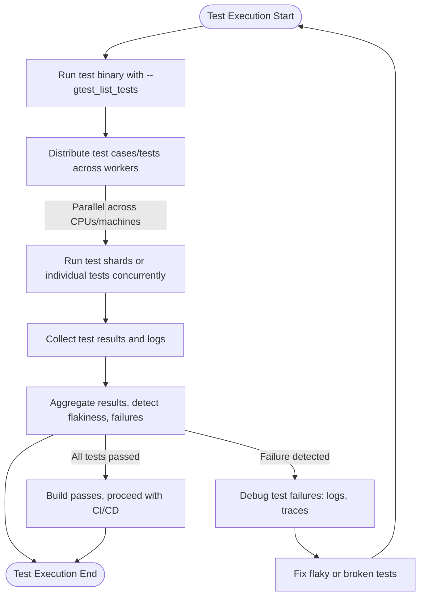

# Performance and Test Suite Scaling

## Overview

This guide shows you how to optimize your test suite's execution time and manage scaling challenges when using GoogleTest and GoogleMock. As your codebase and test suite grow, running all tests sequentially can become prohibitively slow. We cover practical techniques to parallelize test execution, leverage tools like `gtest-parallel`, and best practices for organizing large test suites to achieve maximum efficiency.

## Prerequisites

- A working installation of GoogleTest and GoogleMock.
- Your tests are correctly written and pass standalone.
- Basic understanding of running tests using the GoogleTest framework.

## Expected Outcome

By following this guide, you will be able to execute large test suites faster by distributing test runs across CPU cores or machines. You will also learn how to configure and use `gtest-parallel` effectively and how to organize tests to avoid common scaling bottlenecks.

## Time Estimate

Setup and initial optimization usually takes 1–2 hours, depending on your familiarity with the tooling and your test suite's size.

## Difficulty Level

Intermediate

---

## Step-by-Step Instructions

### 1. Understand Your Current Test Suite Execution

- **Action:** Run your complete test suite as is using the standard `RUN_ALL_TESTS()` GoogleTest binary.
- **Expected Result:** Measure execution time and identify slow tests.

```bash
./your_test_binary
```

- **Tip:** Use built-in timers or wrappers in your CI system to profile test timings.

### 2. Leverage `gtest-parallel` for High-Level Parallelization

- **What:** `gtest-parallel` is a Python-based script that runs GoogleTest tests concurrently across multiple processes.
  - It splits tests per test case or test name, reducing total wall-clock time.

- **Installation:**

Make sure Python 3 is installed. Clone or install `gtest-parallel` from the repository:

```bash
git clone https://github.com/google/gtest-parallel.git
cd gtest-parallel
```

- **Running Your Tests in Parallel:**

```bash
python3 gtest-parallel/path/to/your_test_binary
```

- **Options:**

  - Use `--jobs=N` to specify the maximum number of parallel jobs, usually matching the number of CPU cores.
  - Use `--repeat=COUNT` to rerun tests multiple times to catch flaky tests.

- **Expected Result:** Your tests run concurrently, significantly reducing total test execution time.

- **Verification:** You should see a summary with successful and failed test counts, with overall execution faster than sequential runs.

### 3. Organize Your Tests to Scale with `gtest-parallel`

- If your test binary contains many tests that are slow or heavy:
  - Split the tests logically into multiple test binaries when possible. For example, group tests by component or subsystem.
  - Smaller test binaries can run fully in parallel without contention.

- Use test filters to restrict `gtest-parallel` invocations to subsets of tests for quicker feedback.

- Avoid shared state or global resources during tests to reduce flakiness in parallel executions.

### 4. Use Test Sharding for Distributed or CI Environments

- Test sharding splits tests across multiple machines or agents.

- GoogleTest supports sharding via runtime flags:

```bash
--gtest_total_shards=NUM --gtest_shard_index=INDEX
```

- **Example:** To run shard 0 for 4 total shards:

```bash
./your_test_binary --gtest_total_shards=4 --gtest_shard_index=0
```

- Combine sharding with `gtest-parallel` or your CI's parallel job execution to scale horizontally.

- **Expected Result:** Tests run on separate shards with no cross-shard overlap.

- **Tip:** Ensure all tests are independent to prevent shard ordering issues.

### 5. Profile and Identify Bottlenecks

- Use tools like Google Benchmark, or measure with test timing reports.
- Refactor or break down slow tests.
- Avoid expensive setup/teardown in unit tests; consider using `SetUpTestSuite` and `TearDownTestSuite` for expensive global initialization.

### 6. Use `InSequence` and Ordered Expectations Minimally

- Excessive use of ordered expectations (`InSequence()`) serializes test calls and can hurt parallelism.
- Reserve ordered expectations for cases where call order is critical.

### 7. Avoid Shared Resources in Tests

- Parallel tests must not share mutable global state or external resources unless properly synchronized.
- Use mocks to isolate dependencies and avoid side effects.

### 8. Keep Mock Objects Nicely Scoped

- Favor RAII and stack allocation for mocks when possible to ensure timely destruction and verification.
- Avoid heap leaks of mocks, which can cause incomplete verification and obscure timing issues.

### 9. Run Final Verification Regularly

- Use `Mock::VerifyAndClear()` and `Mock::VerifyAndClearExpectations()` to verify mocks in longer running or complex test flows.

- Use heap checker tools along with GoogleMock to catch leaks.

### 10. Automate Parallel Test Execution in Your Build

- Integrate `gtest-parallel` or equivalent parallel runners into your CI pipelines.
- Tune the number of parallel jobs depending on machine capacity.
- Track flaky tests and minimize their impact by retry or quarantine.

---

## Practical Tips & Best Practices

- **Catch flaky tests early:** flaky tests reduce the reliability of parallel test execution.
- **Group tests logically:** helps with more efficient reruns and sharding.
- **Use selective enabling:** filter tests or shard to speed up focused iterations.
- **Monitor resource consumption:** Parallel execution increases CPU, memory, and IO use.
- **Document sharding strategy:** Ensure all team members understand sharding and parallel test guidelines.

---

## Troubleshooting

<Accordion title="My parallel tests cause race conditions or flaky failures"> 
Check for shared mutable global resources or test dependencies. Use dependency injection and mocks to isolate tests. Avoid static or singleton state unless thread-safe.
</Accordion>

<Accordion title="Some tests do not get run in parallel"> 
Ensure tests are independent and do not use ordered expectations that serialize execution. Verify no explicit ordering dependencies via `InSequence()` where not necessary.
</Accordion>

<Accordion title="How do I debug timing issues with parallel tests?"> 
Run tests under serialization mode (no parallelism) and compare results. Use logging to trace flaky interactions. Review test dependencies and initialization code for side effects.
</Accordion>

<Accordion title="gtest-parallel doesn't find or run my tests"> 
Verify your test binary supports listing tests with `--gtest_list_tests` flag. Check PATH or invocation of the Python script.
</Accordion>

---

## Additional Resources

- [gtest-parallel GitHub repository](https://github.com/google/gtest-parallel) — official parallel execution tool
- [GoogleTest Sharding](https://github.com/google/googletest/blob/main/googletest/docs/advanced.md#sharding-tests) — documentation on test shards
- [gMock Cookbook](https://google.github.io/googletest/gmock_cook_book.html) — recipes for mocking techniques
- [Mocking Best Practices](https://google.github.io/googletest/gmock_best_practices.html) — tips on mock usage

---

## Next Steps

- Explore the [Integrating with Build Systems & CI](../integration-build-systems) guide to automate your parallel test runs.
- Learn about [Advanced Testing Features](../advanced-testing-features) for customizing mock behavior in complex environments.
- Consult the [Mocking Best Practices and Common Pitfalls](../mocking-best-practices) guide to improve the maintainability of your mocks.
- Review the [Common Setup Issues](../../getting-started/setup-troubleshooting/common-setup-issues) for resolving installation or runtime problems.

---

# Diagram: Parallel Test Execution Flow


