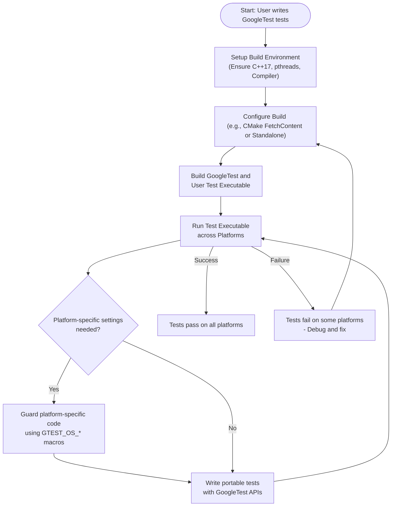

# Cross-Platform and Portability Best Practices

GoogleTest is designed to enable reliable and maintainable testing across diverse operating systems and compiler environments, including Linux, macOS, Windows, and more. This guide helps you write tests that work seamlessly on all supported platforms by addressing system differences, avoiding common portability pitfalls, and leveraging GoogleTest’s built-in cross-platform features.

---

## 1. Understanding Supported Platforms and Environment Differences

GoogleTest supports a wide range of platforms with stable implementations on Linux, Windows, and macOS. However, differences at the OS and compiler level can affect test behavior. Knowing these differences upfront helps you avoid unexpected failures or build issues.

- **Supported Systems**: Linux (including Android), Windows (desktop and variants), macOS, FreeBSD, OpenBSD, Solaris, AIX, and more.
- **Platform-Specific Macros**: GoogleTest uses predefined macros such as `GTEST_OS_LINUX`, `GTEST_OS_WINDOWS`, and `GTEST_OS_MAC` to detect the current platform.
- **Thread Safety**: Multi-threading support depends on pthread availability. Windows (non-MinGW) uses native threading.
- **File System Differences**: Paths and permissions vary; use GoogleTest’s abstractions where possible.

<Tip>
Always consult the [Supported Platforms documentation](https://github.com/google/googletest/blob/main/docs/platforms.md) for up-to-date information on compiler and OS compatibility.
</Tip>

---

## 2. Writing Tests for Portability

### 2.1 Use GoogleTest’s Cross-Platform Constructs

GoogleTest abstracts platform-specific details so you can write uniform tests:

- Use its assertion macros (`EXPECT_*`, `ASSERT_*`) for verifying behavior.
- Use portable file path utilities provided by your build environment or wrap paths appropriately.
- Prefer GoogleTest's API for capturing outputs and environment controls.

### 2.2 Guard Platform-Specific Code

If test code requires platform-specific behavior (e.g., Windows API calls), isolate and guard it using GoogleTest’s platform macros:

```cpp
#if defined(GTEST_OS_WINDOWS)
  // Windows-specific test code
#elif defined(GTEST_OS_LINUX)
  // Linux-specific test code
#else
  // Fallback or skip for other platforms
#endif
```

This prevents compilation errors and clarifies intent.

### 2.3 Manage External Dependencies and Compiler Flags

- Ensure your build system declares dependent libraries and include paths per platform.
- Use `-DGTEST_HAS_PTHREAD=1` or `=0` to override pthread detection if necessary.
- Define `gtest_force_shared_crt` when using Visual Studio to align runtime linkage.

---

## 3. Handling Build System Portability

### 3.1 Building with CMake

GoogleTest provides a robust CMake build script supporting multiple platforms with minimal configuration changes.

- To build GoogleTest standalone:
  ```bash
  git clone https://github.com/google/googletest.git -b v1.17.0
  cd googletest
  mkdir build
  cd build
  cmake ..
  make
  sudo make install
  ```

- For only GoogleTest (without GoogleMock):
  ```bash
  cmake .. -DBUILD_GMOCK=OFF
  ```

- On Windows, CMake generates Visual Studio solutions (`.sln`), enabling building and debugging within Visual Studio.

- On macOS, it generates Xcode project files.

### 3.2 Integrating with Existing CMake Projects

Embed GoogleTest into your project with `FetchContent` to ensure consistent compiler and linker settings:

```cmake
include(FetchContent)
FetchContent_Declare(
  googletest
  URL https://github.com/google/googletest/archive/5376968f6948923e2411081fd9372e71a59d8e77.zip
)
set(gtest_force_shared_crt ON CACHE BOOL "" FORCE) # For Windows
FetchContent_MakeAvailable(googletest)

add_executable(my_tests test.cpp)
target_link_libraries(my_tests gtest_main)
add_test(NAME my_tests COMMAND my_tests)
```

This method avoids library mismatch and ensures your tests compile and link smoothly on all platforms.

---

## 4. Platform-Specific Challenges and Recommendations

### 4.1 Windows Considerations

- MSVC defaults to dynamic CRT linkage, but GoogleTest links statically by default. Use `gtest_force_shared_crt` to align CRT linkage.
- Wide strings (`std::wstring`) use UTF-16 on Windows, but GoogleTest converts them to UTF-8 internally when printing.
- Ensure you have proper Visual Studio versions (VS 2017 or later for GoogleMock compatibility).

### 4.2 Linux and macOS Considerations

- pthreads support is assumed standard; specify `-DGTEST_HAS_PTHREAD` only if detection fails.
- Use path separators `/` consistently.
- macOS users should have Xcode command line tools installed to build with CMake.

### 4.3 Avoiding Macro Name Clashes

Macros cannot follow namespaces in C++. When integrating with other libraries, you may encounter conflicting macro names like `ASSERT_EQ`.

To handle such conflicts, GoogleTest allows renaming macros by defining these flags during compilation:

```bash
-DGTEST_DONT_DEFINE_ASSERT_EQ=1
-DGTEST_DONT_DEFINE_TEST=1
``` 

You then use the prefixed versions such as `GTEST_ASSERT_EQ` and `GTEST_TEST` instead.

---

## 5. Tips for Maximizing Portability

- **Run Tests on All Target Platforms**: Automated CI pipelines ensure your tests behave consistently across OSes.
- **Avoid Platform-Specific APIs in Tests**: Limit dependencies or isolate them in clearly guarded code.
- **Use GoogleTest Features for Thread Safety**: Verify availability of pthread (`GTEST_IS_THREADSAFE`) and handle accordingly.
- **Consistent Compiler Flags**: Apply flags like `-std=c++17` uniformly to match GoogleTest's requirements.
- **Leverage `TEST_F` Fixtures for Shared Setup**: Reduce platform-dependent setup in multiple tests.

<Info>
Remember: GoogleTest requires C++17 standard or newer to build and run correctly on all platforms.
</Info>

---

## 6. Troubleshooting Common Portability Issues

| Issue                                           | Possible Cause                                   | Solution                                                 |
|-------------------------------------------------|-------------------------------------------------|----------------------------------------------------------|
| Compilation fails due to missing pthread         | pthread not detected or linked                   | Explicitly add `-DGTEST_HAS_PTHREAD=1`, link pthread       |
| Runtime errors linking GoogleTest static/shared  | CRT linkage mismatch on Windows                  | Define `gtest_force_shared_crt` to force consistent CRT     |
| Test outputs garbled wide strings on Windows     | UTF-16 wide strings not converted properly       | Trust GoogleTest’s internal conversion; ensure latest version |
| Mac build fails due to missing Xcode tools       | Command line tools not installed                  | Install Xcode command line tools (`xcode-select --install`) |
| Macro name collisions with other libraries       | Conflicting macro names in included headers      | Define `DGTEST_DONT_DEFINE_XXX` flags to rename macros     |

<Tip>
Use verbose build logs and enable GoogleTest verbose output for diagnosing subtle platform-specific issues.
</Tip>

---

## 7. Summary

Writing portable tests is critical to leveraging GoogleTest’s full power across environments. Embrace its cross-platform abstractions, understand platform nuances, and integrate GoogleTest as part of your build system consistently. This approach minimizes issues and maximizes confidence that your tests validate behavior robustly on all supported platforms.

---

## 8. Additional Resources

- [GoogleTest Supported Platforms](https://github.com/google/googletest/blob/main/docs/platforms.md)
- [GoogleTest Primer](https://github.com/google/googletest/blob/main/docs/primer.md)
- [Building and Using GoogleTest with CMake](https://github.com/google/googletest/blob/main/googletest/README.md#build-with-cmake)
- [GoogleTest Configuration and Integration Guide](/getting-started/installation-setup/configuration-integration)
- [GoogleTest Troubleshooting & Common Issues](/getting-started/first-test-experience/common-issues-troubleshooting)

---

## Mermaid Diagram: High-Level Cross-Platform Test Build and Execution Flow



---

# End of Guide
